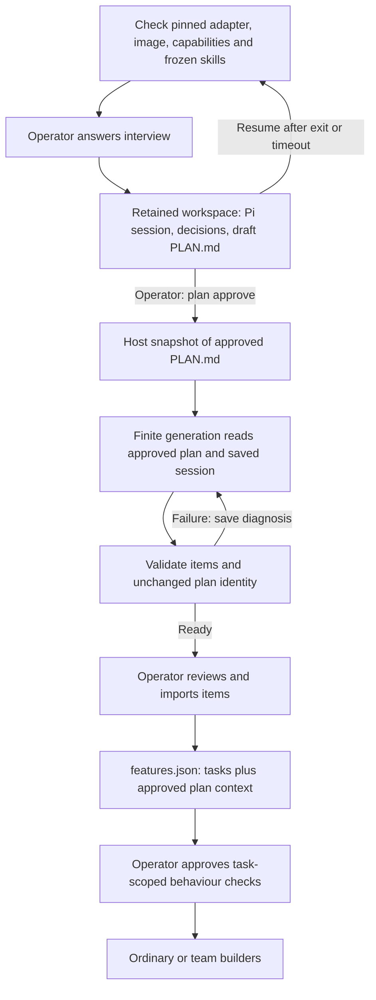
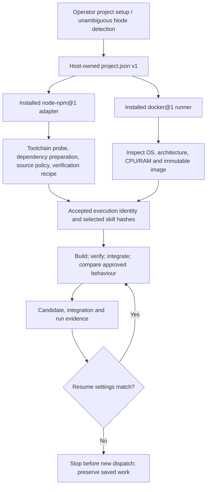
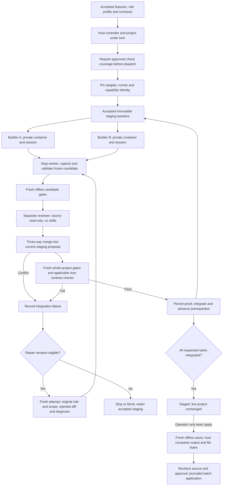
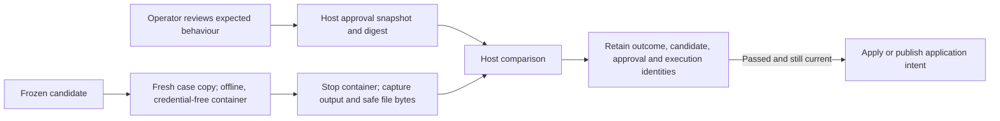
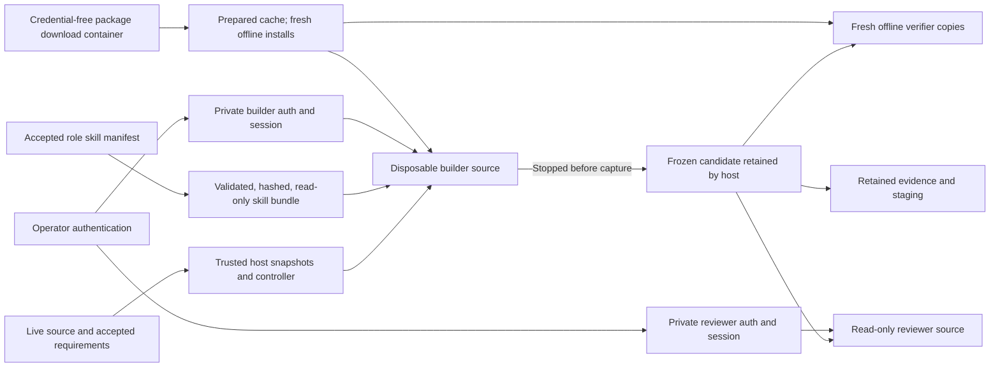
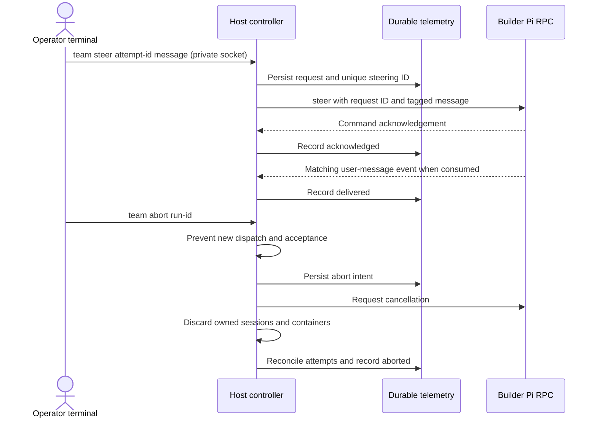
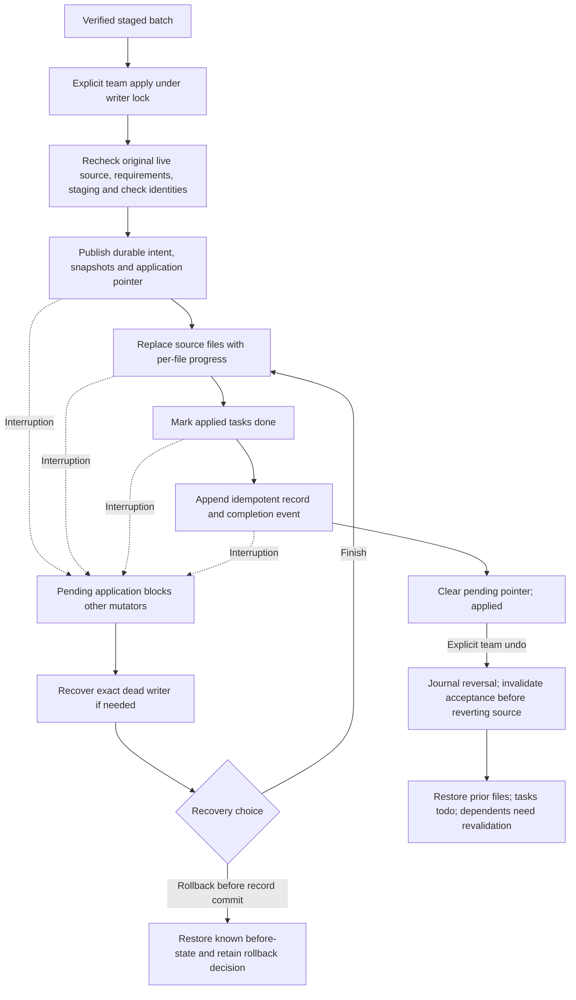

# Harness architecture

Current implementation includes E0 hardening, E1 adapter/runner contracts and the initial U0 guide on top of team M0–M6 and durable planning.
Use the [README](README.md) for commands and [threat model](THREAT_MODEL.md) for
security assumptions. These diagrams describe implemented behavior; milestone
reports preserve their original observations.

## Durable planning and handoff

The planner can write only its retained project copy and configured Pi data.
Host approval, proposal hashes and lifecycle state live outside that copy. A
failed document-generation step requires `plan resume`; retries are not dispatched
automatically. No planning artifact directly changes live source. On timeout or
handled termination, contained-process cleanup precedes completion handling.
After an uncatchable controller kill, explicit writer recovery and resume stop
the previous owned container before continuing. Pi's persisted messages survive
independently of whether the model has finished writing its draft.

Implementation: [planning state](src/planning/store.ts), [commands](src/verbs/plan.ts),
[import](src/verbs/add.ts). `verify:planning` exercises deterministic Docker recovery
and the installed Pi session manager without provider calls.

## Guided entry and readiness

`guide` confirms the selected project and derives actions from existing plan,
feature, writer and application state. It has no separate workflow database or
project index. Each prompt releases stdin before a child planning terminal starts.
`project setup` selects the supported adapter and skill bundles; mixed roots need
an explicit choice. Readiness v2 is available through `doctor [--json]`, including
a v1 capability report from image inspection and an isolated runtime probe. It makes no model
calls and distinguishes an authentication file from verified provider access.
The first guide covers planning, item import, check setup, ordinary work and
writer/pending-application recovery. Advanced team work remains explicit.

## Adapter and runner contracts

The adapter contract owns detection markers, runtime identity, clean dependency
preparation/installation, source exclusions, shared inputs, verification recipes,
test evidence and build-output declarations. The Node adapter retains existing
npm policies and assertion instrumentation. A test-only text adapter exercises
the same pipeline without a Node manifest; it is never registered for operators.
Build-output declarations describe potential artifacts; E3 will add their export
and retention lifecycle.

The Docker runner prepares hardened launches, executes finite commands or connects
RPC, inspects capabilities, cancels/cleans owned containers and exports execution
evidence. Verification remains credential-free and offline. Capability requirements
are checks against the fixed runner, not permission grants. No project can load
host adapter code or select an unrestricted host backend.

Execution identity includes the effective project profile, image, operator tool
paths, configured provider/model, test command, install policy, contract paths,
capability report and selected ordinary/planning skill hashes. Timeout ceilings are
operational limits and can be adjusted on resume. Team role skill versions remain
in the accepted inputs and dispatch events. Dependency environment keys additionally
identify candidate manifests/lockfiles and actual runtime versions.

Implementation: [adapter contract](src/adapters/contract.ts),
[Node adapter](src/adapters/node-npm.ts), [runner contract](src/runners/contract.ts),
[Docker runner](src/runners/docker.ts), [execution identity](src/project/execution.ts).

## Execution and acceptance

Ordinary `work` verifies and applies one item. `team run` stages a batch with one
builder by default, or two with `--max-workers 2`. Only builders overlap; candidate
intake, review and integration are serialized by the host controller. Shared-input
assignments execute exclusively. Neither a model's final answer nor successful
component tests alone advance team prerequisites.

Failure at candidate intake, gates or review also refuses acceptance and follows
the task's bounded retry or blocked-outcome policy. Repair repeats building,
candidate gates, review and combined checks; it has no bypass. The default is
one extra integration repair per task under journal versions 3 and 4. It retains the
original role's skills rather than automatically switching to a diagnosis role.

Each proposed integration passes its combined checks before it becomes staging.
There is no separate model-driven final approval phase: `team apply` validates
the retained source, requirements and trusted-check identities and runs the
operator-approved behaviour cases on final staging before writing.
An ordinary run follows the same frozen-candidate boundary but applies its item
without the team's serial merge, staging or batch journal.

Implementation: [controller](src/team/controller.ts), [worker](src/team/worker.ts),
[scheduler](src/team/scheduler.ts), [integration](src/team/integrate.ts).

## Acceptance evidence boundary

Expected values and approval state are not mounted by this runner. Steps in a
case share source/data; cases use fresh installations. Assertions reported by
project tests remain diagnostics; a read-only shim and lexical counter make
accidental corruption harder but cannot make a candidate's own report trusted.
Host comparison verifies declared behaviour only, not universal correctness or
resistance to a program tailored to those examples. Approval archives and result
files live under `<project>-harness/acceptance/`, outside writable agent state.
Application validates proof against the current candidate and approved checks;
failed runs retain evidence even though disposable work is removed.

Implementation: [checks and evidence](src/acceptance/checks.ts),
[setup prompts](src/verbs/checks.ts), [readiness](src/guide/readiness.ts).

## Isolation and skills

The diagram's arrows mean host-prepared copies or read-only resources, not shared
writable mounts. Preparation and executable gates have no Pi credentials or skill
mounts; gates run with networking disabled. Builder/reviewer model calls and
package downloads use bridge networking. Model egress is not provider-restricted.
Workers never receive the live repository, another attempt's workspace, controller
state, host control socket or Docker socket.

Team skill manifests validate names, dependencies, interaction modes, tool
requirements and declared resources. Ordinary work/planning freeze role selections from `HARNESS_SKILLS`;
teams freeze declared resources from their accepted profile. All launchers disable implicit skills and
extensions. Reviewers receive no skills. Skill availability, observed read-tool
use and worker-reported workflow evidence are separate facts; none proves the
model followed every instruction.

Implementation: [sandbox arguments](src/containment/sandbox.ts),
[attempt inputs](src/team/inputs.ts), [role profile](profiles/team.json),
[skill assessment](SKILLS_ASSESSMENT.md).

## Live RPC control and cancellation

Team builders and reviewers require Pi **0.80.6**. Docker receives interactive
stdin without a TTY. Bounded UTF-8 JSONL frames and request IDs separate command
responses from lifecycle events. Completion requires valid assistant turns,
`agent_end`, `agent_settled` and a subsequent idle state with an empty queue.

Acknowledgement and delivery can arrive in a different order; the diagram shows
a common order. Neither proves compliance with the instruction. Only active
builders accept steering, and uncertain requests are never automatically resent.
The initial abort reply says `abort-requested`; only persisted `aborted` confirms
successful cleanup. Cancellation also covers reviewer and finite-command work.
Pi 0.80.6 lacks `clear_queue`, so the host always destroys the session/container
to discard queued work instead of relying on Pi's abort acknowledgement.

The endpoint is a mode-0600 Unix socket in a mode-0700 temporary directory with
a random capability. The web viewer has no control route. Abrupt controller death
requires explicit dead-writer recovery and resource reconciliation; aborted runs
cannot resume or apply. Accepted staging and audit evidence are retained.

Implementation: [RPC transport](src/agent/rpc.ts), [control](src/team/control.ts),
[owned-container cleanup](src/containment/stop.ts).

## Application, undo and recovery

Recovery compares actual files against retained before/after bytes and refuses
unexpected edits. It can resume any partial stage idempotently; the finish arrow
summarizes that reconciliation rather than unconditionally rewriting all files.
Rollback is refused after the application record is committed; finish recovery
and use undo instead. `team resume` finishes a pending application, but never
implicitly applies newly staged work. With no pending application, `team recover`
only reconciles workers and retained staging.

This is a recoverable sequence of file replacements, not one atomic multi-file
filesystem operation. Cooperating harness writers are excluded; external editors
can still race a final check. Team undo preserves unrelated edits, refuses edits
to batch files and has no redo. Ordinary undo restores raw bytes, merges only supported UTF-8 text and refuses
divergent binary content. Existing hard links and symlink ancestors are refused
in ordinary apply and undo before source writes.

Implementation: [application journal](src/team/apply.ts),
[writer lock](src/workspace/writer-lock.ts), [state reducer](src/team/state.ts).

## Durable state and read-only views

| Location beside the project | Meaning |
|---|---|
| `<project>-harness.writer-lock` | Canonical cooperating-writer ownership |
| `<project>-harness/project.json` | Operator-selected adapter, capabilities and skill names |
| `<project>-harness/executions/<run>/` | Ordinary execution identity and frozen skill resources |
| `<project>-harness/plans/<plan>/execution.json` | Planning execution identity; frozen skills beside it |
| `<project>-harness/teams/<run>/inputs/execution.json` | Team runner/adapter identity; authoritative copy in creation event |
| `<project>-harness/teams/<run>/events/` | Authoritative acceptance and lifecycle events |
| `<project>-harness/teams/<run>/state.json` | Rebuildable acceptance projection |
| `<project>-harness/teams/<run>/telemetry/` | Immutable phases, reported model usage and steering history |
| `<project>-harness/teams/<run>/controller.json` | Host/PID and private endpoint metadata |
| `<project>-harness/teams/<run>/abort.json` | Durable refusal of further execution/application |
| `<project>-harness/teams/<run>/attempts/` | Candidates, proposed integrations and verification evidence |
| `<project>-harness/applications/<application>/` | Immutable intents, source snapshots and application progress |
| `<project>-harness/application.json` | Pointer to a pending application or reversal |
| `<project>-harness/record.jsonl` | Applied, reversed and other ordinary run history |

`team inspect` reads acceptance state. `look` and `view` combine it with telemetry
and retained artifacts, including task roles, prerequisites, phases, gates,
review, repair, integration, elapsed time and reported builder/reviewer spend.
Interrupted reported usage survives resume; missing usage is not inferred and
in-flight calls may exceed dispatch budgets. New version 4 journals bind candidates,
component verification and integration to accepted execution identity. Older records
remain inspect/recover/undo capable; unpinned runs cannot start new dispatch or
application through the CLI. Pending application recovery remains available. Viewer
reads never rebuild state files or start recovery.

## Console implementation and verification

The original S1–S3 console stages (usage capture, browsable history and live
observation) are implemented. Their operating instructions are maintained in
[the README](README.md#reading-what-happened). Static `view` embeds file contents
and historical diffs; `view --serve` adds only the loopback read-only server.
A team-only project is visible before its first applied record. Binary and
oversized files remain listed with an explanation.

Ordinary progress uses a four-second heartbeat; status older than fifteen seconds
or a dead process is shown as stopped. Team liveness uses controller host/PID
metadata. Neither view executes project code, launches a model/container, steals
locks or performs recovery. The server serves only GET `/` and `/status`, polls
once a second from the page, rejects a busy port, and has no control routes.
Display content is escaped; polling updates use text-safe rendering.

Verification references: [usage events](test/events.test.ts),
[static viewer](test/view.test.ts), [live status and server](test/server.test.ts),
[team projections](test/team-status.test.ts), [RPC](test/rpc.test.ts), and
[controller crash recovery](test/team-controller-crash.test.ts).
