# Harness architecture

Current implementation includes E0 hardening, E1 adapter/runner contracts, E2 Python support, E3 artifacts/jobs, E4 CPU regression, Linux-only E6 desktop diagnostics, E9a local staging, GitHub release delivery, isolated browser diagnostics and the extended U0 guide on top of team M0–M6 and durable planning.
Use the [README](README.md) for commands and [threat model](THREAT_MODEL.md) for
security assumptions. These diagrams describe implemented behavior; milestone
reports preserve their original observations.

## Durable planning and handoff

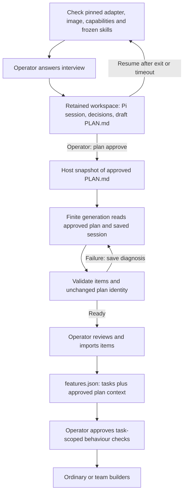
```mermaid
flowchart TD
  E["Check pinned adapter, image, capabilities and frozen skills"] --> U["Operator answers interview"]
  U --> W["Retained workspace: Pi session, decisions, draft PLAN.md"]
  W -->|Resume after exit or timeout| E
  W -->|Operator: plan approve| P["Host snapshot of approved PLAN.md"]
  P --> G["Finite generation reads approved plan and saved session"]
  G --> V["Validate items and unchanged plan identity"]
  V -->|Failure: save diagnosis| G
  V -->|Ready| I["Operator reviews and imports items"]
  I --> F["features.json: tasks plus approved plan context"]
  F --> C["Operator approves task-scoped behaviour checks"]
  C --> B["Ordinary or team builders"]
```

The planner can write only its retained project copy and configured Pi data.
Host approval, proposal hashes and lifecycle state live outside that copy. A
failed document-generation step requires `plan resume`; retries are not dispatched
automatically. No planning artifact directly changes live source. On timeout or
handled termination, contained-process cleanup precedes completion handling.
After an uncatchable controller kill, explicit writer recovery and resume stop
the previous owned container before continuing. Pi's persisted messages survive
independently of whether the model has finished writing its draft.

Implementation: [planning state](src/planning/store.ts), [commands](src/verbs/plan.ts),
[import](src/verbs/add.ts). `verify:planning` exercises deterministic Docker recovery
and the installed Pi session manager without provider calls.

## Guided entry and readiness

`guide` confirms the selected project and derives actions from existing plan,
feature, writer and application state. It has no separate workflow database or
project index. Each prompt releases stdin before a child planning terminal starts.
`project setup` selects the supported adapter and skill bundles; mixed roots need
an explicit choice. Readiness v2 is available through `doctor [--json]`, including
a v1 capability report from image inspection and an isolated runtime probe. It makes no model
calls and distinguishes an authentication file from verified provider access.
The first guide covers planning, item import, check setup, ordinary work and
writer/pending-application recovery. Advanced team work remains explicit.

## Adapter and runner contracts

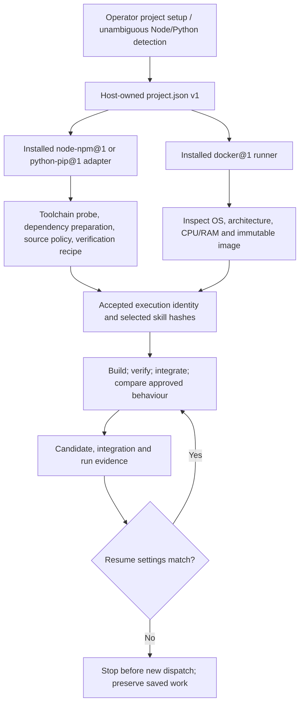
```mermaid
flowchart TD
  S["Operator project setup / unambiguous Node/Python detection"] --> P["Host-owned project.json v1"]
  P --> A["Installed node-npm@1 or python-pip@1 adapter"]
  P --> R["Installed docker@1 runner"]
  A --> T["Toolchain probe, dependency preparation, source policy, verification recipe"]
  R --> C["Inspect OS, architecture, CPU/RAM and immutable image"]
  T --> I["Accepted execution identity and selected skill hashes"]
  C --> I
  I --> B["Build; verify; integrate; compare approved behaviour"]
  B --> E["Candidate, integration and run evidence"]
  E --> Q{"Resume settings match?"}
  Q -->|Yes| B
  Q -->|No| X["Stop before new dispatch; preserve saved work"]
```

The adapter contract owns detection markers, runtime identity, clean dependency
preparation/installation, source exclusions, shared inputs, verification recipes,
test evidence and build-output declarations. The Node adapter retains existing
npm policies and assertion instrumentation. Python uses a separate wheel/pytest
implementation without the Node counter. A test-only text adapter exercises
the same pipeline without a Node manifest; it is never registered for operators.
Build-output declarations feed explicit `verify --retain` collection into the local
SHA256 store. Manifests bind each output to source and execution identities.

The Docker runner prepares hardened launches, executes finite commands or connects
RPC, inspects capabilities, cancels/cleans owned containers and exports execution
evidence. Verification remains credential-free and offline. Capability requirements
are checks against the fixed runner, not permission grants. No project can load
host adapter code or select an unrestricted host backend.

Execution identity includes the effective project profile, image, operator tool
paths, configured provider/model, test command, install policy, contract paths,
capability report and selected ordinary/planning skill hashes. Timeout ceilings are
operational limits and can be adjusted on resume. Team role skill versions remain
in the accepted inputs and dispatch events. Dependency environment keys additionally
identify candidate manifests/lockfiles and actual runtime versions.

Ordinary work review consumes candidate-bound pipeline evidence after all gates pass.
The host checks source digest, executed test command, adapter/runner and pinned image
before persisting `candidates/<run-id>/review-attempt-<n>.json`. The report binds the
baseline, candidate, execution and environment identities; it carries capabilities,
gate outcomes, skipped gates and at most 12,000 characters of diagnostic output
(8,000 for tests, 1,000 per other gate, with truncation flags). The report travels in
the read-only review prompt; private acceptance commands do not. Findings must
reconcile observed results with source reasoning and label runtime uncertainty.
Passing project tests never overrides reviewer findings or acceptance requirements.
Operator browser observations are a separate, explicitly labelled input. `evidence
setup <run-id>` takes a writer lock, checks the inspected copy against the retained
checkpoint, shows observations and limitations, and requires confirmation. Receipts
and their archives live outside worker mounts. Matching uses source, baseline,
task, approval and execution digests; mismatches are not attached to review. Receipt
hashes detect corruption, not dishonesty by a host operator. No observation grants
an automatic pass or skips independent acceptance.

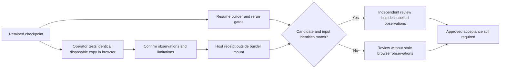
```mermaid
flowchart LR
  C[Retained checkpoint] --> B[Operator tests identical disposable copy in browser]
  B --> E[Confirm observations and limitations]
  E --> H[Host receipt outside builder mount]
  C --> W[Resume builder and rerun gates]
  W --> M{Candidate and input identities match?}
  H --> M
  M -->|Yes| R[Independent review includes labelled observations]
  M -->|No| N[Review without stale browser observations]
  R --> A[Approved acceptance still required]
  N --> A
```

Each resumed implementation reruns gates and produces fresh evidence. Explicit
`work --resume <id> --refresh-checks` can adopt corrected, already approved probe
steps after comparing the archived approval with the current one. Only the resumed
task's executable steps may differ; case metadata, contracts and other tasks stay
fixed. All other checkpoint identity guards remain active, and both approval
digests are recorded without rewriting the original checkpoint.

Implementation: [adapter contract](src/adapters/contract.ts),
[Node adapter](src/adapters/node-npm.ts), [runner contract](src/runners/contract.ts),
[Docker runner](src/runners/docker.ts), [execution identity](src/project/execution.ts).

## Python preparation and verification

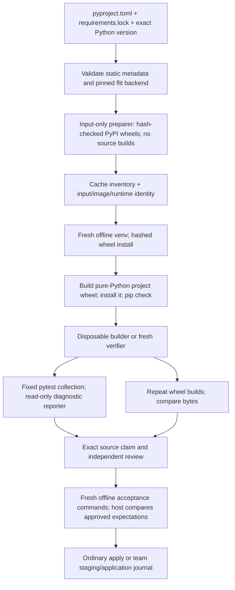
```mermaid
flowchart TD
  P["pyproject.toml + requirements.lock + exact Python version"] --> V["Validate static metadata and pinned flit backend"]
  V --> D["Input-only preparer: hash-checked PyPI wheels; no source builds"]
  D --> K["Cache inventory + input/image/runtime identity"]
  K --> I["Fresh offline venv; hashed wheel install"]
  I --> B["Build pure-Python project wheel; install it; pip check"]
  B --> W["Disposable builder or fresh verifier"]
  W --> T["Fixed pytest collection; read-only diagnostic reporter"]
  W --> R["Repeat wheel builds; compare bytes"]
  T --> C["Exact source claim and independent review"]
  R --> C
  C --> A["Fresh offline acceptance commands; host compares approved expectations"]
  A --> S["Ordinary apply or team staging/application journal"]
```

Dependency installation is recreated per executable gate and acceptance case.
Candidate test reports are diagnostic: a Python process can fabricate its output,
so only a matching host-side acceptance result permits application. Build outputs
are discarded in source work; E3 retains fresh outputs through `verify --retain`. The adapter contributes fixed container
environment variables so Python commands and console entry points resolve to the
fresh venv in builders and acceptance checks. Project files cannot supply these
harness settings. Python contract-suite declarations are refused until supported.
See [Python policy and migration](PYTHON.md) and [adapter](src/adapters/python-pip.ts).

## Acceptance-check preparation


```mermaid
flowchart LR
  W["checks prepare: saved request/time allowance"] --> P["Saved plan, criteria and source"]
  P --> O["Behaviour outline and interface"]
  O --> R["Independent outline review"]
  R -->|conflict| O2["Correct outline; at most two attempts"]
  O2 --> R
  R -->|consistent| C["Generate and save one behaviour at a time"]
  C -->|still oversized| P2["Partition unfinished behaviour; at most twice"]
  P2 --> R2["Review partition; retain interface and completed checks"]
  R2 --> C
  C --> H["Refresh changed helper pins; invalidate affected receipts"]
  H --> S["Syntax check and independent case review"]
  S -->|concrete defect| F["Repair only that case; bounded budget"]
  F --> CP["Save reply and resume the same charged attempt"]
  CP --> S
  F -->|budget exhausted| B["Saved blocked case"]
  B -->|one recorded workflow retry or explicit operator retry| T["Archive budget; repair selected code with shared helper"]
  W -->|allowance reached| Pause["Save progress; resume with checks prepare"]
  T --> S
  B -->|operator chooses simplify| X["Stage 2–3 smaller behaviours and explicit evidence limits"]
  X --> XR["Independent outline review; freeze contract and peer checks"]
  XR --> XC["Generate one replacement, validate and review it; save its receipt before the next"]
  XC -->|oversized reply| XO["Save raw reply and size; subdivide only this child within depth/operation limits"]
  XO --> XR
  XC -->|all replacements reviewed| XS["Archive old case; retain peer reviews; no approval"]
  XS --> S
  S -->|all scopes reviewed| U["Operator reviews behaviours and limitations"]
  U -->|approved| A["Existing offline candidate acceptance gate"]
```

The writer-locked controller (`acceptance/workflow.ts`) retains command allowances,
reported spend and retries outside source in `acceptance/workflow.json`. An async-local
budget surrounds all request paths, including format corrections. It reserves a request
before dispatch and bounds its timeout by both the remaining wall time and per-request
limit. Pi JSON events provide final response text separately from usage; only turn-end
usage is counted. Missing or interrupted reporting is marked incomplete. A pause before
dispatch must not consume a response repair attempt. Saved raw/corrected review replies
are reused. Readiness of the complete draft is checked before spending a new request;
the controller never calls approval. Defaults are 12 requests, 600 seconds elapsed,
180 seconds per request; these are dispatch/time limits, not exact provider-token caps.

The contract and coverage outline stay fixed during case repairs. Each review
receipt binds task requirements, outline and selected case bytes; the outer saved
state additionally binds project source. Resume reuses matching successful reviews
and retains spent repair budgets. Before code exists, outline corrections are
independently reviewed with a separate two-attempt budget. Invalid generated cases
retain their raw response and at most two format/size correction attempts before
quality review. Persistently oversized unfinished behaviours may be partitioned
at most twice, preserving the interface and completed cases and independently
reviewing the updated outline. Retired case responses remain in preparation state.
Unchanged repairs and
exhausted budgets stop without approving checks. Preparation and review ledgers
live outside application source. The initial request is saved before provider
access; a deliberate restart carries forward the latest proposal and findings
while archiving the old attempt. Legacy complete drafts can enter scoped review
without retyping requirements. Provider calls remain independent of application
execution; a reviewed check design is not an observed application pass.

Targeted retry is an explicit operator action (`checks repair [case-id]`). The
`checks prepare` controller may also grant one durable retry per task/source/scope
when a case exhausts its repair budget. Repeated invocation does not renew that
automatic retry. The writer-locked transaction checks source/task fingerprints and the
selected case receipt, archives the old state, and records a renewed per-case
budget before a provider request. The host accepts inline code replacements only:
case identity, command prefix, expected output, coverage, contract and unrelated
cases stay fixed. Independent review still gates the selected code; a partial
review cannot create a suite approval receipt. Existing approvals are unchanged.

Design simplification (`checks simplify [case-id]`) uses a separate checkpoint,
bound to the original proposal, task, source and approval digest. It can replace
only a rejected or blocked case's outline with two or three new IDs and append evidence
limitations only to affected criteria. An independent outline review checks
the proposed replacement (not unrelated frozen design choices). Matching
Node/SQLite web cases use a reusable entry/database outline; other cases ask the
model for the smaller design. Neither path skips independent review of
required protections and compatibility with unchanged peer code before existing
peer receipts are rebound to the new outline. Contract and task scope cannot be
changed. Each replacement targets 8 KiB, has the standard 16 KiB ceiling and is independently reviewed. The old
review draft remains active until every replacement passes; the final writer-locked
checkpoint archives the old state and invalidates a complete guided draft. A saved
completion digest permits recovery if the process stops after that checkpoint.
Complete outline replies are saved before schema validation, including corrections.
The host assigns safe unique IDs for missing or malformed model labels without
changing descriptions. Invalid descriptions and schema fields produce precise
feedback within the same two-outline-request allowance. Pending replies are bound
to the original or corrected outline digest; resumption parses a saved reply before
charging another request. Rejected and accepted replies remain in checkpoint history.
Legacy checkpoints with a spent request but no reply retain that spent allowance.
Oversized generated replies retain their raw content, measured step size and error.
Only the oversized child is repartitioned; its independent outline review is saved
before generation resumes. Nested checkpoints bind to the immediate outline and
retain prior review receipts. Depth two, four subdivisions and 32 total cases bound
this recovery. Before subdivision, a saved reply rejected under the former 8 KiB
rule, or the former single-string output expectation schema, is retried once
under the current schema and standard 16 KiB ceiling, retaining its spent attempt
and original response. Schema, pins, syntax and independent review remain required.
Failures above the hard ceiling still subdivide within the saved limits. A standalone invocation uses
the shared request/time budget infrastructure and writes a spend audit; nested
invocations reuse their parent's allowance. An earlier task's guided draft cannot
mask fresh preparation for the current task. Status identifies pending subdivision
and the next recovery command. Neither simplification nor retained receipts grant
operator approval.

The server helper is bundled outside project source. Acceptance snapshots its
bytes into a read-only `/harness-checks` mount without model credentials or host
expectations. A `serverRuntime` digest in each importing step binds those bytes to
the proposal and approval. A different helper digest fails closed. Unapproved
drafts may retain a well-formed stale recipe digest while preserving canonical
commands, settings and expectations. Scoped review refreshes affected unapproved pins automatically without consuming
code-repair attempts, then invalidates their receipts. Peer checks remain intact;
recipe refresh still requires independent review, and approval/execution parsing
remains strict. Cached review passes cannot hide changed runtime pins. The helper
bounds readiness and termination waits, checks both exit and signal states,
escalates termination, drains stdout and stderr through natural end within a bounded
wait, then releases pipe handles. Undrained or prematurely closed output fails
verification rather than silently omitting shutdown logs. It removes isolated data even on
failure, and retains data across intentional restarts. Linux process-group
signalling complements container teardown. The helper supplies lifecycle mechanics;
application observations and their host comparisons remain separate.

The optional HTTP helper has an independent `httpRuntime` pin and uses the same
read-only mount. It retains response headers/text, refuses automatic redirect
following and limits response time/size. Positive JSON convenience defaults are
separate from raw negative probes. Application-specific assertions stay in the
reviewed check; this transport helper cannot establish privacy or coverage itself.
It does not change the identities of existing server, asset or recipe runtimes.

## Execution and acceptance

Ordinary `work` verifies and applies one item. `team run` stages a batch with one
builder by default, or two with `--max-workers 2`. Only builders overlap; candidate
intake, review and integration are serialized by the host controller. Shared-input
assignments execute exclusively. Neither a model's final answer nor successful
component tests alone advance team prerequisites.

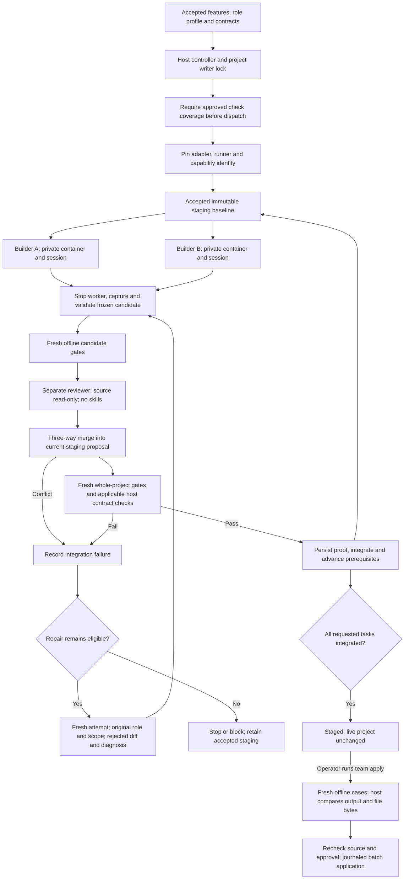
```mermaid
flowchart TD
  T["Accepted features, role profile and contracts"] --> H["Host controller and project writer lock"]
  H --> P["Require approved check coverage before dispatch"]
  P --> EC["Pin adapter, runner and capability identity"]
  EC --> S["Accepted immutable staging baseline"]
  S --> A["Builder A: private container and session"]
  S --> B["Builder B: private container and session"]
  A --> C["Stop worker, capture and validate frozen candidate"]
  B --> C
  C --> G["Fresh offline candidate gates"]
  G --> R["Separate reviewer; source read-only; no skills"]
  R --> M["Three-way merge into current staging proposal"]
  M --> V["Fresh whole-project gates and applicable host contract checks"]
  V -->|Pass| I["Persist proof, integrate and advance prerequisites"]
  I --> S
  M -->|Conflict| F["Record integration failure"]
  V -->|Fail| F
  F --> Q{"Repair remains eligible?"}
  Q -->|Yes| D["Fresh attempt; original role and scope; rejected diff and diagnosis"]
  D --> C
  Q -->|No| X["Stop or block; retain accepted staging"]
  I --> E{"All requested tasks integrated?"}
  E -->|Yes| Z["Staged; live project unchanged"]
  Z -->|Operator runs team apply| AC["Fresh offline cases; host compares output and file bytes"]
  AC --> J["Recheck source and approval; journaled batch application"]
```

Failure at candidate intake, gates or review also refuses acceptance and follows
the task's bounded retry or blocked-outcome policy. Repair repeats building,
candidate gates, review and combined checks; it has no bypass. The default is
one extra integration repair per task under journal versions 3 and 4. It retains the
original role's skills rather than automatically switching to a diagnosis role.

Each proposed integration passes its combined checks before it becomes staging.
There is no separate model-driven final approval phase: `team apply` validates
the retained source, requirements and trusted-check identities and runs the
operator-approved behaviour cases on final staging before writing.
An ordinary run follows the same frozen-candidate boundary but applies its item
without the team's serial merge, staging or batch journal.

Implementation: [controller](src/team/controller.ts), [worker](src/team/worker.ts),
[scheduler](src/team/scheduler.ts), [integration](src/team/integrate.ts).

## Ordinary implementation checkpoints

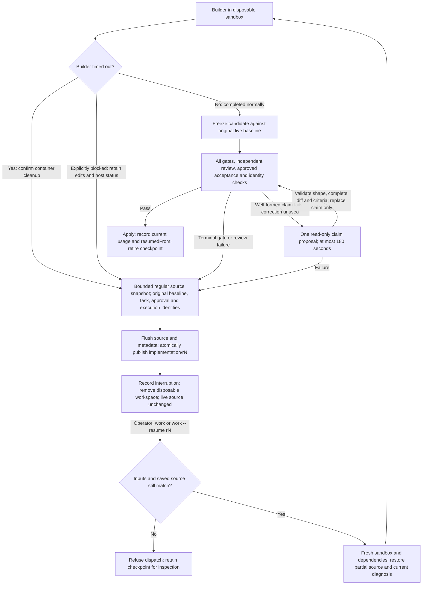
```mermaid
flowchart TD
  B["Builder in disposable sandbox"] --> T{"Builder timed out?"}
  T -->|Yes: confirm container cleanup| S["Bounded regular source snapshot; original baseline, task, approval and execution identities"]
  S --> P["Flush source and metadata; atomically publish implementation/rN"]
  P --> X["Record interruption; remove disposable workspace; live source unchanged"]
  X -->|Operator: work or work --resume rN| C{"Inputs and saved source still match?"}
  C -->|No| R["Refuse dispatch; retain checkpoint for inspection"]
  C -->|Yes| F["Fresh sandbox and dependencies; restore partial source and current diagnosis"]
  F --> B
  T -->|Explicitly blocked: retain edits and host status| S
  T -->|No: completed normally| V["Freeze candidate against original live baseline"]
  V --> G["All gates, independent review, approved acceptance and identity checks"]
  G -->|Pass| A["Apply; record current usage and resumedFrom; retire checkpoint"]
  G -->|Terminal gate or review failure| S
  G -->|Well-formed claim fails; correction unused| CR["One read-only claim proposal; at most 180 seconds"]
  CR -->|Validate shape, complete diff and criteria; replace claim only| G
  CR -->|Failure| S
```

A checkpoint is not a candidate or an acceptance proof. Publication is host-owned,
after the worker is stopped, and the saved source is never directly applied.
Restoration preserves source additions/deletions while excluding prior claims and
generated dependencies. The fresh Pi session receives the original instruction,
including the latest repair diagnosis; its original attempt number is retained.
Timeout changes are permitted, while changed inputs require restoration or an
explicit `work --fresh`. Blocked submissions also retain source; the controlled blocked-status transition updates resume identity. Repeated timeouts publish a new checkpoint before retiring
the parent. Run IDs account for published checkpoints even if record append was
interrupted. Incomplete `.pending-*` directories are not resumable.

Handled builder timeouts, explicit blocked submissions, terminal gate/acceptance failures and review failures
create checkpoints. Unexpected verification exceptions retain worker source only
after confirmed builder cleanup and before application starts. Arbitrary controller
death, builder/provider errors, partial applications and old deleted workspaces are
not recovered by this mechanism.

Claim-only correction is a separate read-only proposal with one request per run,
no skills/session and a 180-second ceiling. The host validates it against the full
original-baseline change set and requested evidence before replacing only the claim.
It reruns candidate gates before review and acceptance. Independent ordinary review
receives host-approved plan/contract context, never private acceptance commands or
the builder conversation. See [claim correction](src/agent/claim-repair.ts).

Implementation: [checkpoint store](src/workspace/work-checkpoints.ts),
[ordinary work](src/verbs/work.ts). `test/work-resume-docker.test.ts` exercises a real
Docker timeout and continuation using a deterministic fake Pi with no provider calls.

## Acceptance evidence boundary

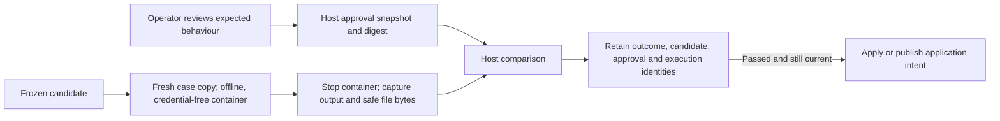
```mermaid
flowchart LR
  O["Operator reviews expected behaviour"] --> A["Host approval snapshot and digest"]
  C["Frozen candidate"] --> V["Fresh case copy; offline, credential-free container"]
  V --> X["Stop container; capture output and safe file bytes"]
  A --> H["Host comparison"]
  X --> H
  H --> E["Retain outcome, candidate, approval and execution identities"]
  E -->|Passed and still current| W["Apply or publish application intent"]
```

Expected values and approval state are not mounted by this runner. Steps in a
case share source/data; cases use fresh installations. Assertions reported by
project tests remain diagnostics; a read-only shim and lexical counter make
accidental corruption harder but cannot make a candidate's own report trusted.
Host comparison verifies declared behaviour only, not universal correctness or
resistance to a program tailored to those examples. Approval archives and result
files live under `<project>-harness/acceptance/`, outside writable agent state.
Application validates proof against the current candidate and approved checks;
failed runs retain evidence even though disposable work is removed.

Implementation: [checks and evidence](src/acceptance/checks.ts),
[setup prompts](src/verbs/checks.ts), [readiness](src/guide/readiness.ts).

## Isolation and skills

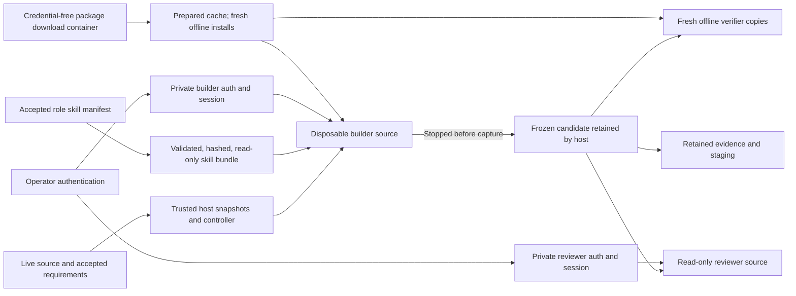
```mermaid
flowchart LR
  P["Live source and accepted requirements"] --> H["Trusted host snapshots and controller"]
  H --> W["Disposable builder source"]
  K["Accepted role skill manifest"] --> S["Validated, hashed, read-only skill bundle"]
  S --> W
  A["Operator authentication"] --> B["Private builder auth and session"]
  A --> R["Private reviewer auth and session"]
  B --> W
  W -->|Stopped before capture| C["Frozen candidate retained by host"]
  C --> G["Fresh offline verifier copies"]
  C --> V["Read-only reviewer source"]
  R --> V
  N["Credential-free package download container"] --> D["Prepared cache; fresh offline installs"]
  D --> W
  D --> G
  C --> E["Retained evidence and staging"]
```

The diagram's arrows mean host-prepared copies or read-only resources, not shared
writable mounts. Preparation and executable gates have no Pi credentials or skill
mounts; gates run with networking disabled. Builder/reviewer model calls and
package downloads use bridge networking. Model egress is not provider-restricted.
Workers never receive the live repository, another attempt's workspace, controller
state, host control socket or Docker socket.

Team skill manifests validate names, dependencies, interaction modes, tool
requirements and declared resources. Ordinary work/planning freeze role selections from `HARNESS_SKILLS`;
teams freeze declared resources from their accepted profile. All launchers disable implicit skills and
extensions. Reviewers receive no skills. Skill availability, observed read-tool
use and worker-reported workflow evidence are separate facts; none proves the
model followed every instruction.

Implementation: [sandbox arguments](src/containment/sandbox.ts),
[attempt inputs](src/team/inputs.ts), [role profile](profiles/team.json),
[skill assessment](SKILLS_ASSESSMENT.md).

## Live RPC control and cancellation

Team builders and reviewers require Pi **0.80.6**. Docker receives interactive
stdin without a TTY. Bounded UTF-8 JSONL frames and request IDs separate command
responses from lifecycle events. Completion requires valid assistant turns,
`agent_end`, `agent_settled` and a subsequent idle state with an empty queue.

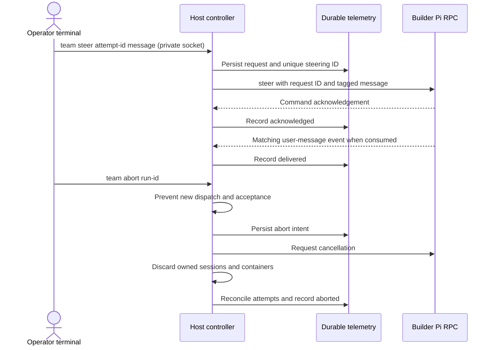
```mermaid
sequenceDiagram
  actor O as Operator terminal
  participant H as Host controller
  participant T as Durable telemetry
  participant P as Builder Pi RPC
  O->>H: team steer attempt-id message (private socket)
  H->>T: Persist request and unique steering ID
  H->>P: steer with request ID and tagged message
  P-->>H: Command acknowledgement
  H->>T: Record acknowledged
  P-->>H: Matching user-message event when consumed
  H->>T: Record delivered
  O->>H: team abort run-id
  H->>H: Prevent new dispatch and acceptance
  H->>T: Persist abort intent
  H->>P: Request cancellation
  H->>H: Discard owned sessions and containers
  H->>T: Reconcile attempts and record aborted
```

Acknowledgement and delivery can arrive in a different order; the diagram shows
a common order. Neither proves compliance with the instruction. Only active
builders accept steering, and uncertain requests are never automatically resent.
The initial abort reply says `abort-requested`; only persisted `aborted` confirms
successful cleanup. Cancellation also covers reviewer and finite-command work.
Pi 0.80.6 lacks `clear_queue`, so the host always destroys the session/container
to discard queued work instead of relying on Pi's abort acknowledgement.

The endpoint is a mode-0600 Unix socket in a mode-0700 temporary directory with
a random capability. The web viewer has no control route. Abrupt controller death
requires explicit dead-writer recovery and resource reconciliation; aborted runs
cannot resume or apply. Accepted staging and audit evidence are retained.

Implementation: [RPC transport](src/agent/rpc.ts), [control](src/team/control.ts),
[owned-container cleanup](src/containment/stop.ts).

## Application, undo and recovery

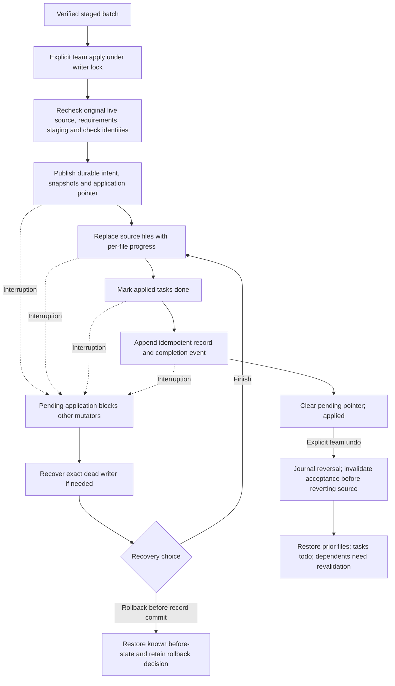
```mermaid
flowchart TD
  S["Verified staged batch"] --> A["Explicit team apply under writer lock"]
  A --> C["Recheck original live source, requirements, staging and check identities"]
  C --> J["Publish durable intent, snapshots and application pointer"]
  J --> W["Replace source files with per-file progress"]
  W --> F["Mark applied tasks done"]
  F --> R["Append idempotent record and completion event"]
  R --> D["Clear pending pointer; applied"]
  J -. Interruption .-> P["Pending application blocks other mutators"]
  W -. Interruption .-> P
  F -. Interruption .-> P
  R -. Interruption .-> P
  P --> K["Recover exact dead writer if needed"]
  K --> N{"Recovery choice"}
  N -->|Finish| W
  N -->|Rollback before record commit| B["Restore known before-state and retain rollback decision"]
  D -->|Explicit team undo| U["Journal reversal; invalidate acceptance before reverting source"]
  U --> V["Restore prior files; tasks todo; dependents need revalidation"]
```

Recovery compares actual files against retained before/after bytes and refuses
unexpected edits. It can resume any partial stage idempotently; the finish arrow
summarizes that reconciliation rather than unconditionally rewriting all files.
Rollback is refused after the application record is committed; finish recovery
and use undo instead. `team resume` finishes a pending application, but never
implicitly applies newly staged work. With no pending application, `team recover`
only reconciles workers and retained staging.

This is a recoverable sequence of file replacements, not one atomic multi-file
filesystem operation. Cooperating harness writers are excluded; external editors
can still race a final check. Team undo preserves unrelated edits, refuses edits
to batch files and has no redo. Ordinary undo restores raw bytes, merges only supported UTF-8 text and refuses
divergent binary content. Existing hard links and symlink ancestors are refused
in ordinary apply and undo before source writes.

Implementation: [application journal](src/team/apply.ts),
[writer lock](src/workspace/writer-lock.ts), [state reducer](src/team/state.ts).

## Durable state and read-only views

| Location beside the project | Meaning |
|---|---|
| `<project>-harness.writer-lock` | Canonical cooperating-writer ownership |
| `<project>-harness/ml/<id>/approved.json` | Frozen schema, split hashes/IDs, recipe, preprocessing, thresholds and job budget |
| `<project>-harness/ml/<id>/train.json`, `holdout.json` | Host-only approved data; never mounted together into workers |
| `<project>-harness/ml/<id>/state.json`, `evaluation-<hash>.json` | Saved job/model references and host evaluation results |
| `<project>-harness/jobs/<job>/state.json` | Accepted command, identities, bounded events and latest checkpoint reference |
| `<project>-harness/artifacts/manifests/` | Immutable output provenance and references |
| `<project>-harness/artifacts/blobs/` | SHA256 bytes; only unreferenced blobs can be collected |
| `<project>-harness/verify-<id>.json` | Retained verification build environment and input identities |
| `<project>-harness/project.json` | Operator-selected adapter, capabilities and skill names |
| `<project>-harness/executions/<run>/` | Ordinary execution identity and frozen skill resources |
| `<project>-harness/plans/<plan>/execution.json` | Planning execution identity; frozen skills beside it |
| `<project>-harness/teams/<run>/inputs/execution.json` | Team runner/adapter identity; authoritative copy in creation event |
| `<project>-harness/teams/<run>/events/` | Authoritative acceptance and lifecycle events |
| `<project>-harness/teams/<run>/state.json` | Rebuildable acceptance projection |
| `<project>-harness/teams/<run>/telemetry/` | Immutable phases, reported model usage and steering history |
| `<project>-harness/teams/<run>/controller.json` | Host/PID and private endpoint metadata |
| `<project>-harness/teams/<run>/abort.json` | Durable refusal of further execution/application |
| `<project>-harness/teams/<run>/attempts/` | Candidates, proposed integrations and verification evidence |
| `<project>-harness/applications/<application>/` | Immutable intents, source snapshots and application progress |
| `<project>-harness/application.json` | Pointer to a pending application or reversal |
| `<project>-harness/record.jsonl` | Applied, reversed and other ordinary run history |

`team inspect` reads acceptance state. `look` and `view` combine it with telemetry
and retained artifacts, including task roles, prerequisites, phases, gates,
review, repair, integration, elapsed time and reported builder/reviewer spend.
Interrupted reported usage survives resume; missing usage is not inferred and
in-flight calls may exceed dispatch budgets. New version 4 journals bind candidates,
component verification and integration to accepted execution identity. Older records
remain inspect/recover/undo capable; unpinned runs cannot start new dispatch or
application through the CLI. Pending application recovery remains available. Viewer
reads never rebuild state files or start recovery.

## Console implementation and verification

The original S1–S3 console stages (usage capture, browsable history and live
observation) are implemented. Their operating instructions are maintained in
[the README](README.md#reading-what-happened). Static `view` embeds file contents
and historical diffs; `view --serve` adds only the loopback read-only server.
Empty and team-only projects are visible before their first applied record. Binary and
oversized files remain listed with an explanation.

Ordinary progress uses a four-second heartbeat; status older than fifteen seconds
or a dead process is shown as stopped. Team liveness uses controller host/PID
metadata. Neither view executes project code, launches a model/container, steals
locks or performs recovery. The server serves GET `/`, `/status`, `/workspace`
and ID-scoped `/output/<artifact-id>` downloads. Status polls every two seconds,
workspace details every ten; busy ports are rejected and there are no control routes.
Display content is escaped. Ordinary status uses text updates; team cards use
host-rendered escaped HTML from the same fixed status route. Poll requests have an
eight-second timeout and do not overlap. Expanded team details are preserved;
replacement waits while keyboard focus is inside a card.

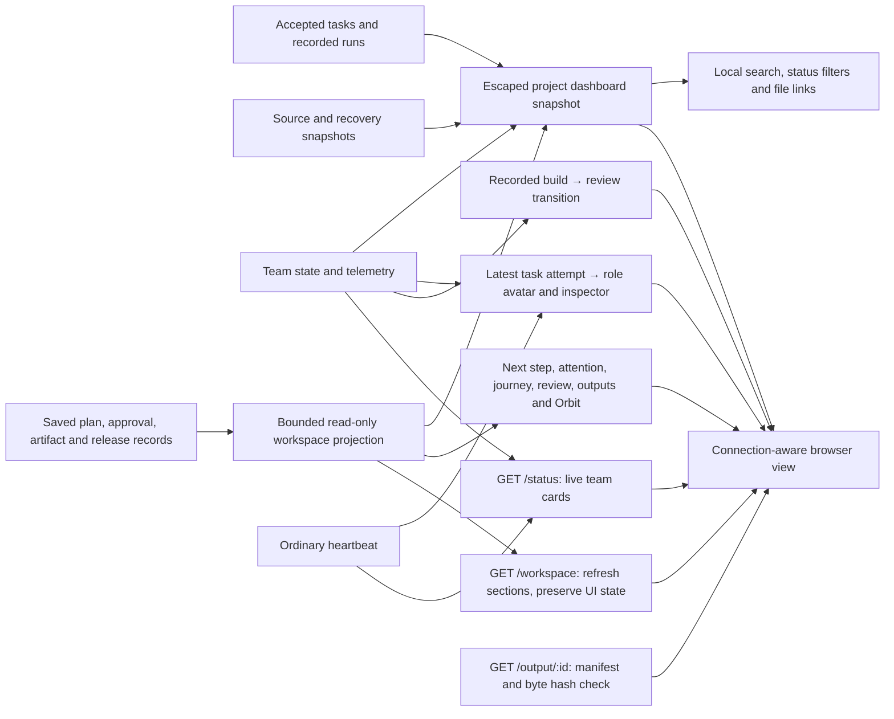
```mermaid
flowchart LR
  F["Accepted tasks and recorded runs"] --> P["Escaped project dashboard snapshot"]
  S["Source and recovery snapshots"] --> P
  T["Team state and telemetry"] --> P
  D["Saved plan, approval, artifact and release records"] --> W["Bounded read-only workspace projection"]
  W --> P
  W --> G["Next step, attention, journey, review, outputs and Orbit"]
  G --> B
  P --> Q["Local search, status filters and file links"]
  T --> O["Latest task attempt → role avatar and inspector"]
  H --> O
  O --> B
  T --> X["Recorded build → review transition"]
  X --> B
  T --> L["GET /status: live team cards"]
  H["Ordinary heartbeat"] --> L
  L --> B["Connection-aware browser view"]
  P --> B
  W --> U["GET /workspace: refresh sections, preserve UI state"]
  U --> B
  A["GET /output/:id: manifest and byte hash check"] --> B
```

Task, file and history sections refresh without a full-page reload. The client
retains search/filter controls, open details, selected files, focus and scroll.
Office controls preserve zoom, inspection and selection through scene updates. The completion
summary excludes `wont` scope, preserves blocked/waiting distinctions and reports
unreadable data. No dashboard filter writes state or dispatches work. Project
selection and mutation remain in the CLI. `view/workspace.ts` reads bounded state
without creating stores. Approved plans, import items and acceptance manifests
are digest checked. Team diffs compare retained original and combined snapshots,
canonicalizing host paths and validating per-file hashes before display. They
are bounded to 40 files, 64 KiB/1,500 input lines and 600 changed lines per file.

Artifact downloads accept only manifest IDs, refuse symlinks/hardlinks and verify
size/hash, with a 32 MiB ceiling. Small PNG previews share a 1 MiB embedding budget.
Saved HTML has no active download endpoint. Release cards display local state,
not a remote publishing claim. Orbit and the next-step card use the same pure
state-derived guidance; neither dispatches an agent or executes a command.

The office is another projection of the same read-only records. Builder/reviewer
activity requires a live controller and a matching model phase. Gates, preparation,
integration and application never create working people. Multiple active reviewers
share a visual room only; no multi-agent discussion is implied. Avatar IDs include
the team and attempt. A separate persona allocation reserves builder and reviewer
identities for every task before rendering, ordered by team/task/role. Full names
and SVG variants are unique within the roster and stable across phases, retries
and reordered input for that assignment set. Adding/removing tasks can reassign
personas. The original integer-grid artwork lives in `view/office-sprites.ts`;
role classification chooses tools and desk-screen treatment. Decorative companions
never enter the worker model and freeze with pause, disconnection, reduced motion
or snapshot mode. The latest attempt for each
assignment replaces prior attempts, and overflow remains selectable in the roster.
Ordinary runs use the existing heartbeat assessment. Saved snapshots cannot animate.

`reviewHandoffEvents` derives candidate-review transitions from ordered host telemetry
without writing new events. The browser remembers observed event IDs; only a new,
recent handoff can animate once. Reconnection and paused/reduced-motion settings
preserve the distinction between current activity and presentation. Selection survives
scene updates. The original PNG is embedded in the initial page and reused across
small escaped HTML updates; CSP allows `img-src data:` and no external image hosts.

Verification references: [workspace guidance, documents and outputs](test/guidance.test.ts),
[office projections and interactions](test/office.test.ts),
[character identities and motion](test/office-personalities.test.ts),
[usage events](test/events.test.ts),
[static viewer](test/view.test.ts), [live status and server](test/server.test.ts),
[team projections](test/team-status.test.ts), [RPC](test/rpc.test.ts), and
[controller crash recovery](test/team-controller-crash.test.ts).

## Artifact and job lifecycle (E3)

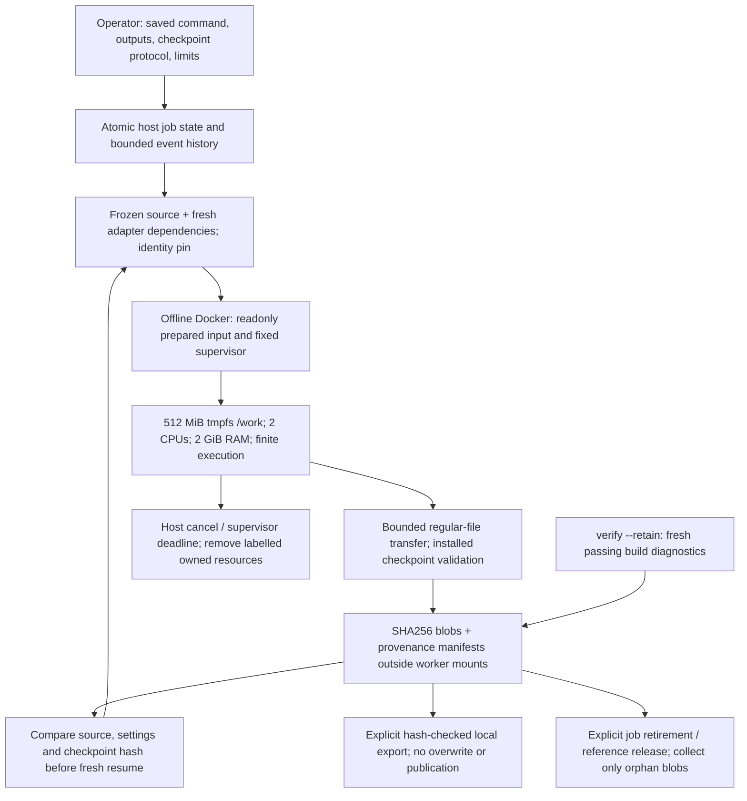
```mermaid
flowchart TD
  O["Operator: saved command, outputs, checkpoint protocol, limits"] --> J["Atomic host job state and bounded event history"]
  J --> P["Frozen source + fresh adapter dependencies; identity pin"]
  P --> R["Offline Docker: readonly prepared input and fixed supervisor"]
  R --> W["512 MiB tmpfs /work; 2 CPUs; 2 GiB RAM; finite execution"]
  W --> C["Bounded regular-file transfer; installed checkpoint validation"]
  C --> A["SHA256 blobs + provenance manifests outside worker mounts"]
  A --> U["Compare source, settings and checkpoint hash before fresh resume"]
  U --> P
  W --> K["Host cancel / supervisor deadline; remove labelled owned resources"]
  V["verify --retain: fresh passing build diagnostics"] --> A
  A --> E["Explicit hash-checked local export; no overwrite or publication"]
  A --> G["Explicit job retirement / reference release; collect only orphan blobs"]
```

The job controller owns source snapshots and accepted declarations in sibling state.
A worker gets a read-only prepared input plus a bounded tmpfs; generated data never
writes into host project source. Fixed transfer code reads bounded regular files;
no worker archive is extracted on the host. Job output is unverified, while retained
verification builds are labelled diagnostics-passed. Neither status is independent
application acceptance or publication. Ordinary and team source application remain
unchanged except for the new source-file size and generated-format refusals.

Reservations charge the full declared attempt allowance before launch, even on early
exit or controller loss. The supervisor enforces a second execution deadline and
keeps tmpfs alive for at most 60 seconds for transfer. The host normally cleans it
sooner. SIGKILL recovery checks saved ownership labels and environment before
removing resources; a compatible checkpoint is required for another attempt.
See [JOBS.md](JOBS.md) for protocol, quotas, retention and operator commands.

## CPU regression and protected evaluation (E4)

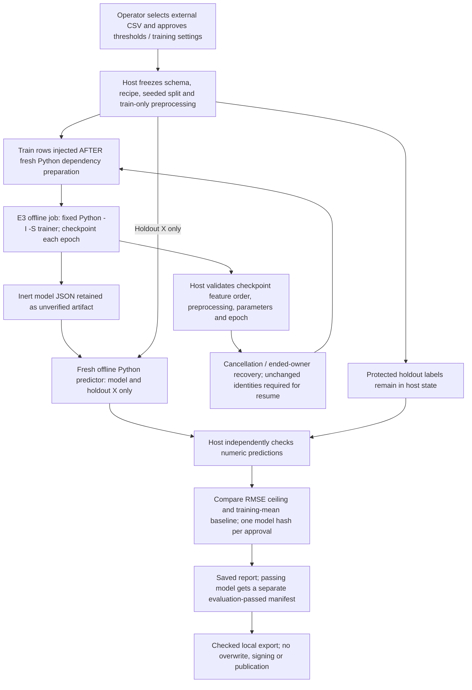
```mermaid
flowchart TD
  O["Operator selects external CSV and approves thresholds / training settings"] --> H["Host freezes schema, recipe, seeded split and train-only preprocessing"]
  H --> T["Train rows injected AFTER fresh Python dependency preparation"]
  H --> Y["Protected holdout labels remain in host state"]
  T --> J["E3 offline job: fixed Python -I -S trainer; checkpoint each epoch"]
  J --> C["Host validates checkpoint feature order, preprocessing, parameters and epoch"]
  C --> R["Cancellation / ended-owner recovery; unchanged identities required for resume"]
  R --> T
  J --> M["Inert model JSON retained as unverified artifact"]
  M --> F["Fresh offline Python predictor: model and holdout X only"]
  H -->|Holdout X only| F
  F --> P["Host independently checks numeric predictions"]
  Y --> P
  P --> Q["Compare RMSE ceiling and training-mean baseline; one model hash per approval"]
  Q --> E["Saved report; passing model gets a separate evaluation-passed manifest"]
  E --> X["Checked local export; no overwrite, signing or publication"]
```

The fixed trainer bypasses project imports and Python dependency startup hooks.
No protected labels or ML state directory are mounted during training, dependency
preparation or inference. Recipe source hashes and approval hashes bind jobs;
changed data or settings cannot silently reuse a checkpoint. Evaluation metrics
are host computations, independent of training/project reports. A transient
inference infrastructure failure can retry only the same model. Quality failure
consumes that model's evaluation and retains the failed result.

The guide reads these same saved approvals and jobs; it adds no parallel lifecycle
store. Retirement releases artifact references while retaining host-only data and
audit records. See [ML.md](ML.md) for numerical tolerances, leakage limitations,
retention, the supported CSV/JSON schemas and the exact runnable example.

## Packaged Linux desktop verification (E6)

The desktop lane keeps the existing Node adapter for source work and adds an
explicitly prepared Electron/Playwright/ASAR/Xvfb image. `desktop setup` stores the
reviewed journey and immutable image/toolchain/protocol identity outside source.
`desktop verify` freezes the current source, packages it twice using fixed tools
without executing application code, and compares the ASAR bytes. A fresh offline
container assembles the pinned runtime with that package and drives one window.

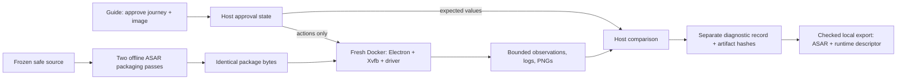
```mermaid
flowchart LR
  G["Guide: approve journey + image"] --> A["Host approval state"]
  S["Frozen safe source"] --> P["Two offline ASAR packaging passes"]
  P --> B["Identical package bytes"]
  B --> V["Fresh Docker: Electron + Xvfb + driver"]
  A -->|"actions only"| V
  V --> O["Bounded observations, logs, PNGs"]
  A -->|"expected values"| C["Host comparison"]
  O --> C
  C --> R["Separate diagnostic record + artifact hashes"]
  R --> E["Checked local export: ASAR + runtime descriptor"]
```

Only the disposable workspace is writable; fixed instrumentation and action/package
inputs are read-only. No provider credentials, host display socket or Docker socket
enter the container. The driver and app main process share that container, so host
comparison does not make GUI observations independent acceptance evidence. A passing
package is `diagnostics-passed`. Ordinary source acceptance/application stays separate.

Saved runs bind source, approval, image and tool versions, package/report hashes,
container ownership and status. Ctrl-C and bounded deadlines stop execution; recovery
checks ownership before removing resources after a controller crash. A rerun starts
from a fresh app, not a partial GUI checkpoint. Artifact release protects unreleased
desktop references; guide and `look` read these saved records directly. The separate
macOS VM lane is described below; Windows remains unimplemented. See [DESKTOP.md](DESKTOP.md) for Linux limits and image preparation.


## Reviewed local release preparation (E9a)

Release drafts select an existing diagnostic/evaluated artifact, verify its bytes,
and retain a separate manifest reference. The draft binds original provenance,
snapshot identity, name/version and local destination, including parent-directory
identity. Approval covers that exact manifest digest. Expected product quality is
inherited from the original workflow and is not re-evaluated by staging.

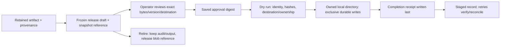
```mermaid
flowchart LR
  A["Retained artifact + provenance"] --> D["Frozen release draft + snapshot reference"]
  D --> R["Operator reviews exact bytes/version/destination"]
  R --> P["Saved approval digest"]
  P --> V["Dry run: identity, hashes, destination/ownership"]
  V --> S["Owned local directory: exclusive durable writes"]
  S --> C["Completion receipt written last"]
  C --> J["Staged record; retries verify/reconcile"]
  D --> T["Retire: keep audit/output, release blob reference"]
```

`src/releases` owns these records; guide and `look` read them directly. Stage uses
the existing project writer lock and never mounts or executes artifacts. A killed
controller can resume completed writes; foreign contents, changed destinations
and missing ownership cause a refusal. The receipt is the completion boundary,
not directory creation. A copied release artifact remains retained independently
of its producing job/workflow until retirement. Local staging has no credential path; the separate GitHub backend is described below. See [RELEASES.md](RELEASES.md) for local filesystem limits.

### Maintained static asset evidence

Acceptance probes can import `/harness-checks/assets.mjs`. parse5 handles HTML,
Acorn handles JavaScript and CSS Tree handles CSS. Static same-origin references
are traversed with bounded requests and retained raw response bodies, including
binary assets. Database and sidecar snapshots can be compared by containment
against all responses before and after reads. Dynamic browser behaviour is an
explicit evidence limit, not a static-parser claim.

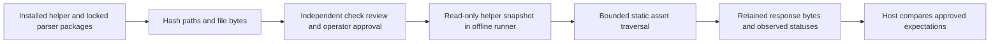
```mermaid
flowchart LR
  Installed[Installed helper and locked parser packages] --> Pin[Hash paths and file bytes]
  Pin --> Review[Independent check review and operator approval]
  Review --> Mount[Read-only helper snapshot in offline runner]
  Mount --> Assets[Bounded static asset traversal]
  Assets --> Bytes[Retained response bytes and observed statuses]
  Bytes --> Host[Host compares approved expectations]
```

`assetRuntime` is separate from `serverRuntime`, preserving old server-only
receipts. The runtime snapshot includes transitive dependencies and licenses.
It never resolves against candidate node_modules. Stale or missing pins fail
before approval or execution. Dependency upgrades need a fresh review and approval
for affected checks. The helper does not execute browser scripts or replace
operator-approved application assertions.

### Scoped repair-response recovery

Ordinary scoped reviews and explicit retries share one code-replacement path;
ordinary repair no longer relies on exact before/after text matching. A host
checkpoint saves each model code-repair reply before interpreting it.
The strict replacement schema still permits only a one-based step and complete
inline source. A malformed reply receives at most one separate format correction;
it cannot change commands, expectations, the contract or another case. Semantic
no-op failures do not spend a format request. Both responses remain available for
diagnosis under `acceptance/repair-responses`.

Checkpoints bind exact proposal, findings, request prompt, helper digests and
explicit retry epoch. Started requests are saved before dispatch, so crashes cannot
silently replenish budgets. The scope ledger records the pending repair kind,
charged attempt and findings. Resume finishes that same attempt before charging
another, even at the final attempt. Explicit renewal clears the pending marker
and advances the retry epoch; it cannot silently reuse an exhausted request.
Received responses are reused after interruption.
Independent syntax and behavioural reviews still follow; no reply cache approves
checks or changes application code.

### Data-only acceptance recipes

The first recipe catalog entry is `node-web-sqlite@1`. Routine check logic is
maintained in the harness, not generated separately for each project. The catalog
strictly validates settings, compiles a fixed runner command and pins the recipe,
shared server/asset helpers and parser dependency bytes. `recipeRuntime` identifies
that implementation. The host validates typed observations returned by the runner;
commands, pins or extra model-authored expectations cannot override the recipe.

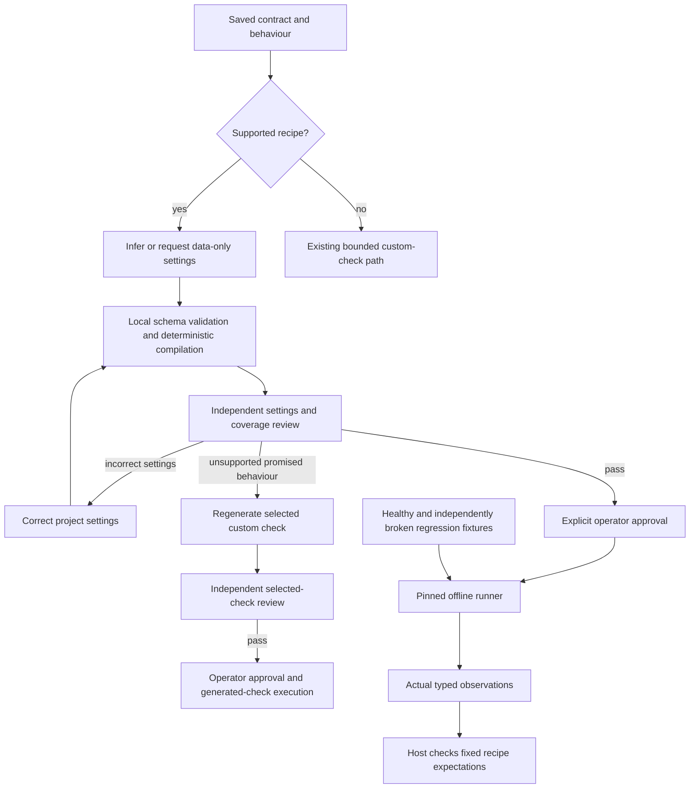
```mermaid
flowchart TD
    Plan[Saved contract and behaviour] --> Match{Supported recipe?}
    Match -->|yes| Settings[Infer or request data-only settings]
    Settings --> Schema[Local schema validation and deterministic compilation]
    Schema --> Mapping[Independent settings and coverage review]
    Mapping -->|incorrect settings| Edit[Correct project settings]
    Mapping -->|unsupported promised behaviour| Regenerate[Regenerate selected custom check]
    Regenerate --> CustomReview[Independent selected-check review]
    CustomReview -->|pass| CustomApproval[Operator approval and generated-check execution]
    Edit --> Schema
    Mapping -->|pass| Approve[Explicit operator approval]
    Approve --> Run[Pinned offline runner]
    Run --> Observe[Actual typed observations]
    Observe --> Host[Host checks fixed recipe expectations]
    Fixtures[Healthy and independently broken regression fixtures] --> Run
    Match -->|no| Custom[Existing bounded custom-check path]
```

Settings reviews do not generate or repair executable source. A reported mismatch
stops before a code-repair request. Saved mappings are reused only for their exact
candidate, runtime pin, task/source fingerprints and unchanged base approval. A
migration archives the original check, replaces only its selected scope and preserves
unrelated review receipts. Operator approval and application execution remain separate.

The runner samples same-origin static assets, configured public APIs, actual and
standard SQLite-family paths, and wrong Host/Origin requests. It retains raw bodies
for containment comparisons against snapshots before and after reads. Bounds and
unsupported static references fail explicitly. This does not prove browser rendering,
all possible routes/encodings, cryptographic properties, or application lifecycle
behaviour; those requirements still need their own checks or source/browser evidence.

Automatic recipe routing recognizes only complete catalogue descriptions, including
legacy exact aliases. Unknown or compound descriptions follow generated preparation;
keyword overlap cannot replace domain observations with fixed recipe evidence.
`checks regenerate <case-id>` checkpoints a single replacement and its independent
review in `acceptance/regenerations/<case-id>.json`. It binds the unchanged task/source,
base draft, contract, coverage, case identity and approval digest, preserving peer
receipts. A passing replacement is archived and committed to review progress only
after freshness checks; approval remains a separate operator action. Failed or
interrupted generation leaves the original draft intact, and a saved candidate is
reused after review interruption. Each explicit invocation is bounded to two provider
requests and 360 seconds, with a 180-second per-request cap. Rejected candidates are
archived on retry; model format corrections share the same allowance.

Output inclusion expectations accept one string or a list of strings. The host
requires every fragment independently, in addition to any exact output constraint.
Approval fingerprints include the full list. Targeted repairs must match exactly
once within one fragment and preserve all others; malformed or empty lists fail
schema validation before approval or execution.


### Acceptance dependency and preparation ownership

Preparation and simplification finish one executable case through independent review
before generating another. Their durable ledgers survive provider interruptions;
only changed scopes are reviewed again. Request admission reserves a useful configured
window before spending another request. Provider/timeout failures remain recorded
spend but are separate from generated-response and format-defect budgets.

`acceptance/regression.ts` resolves approved completed transitive prerequisites.
`requireChecks`, candidate verification and proof validation use that expanded scope.
New outlining receives prerequisite descriptions through `dependency-context.ts`;
actual fresh execution is required before application, so reuse does not mean trusting
an old pass. Builder contract context includes those prerequisite contracts.

See [the architecture review](docs/acceptance-architecture-review.md) for evidence,
tradeoffs, the updated flow and the remaining typed-scenario/browser boundaries.

## Isolated browser diagnostics

The browser controller (`src/browser/`) runs a read-only source snapshot in a
network-none app container. A separately owned Chromium container joins only
that network namespace and mounts harness instrumentation, action instructions
and its output folder. Expected values remain on the host. Journey approval
pins runtime and protocol; results bind source, approval and runtime identities.
Host comparisons and bounded artifacts record observed UI behaviour without
substituting for source acceptance. Cancellation and explicit recovery verify
container labels, token and immutable image before removal. See [BROWSER.md](BROWSER.md)
for boundaries and supported actions. Native/mobile/GPU runners remain separate.


## GitHub draft delivery and explicit publication

The host consumes one staged release, freezes repository/tag/commit and payload
hash into a separately approved manifest, and obtains GitHub credentials only
for the outbound delivery operation. Source builders and containers receive none.

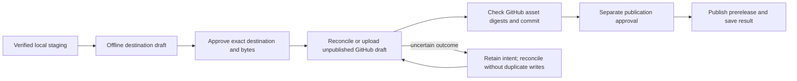
```mermaid
flowchart LR
  S[Verified local staging] --> D[Offline destination draft]
  D --> A[Approve exact destination and bytes]
  A --> U[Reconcile or upload unpublished GitHub draft]
  U --> V[Check GitHub asset digests and commit]
  V --> P[Separate publication approval]
  P --> R[Publish prerelease and save result]
  U -->|uncertain outcome| C[Retain intent; reconcile without duplicate writes]
  C --> U
```

The API transport is restricted to GitHub.com API/upload hosts. Intent records
precede external mutations, so uncertain outcomes never prompt blind recreation.
Foreign releases or modified assets stop delivery. Local byte verification does
not prove commit-to-artifact provenance, and remote checks are not atomic with
publication. See [RELEASES.md](RELEASES.md) for tested scope and recovery limits.


## Native macOS script diagnostics

`src/native/` is a separate diagnostic lane; it does not replace the Docker runner
used by ordinary implementation and acceptance. Preparation uses a source-free
trusted macOS VM. Registration requires real offline boundary fixtures before a
profile becomes available to project checks.

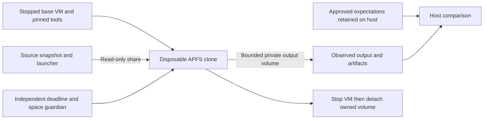
```mermaid
flowchart LR
  B[Stopped base VM and pinned tools] --> C[Disposable APFS clone]
  S[Source snapshot and launcher] -->|Read-only share| C
  C -->|Bounded private output volume| O[Observed output and artifacts]
  E[Approved expectations retained on host] --> H[Host comparison]
  O --> H
  G[Independent deadline and space guardian] --> C
  C --> X[Stop VM then detach owned volume]
```

The network device terminates in a pinned frame dropper; no network path is
forwarded. A saved global slot and project writer lock serialize native work.
The guardian bounds orphan lifetime; explicit recovery checks the ended
controller's PID and resource ownership. Results are diagnostic, not independent
acceptance: project code can fabricate its own output. See [NATIVE.md](NATIVE.md)
for image identity caching, disk limits and deferred platform capabilities.

### Packaged macOS GUI lane

The macOS Electron controller stages a bounded source snapshot and harness-owned
GUI actions in a derived native job. Expected UI text/counts never enter that
job. A pinned GUI base supplies Electron, Playwright and ASAR; the guest packages
the app twice, runs the `.app`, and produces observations and window screenshots.
After native VM cleanup, the host checks those observations and rechecks source
identity. The outer GUI record retains its native child identity for recovery.

```mermaid
flowchart LR
  A[Approved GUI journey] --> H[Host expected results]
  S[Source snapshot] --> J[Derived native job]
  A -->|actions only| J
  J --> V[Offline macOS VM]
  V --> P[Package and exercise Electron app]
  P --> O[Observations and screenshots]
  O --> C[Host comparison]
  H --> C
  C --> R[GUI diagnostic record]
```

GUI preparation uses a source-free clone, transfers pinned tools as an archive,
flushes the disk and shuts the guest down before registration. Native boundary
checks and positive/negative GUI fixtures gate activation. Native GUI diagnostics
remain separate from project `work` verification and from signing/distribution.

## SwiftUI/AppKit diagnostic lane

The native UI controller stages a bounded source copy, approved build entry and
application path, and harness-owned Swift accessibility driver. It reuses the
native VM controller rather than starting host applications. Each guest compiles
and grants permissions to the driver at one fixed guest path. Only actions enter
the guest; expected values stay in host approval state.

```mermaid
flowchart LR
  A[Approved build path and UI journey] --> H[Host controller]
  S[Source snapshot] --> V[Offline disposable macOS VM]
  H --> V
  V --> B[Build .app and Swift AX driver]
  B --> U[Accessibility actions and window screenshot]
  U --> O[Bounded retained observations]
  O --> C[Host expectation comparison]
  C --> R[Diagnostic record and export]
```

Runtime receipts bind the native profile and this driver's protocol. Validation
requires real SwiftUI/AppKit journeys and a persistence mutation. Source acceptance
remains separate because driver and app share a guest. Records under `apple-gui`
link to native ownership/recovery state; `look` and project removal account for
active native UI runs. See MACOS_NATIVE.md for build and evidence limits.

## Metal training and checkpoint recovery

`src/metal/` composes bounded native jobs without changing the native isolation
protocol. Only harness-owned Swift kernels, approved training rows and a verified
checkpoint enter a segment. The VM must complete both Metal error and gradient
kernels for every epoch; there is no CPU training fallback.

```mermaid
flowchart LR
  A[Approved external CSV and settings] --> T[Frozen training split]
  A --> H[Protected host holdout]
  T --> V[Offline native VM: Metal segment]
  C[Last verified checkpoint] --> V
  V --> G[Host identity and progress validation]
  G --> C
  V -->|Interrupted| R[Owned recovery; discard unfinished segment]
  R --> C
  C -->|All epochs complete| E[Host holdout evaluation]
  H --> E
  E -->|Quality goal passed| X[Inert JSON model export]
```

A state write reserves each attempt before dispatch. Completed checkpoints and
attempt status are committed together with atomic state replacement. A child
native result can be promoted after a dead controller is recovered, otherwise
only the last completed checkpoint survives. Reservations stay spent. Runtime,
data and settings identities prohibit mismatched resumption. The first evaluated
model hash is frozen, including after quality failure. See [METAL.md](METAL.md)
for supported data, budgets, validation and shared-GPU limits.


## PyTorch CPU recipes

The PyTorch registry dispatches fixed recipes through the existing job controller.
It preserves linear-regression recipe identity. An approval pins external JSON
data, its protected split, training-only normalization, quality ceiling, image and
recipe hash. Only training rows enter the offline container. PyTorch is installed
in the pinned system image, invoked with `-I`; project packages are not imported.

```mermaid
flowchart LR
  A[Data and resource approval] --> S[Immutable training / holdout split]
  S --> T[Offline CPU job: classifier or k-means]
  T --> C[Atomic complete JSON checkpoint]
  C --> R[Host-retained checkpoint]
  R --> T
  T --> M[Inert numeric model]
  M --> E[Host inference and quality comparison]
  S --> E
  E --> P[Evaluated JSON export]
```

Classifier checkpoints include Adam and scheduler state, parameters, both RNGs,
sampler order/cursor and update progress. No pickle is loaded. The CPU-only exact
recovery test compares full state across fresh processes and detects a deliberate
optimizer-reset mutation. Job crash recovery retains ownership, stops the owned
container and resumes only validated saved state. No saved update means no silent
restart. Evaluation freezes the first candidate; only quality-passed exports get
evaluated provenance. Clustering compactness does not establish semantic quality.

The bounded LoRA experiment loads only pinned safetensors with remote code disabled
and verifies fresh-process checkpoint recovery. It is not a general user-corpus
training controller. The source-free Mac VM probe installs pinned Python/PyTorch
in an owned clone with offline networking and an external guardian. It records
numerical failures as incompatibility evidence, never as training readiness.
See [PYTORCH.md](PYTORCH.md) for measured results and limitations.

## Protected product requirements and evidence

`product setup` is an optional operator step after accepting items. It indexes
existing task requirements, saved plan context and approved interface contracts
in `<project>-harness/product/approved.json`. It does not create a second editable
plan. Optional source documents are pinned by content hash. Completion status and
role assignment do not alter requirement identity; scope, priority, criteria and
interface choices do. Approval previews are checked again when saved.

```mermaid
flowchart TD
  R["Accepted tasks, plan context, interface choices"] --> P["Operator reviews product kind and verification needs"]
  D["Optional protected source documents"] --> P
  P --> S["Host-owned product specification"]
  S --> B["Baseline, candidate, staging and resume enforce identity"]
  B --> G["Existing independent review and acceptance gates"]
  V["product verify: offline diagnostics and approved behaviour"] --> E["Source-bound evidence"]
  W["Real browser observations and artifact provenance"] --> E
  H["Explicit human assessment"] --> E
  S --> Q["product report: current, stale, failed, missing or human"]
  E --> Q
```

Protected documents cannot change in builder candidates, even in shared-inputs
assignments. Staging and implementation checkpoints carry product identity.
Changing approved requirements stops dispatch/application until `product setup`
is reviewed again. Existing projects without a product approval retain their
current workflow.

`product verify` reuses the adapter's offline diagnostics and approved acceptance
runner with no provider call. Starting a diagnostic run invalidates the previous
pass; interruption cannot leave that pass appearing current. Applicable tests,
collection, type and build checks retain their actual verdicts, including skipped
checks. Acceptance evidence must cover the current source and current approval.
The report re-evaluates saved browser observations against their journey, checking
artifact provenance, rather than trusting a run's status label.

This is product evidence, distinct from `doctor` environment readiness. It is
not a release authorization. Linux/macOS desktop evidence can now be selected and
aggregated, as can selected CPU/PyTorch/Metal model evidence. ML application
integration and security/performance assessments remain explicit gaps; their existing runners continue to work. A human assessment never
turns those unaggregated lanes
into automatic passes. Source, profile or requirement changes invalidate affected
evidence, and missing evidence never becomes success because an item is done.

## Optional Git worktree delivery

The host worktree controller is an optional layer around ordinary task builds.
It does not replace source snapshots, containment, independent review, acceptance
proofs or implementation checkpoints. The primary repository must have a clean
checkout on a branch, accepted work items and approved checks for the selected task.

```mermaid
flowchart TD
  P["Primary checkout: clean committed base"] --> W["Host creates task branch and linked checkout"]
  W --> C["Copy approved controls; no historical evidence"]
  C --> B["Pi works in a disposable source copy without Git metadata"]
  B --> G["Existing gates, separate review and host acceptance"]
  G --> T["Apply to task checkout; explicit verified commit"]
  T --> I["Detached integration of current target and task tip"]
  I --> V["Fresh diagnostics and acceptance for completed tasks"]
  V -->|Pass and identities unchanged| F["Fast-forward target to verified merge commit"]
  V -->|Failure or conflict| R["Retain task and integration; leave primary unchanged"]
  F --> D["Explicit cleanup of clean merged checkouts; retain branches/evidence"]
```

State is held under `<project>-harness/worktrees/<id>/state.json`, alongside the
managed checkout and separately named integration attempts. Control fingerprints
bind task semantics, interface approvals, model settings, environment profile and
optional product specification. Status transitions do not change task semantics.
Changes to approved controls require a fresh task worktree, preserving old work.
No approval is inferred from a prior checkout's records.

Branch builds own their usual checkout writer, so independent tasks can build
concurrently. Git mutations hold the primary writer and the selected task writer.
A saved `verified` integration records target HEAD, task tip and merge commit
before fast-forward; recovery validates these identities and clean checkouts.
Failed, interrupted and conflicting integration attempts are never force-reset.
Commands disable hooks, filesystem-monitor commands, signing prompts and global
attributes, reject repository attributes/filters and submodules, and do not make
network requests. Tests include actual Git branches, interrupted merge stages,
refused cleanup, changed approvals/source and offline Docker regression rejection.

## Selected evidence foundation (E1)

A product specification may include a versioned `evidence` scope containing up to
16 required approval/runtime references. Absence preserves the legacy report;
an empty scope cannot waive a desktop/ML requirement. Scope changes alter the
protected product digest and require operator approval. Selection lists Linux
Electron, macOS Electron and SwiftUI/AppKit journeys separately. ML workflow approvals are selected separately for CPU regression, PyTorch CPU
and Metal regression.

```mermaid
flowchart LR
  J[Approved journeys] --> S[Product selection and pinned runtime]
  R[Runner records and retained artifacts] --> A[Bounded read-only adapter]
  S --> A
  A --> V[Validate bytes, provenance and raw observations]
  V --> E[Outcome plus current/stale/missing applicability]
  E --> P[Product report and next action]
  E --> H[Human assessment bound to selected evidence digest]
```

`src/product/evidence/` separates the scope/result contract, bounded consistent
file reader and first desktop adapter. Runner-native records remain authoritative;
no second mutable pass flag is stored. A matching run is selected by source,
approval and runtime, then ordered by recorded time. Ambiguous equal timestamps
are refused. A newer incomplete attempt without a captured source blocks fallback.
Other source versions remain historical; unrelated approvals are not requirements.

The Linux adapter recomputes journey comparisons from observations, validates
package and screenshot references, and checks the current harness driver protocol.
It verifies artifacts' hashes and producer/input/environment identities. Passing
saved assessment flags alone are insufficient. Required unsupported providers
cannot pass and never convert to skipped. Artifact cleanup invalidates references;
aggregation does not secretly retain another copy. No native process or provider
is invoked while reporting. Inspection has limits of 256 directory entries,
1024 file references and 128 MiB read bytes, with per-file artifact limits retained.
Concurrent modifications invalidate the snapshot before publication.

These are packaged GUI diagnostics. They do not replace independent acceptance,
prove universal accessibility, authenticate a malicious host operator, or authorize
a release. ML subjects and recovery chains are described below.


## Native desktop evidence aggregation (E2)

`src/product/evidence/native.ts` reads both Mac GUI formats without invoking
runtime discovery or provisioning. It validates pinned profile metadata and the
current harness protocol, resolves the latest matching source/approval/runtime,
and recomputes raw journey comparisons. Names and bytes identify the app package,
observation report and each required PNG. Duplicate names and malformed selected
records fail closed. Historical evidence keeps the exact approved OS/runtime;
reporting makes no claim about what is currently installed on the host.

```mermaid
flowchart TD
  P[Product target selection] --> G[Mac GUI approval and run]
  G --> C[Copied package, observations and screenshots]
  G --> N[Linked native run and script approval]
  N --> O[Original native artifacts and exit/output observations]
  C --> M[Match producer, source, environment and copied hashes]
  O --> M
  N --> K[Require completed native execution and cleanup]
  M --> A[Recompute approved GUI comparisons]
  K --> A
  A --> R[Product evidence with native execution references]
```

The original child records live within the GUI run's `candidate-harness` state.
They remain part of the bounded, consistent read set: copying files into the outer
artifact store does not erase their lineage. The native check must be the GUI
controller's declared entry/output/package contract, not an arbitrary build-only
script. Its run must have completed and released its output mount. The host
rechecks observed exit and stdout and does not adopt stored assessment booleans.
A changed or missing child invalidates the outer evidence. The shared report's
human assessment digest includes the native execution/artifact references.

Real opt-in coverage:

```sh
HARNESS_VERIFY_PRODUCT_MACOS=1 node --test test/product-macos-process.test.ts
```

This executes positive and deliberately wrong expectation journeys for Electron, SwiftUI and AppKit in the installed offline VM.
Interrupted test runs retain their ownership state for recovery. Fixtures exercise
corruption, runtime/approval mismatch, substitution, missing screenshots and cleanup.


## ML evidence aggregation (E3)

The ML adapters use the same bounded, consistent reader. They validate the exact
selected workflow, frozen deterministic split, train-only preprocessing, recipe,
immutable image or native profile, job identity and artifacts. CPU/PyTorch models
are inert JSON; host arithmetic recomputes held-out predictions and comparisons.
Metal validation additionally reconstructs each fixed segment's source identity,
including approved training input and previous checkpoint, and resolves the native
script approval, artifact provenance, exit/stdout observations and cleanup.

```mermaid
flowchart TD
  P[Selected ML approval and runtime] --> D[Frozen split and training preprocessing]
  D --> T[Training job or native segment chain]
  T --> M[Exact model and evaluated artifact]
  D --> H[Host numeric holdout comparison]
  M --> H
  H --> Q[Quality metrics and limitations]
  T --> C[Checkpoint completeness]
  T --> R[Interruption, checkpoint and resumed attempt links]
  R --> F[Recovery claim tied to evaluated model]
  Q --> S[Product report]
  C --> S
  F --> S
  I[Application integration remains separate and missing] --> S
```

New recipe jobs retain `jobs/<id>/recovery/attempt-N.json` before launch and update
it after dispatch and confirmed cleanup. These host records pin source, spec,
execution identity, image, input/output checkpoint IDs, progress and outcome.
Controller recovery completes the retained attempt record; it never fabricates
records for older attempts. Aggregation checks the complete chain and validates
all referenced checkpoint artifacts. Only observed interruption followed by resumed
progress to the evaluated model can pass recovery. Uninterrupted-reference
numerical equivalence is not inferred. The separate fixed Metal validation trial
uses its existing 0.00001 tolerance, not a new bitwise-GPU assumption.

Quality, checkpoint, recovery and application integration are distinct required
rows. Model identity is independent of application source. An integration row is
source-bound but remains missing until a supported source-and-model integration
proof exists. That gap cannot be waived by a general human assessment. Older job
records remain usable for quality but lack demonstrated recovery unless they
contain sufficient lineage. Reporting runs no containers, models, VMs or downloads.

The normal suite uses labelled deterministic fixtures. Opt-in real tests are in
`test/product-ml-process.test.ts`: `HARNESS_VERIFY_PRODUCT_ML=1` enables CPU/PyTorch
training and cancellation/resume; `HARNESS_VERIFY_PRODUCT_METAL=1` enables the
existing bounded native interruption/recovery validation plus aggregation. These
require configured immutable local runtime images; no provider calls occur.
