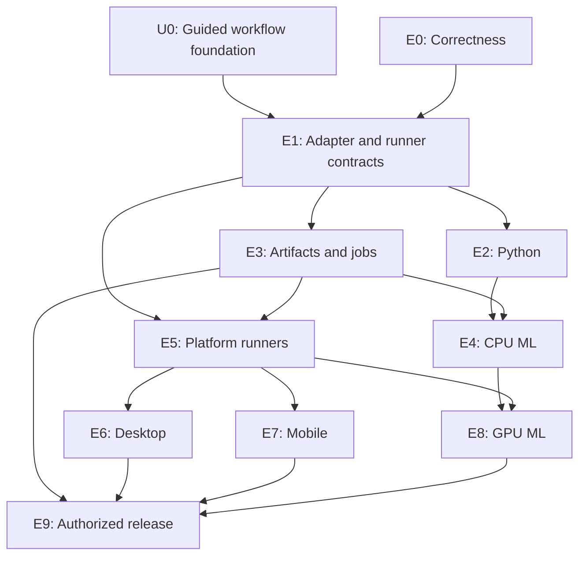

# Harness expansion development plan

Status: E0 and the initial U0 guided journey implemented; expansion milestones remain planned.
Updated 2026-09-12. See README.md for shipped commands and limitations.

Delivered in E0/U0: strict reviewer schema, byte-preserving ordinary undo,
canonical writable-state and hard-link protections, read-only assertion
instrumentation, required operator-approved behaviour checked on the host,
retained acceptance evidence, `guide`, `doctor`, and short check-setup prompts.
Deterministic terminal/Docker tests cover the complete initial journey and
interrupted planning; a human usability trial and advanced guided team/backlog
operations remain U0 follow-up. No new project language or platform is supported
yet. The controller remains Node/TypeScript.
Baseline: agent-harness main at d5662c1, including team M0–M6 and durable planning.

## Objective

Extend the existing harness from Node-focused execution into verified Python, desktop, mobile and ML workflows. Support means the harness can prepare a reproducible environment, execute the project, collect useful verification evidence, retain outputs, recover from interruption, and clearly state what was and was not verified. Generating source code alone does not qualify a platform as supported.

Build on the existing planner, accepted feature list, skills, isolated workers, candidate checks, independent review, team integration, staging and journaled application. Preserve the Node workflow while extending it. The controller remains TypeScript; target-project languages do not require rewriting the controller.

## User experience is a delivery requirement

The operator should be able to describe a goal, make understandable decisions,
review results and continue work without learning the harness internals. Guided
use is part of correctness and acceptance in every milestone, not a final layer
added after platform support.

Keep two compatible ways to work:

- The `harness guide` CLI entry point for ordinary use, with saved progress and
  contextual next actions. Future platform-specific actions remain proposed.
- Explicit commands and structured results for experienced operators, scripts
  and CI. Interactive prompts must not make unattended commands hang.

The first implementation remains CLI-first. Improve the existing read-only web
view for observation where useful. A writable web console is a separate decision;
it is not necessary to make the CLI understandable.

### U0 — Guided workflow foundation

Start U0 alongside E0, and deliver its first complete journey before declaring
E1 complete. Continue extending the same journey in every later milestone.

1. **Discover and select.** Show the selected project and saved state. Help the
   user create a new project or resume an existing one. Project selection must
   be explicit before mutation, especially when the shell directory and a
   configured project differ. A project index must not become a second,
   contradictory source of lifecycle state.
2. **Check readiness.** Report which prerequisites are ready, missing or expired,
   with one relevant remedy at a time. Detect missing Docker, unsupported
   toolchains and authentication failures before expensive dispatch where
   possible. Never request tokens in conversation. Installing tools or opening
   a provider login must be an explicit action with its purpose explained.
3. **Plan conversationally.** Use the selected interview skills, save answers as
   work progresses, show an editable summary, and request approval of concrete
   scope. Pass approved documents to subsequent stages automatically. The user
   should not retype criteria or paste the same specification into a new session.
4. **Explain the proposed work.** Present each task in plain language, including
   prerequisites and what done means. Offer supported edit, defer and drop
   actions. Keep detailed JSON and internal paths available as optional detail.
5. **Start with a clear effect.** Before execution, state whether success will
   apply changes directly or retain them for review, and show the selected
   resource limits. Explain known cost estimates and unknown usage without
   presenting a budget as a guaranteed final bill.
6. **Show useful progress.** Display the current phase, active task, last
   meaningful activity, completed checks, retries and reason for waiting.
   Distinguish working, waiting for input, blocked, stopped and finished. A
   spinner alone is not sufficient. Do not invent time-to-completion estimates.
7. **Explain outcomes.** On completion, summarize what changed, what was checked,
   what remains unverified, and the relevant next actions: preview, apply,
   continue, revise or undo. Use readable task names in normal interaction;
   retain stable run IDs for advanced commands and audit records.
8. **Recover in context.** After interruption, show the saved project and stage
   and offer continuation from them. Locate the correct recovery record without
   requiring the user to copy tokens or paths. Validate process ownership and
   dead-owner recovery rules before acting; never steal a live writer lock.
   A recovery must explain whether it resumes work, restores files or discards
   an attempt. Preserve explicit commands for operators who need them.
9. **Keep actions proportionate.** Do not repeatedly ask for decisions already
   settled or for routine reversible steps already authorized. For destructive
   actions and publication, show the exact project/artifact, destination and
   consequence before requesting any necessary approval. Never turn a vague
   acceptance into authorization to publish unrelated work.

### Usability acceptance

Test complete operator journeys, not only command parsing. At each milestone,
include the new capability in the guided workflow and use a fresh project for
at least one end-to-end trial.

Required foundation scenarios:

- A first-time user selects a project, checks readiness, completes a short
  interview, approves tasks, starts work and understands the result without
  opening source code or hand-editing JSON.
- An existing user resumes a saved plan without re-entering answers, manually
  locating a session file, or copying the specification between stages.
- A missing dependency or expired login produces a comprehensible explanation
  and actionable next step. After the remedy, progress continues from saved
  state rather than restarting the project.
- Timeout and controller-crash scenarios preserve context and guide the user
  through valid recovery. Active-writer conflicts clearly identify the work
  already running; they cannot be dismissed as stale without evidence.
- Before the relevant action, the user can distinguish staged changes, applied
  changes, a Git commit, and an externally published artifact.
- Empty or deferred queues do not start unintended work. Deferred deployment
  remains deferred until the operator deliberately enables it.
- A keyboard-only, plain-text terminal session works without reliance on color,
  animation or a wide screen. Long output has a concise summary and optional
  details. CI receives stable exit codes and machine-readable outcomes.
- Removing a project lists its actual source and associated state, preserves
  unrelated projects, and accurately reports partial cleanup or permissions
  that prevented completion.

Record completion rate, observed confusion, repeated input, manual file/path
copying, number of recovery steps and time to the first useful result. Set
numerical targets after measuring the current workflow; do not invent a baseline.
For the happy path, repeated specification entry and required manual JSON editing
must both be zero. Automated CLI/PTY tests cover known failure paths; a short
operator walkthrough checks whether the explanations make sense to a human.

A milestone with working internals but an unfinished or confusing operator
journey is not complete. Document any remaining advanced-only operation clearly.

## Delivery sequence

| Milestone | Deliverable | Depends on |
|---|---|---|
| U0 | Guided workflow foundation; extended throughout delivery | Starts alongside E0; first journey required by E1 |
| E0 | Correctness and verification hardening | Existing main |
| E1 | Project adapters and runner capability contract | E0 |
| E2 | Reproducible Python projects | E1 |
| E3 | Artifact storage and long-running jobs | E1 |
| E4 | CPU-based ML workflows | E2, E3 |
| E5 | Isolated platform runners | E1, E3 |
| E6 | Desktop application verification | E5, Node adapter |
| E7 | Mobile application verification | E5, Node adapter |
| E8 | GPU training workflows | E4, E5 |
| E9 | Controlled release and distribution | Relevant platform milestone, E3, E5 |

Recommended execution order: U0 alongside E0, then E1 → E2 → E3 → E4 → E5 → E6 → E7 → E8 → E9. U0 continues as a required operator journey in each later milestone.
E6, E7 and E8 can be reprioritized after E5 based on the next real project and available hardware. Each milestone is a separate reviewable delivery, not one large implementation branch.

The release milestone is implemented incrementally for supported artifact types; a desktop release need not wait for GPU support.

## E0 — Correctness before expansion

### Deliver

1. Strictly validate reviewer response structure. Missing or malformed finding arrays cannot become an empty passing review.
2. Make ordinary undo byte-preserving for binary files. Restrict three-way text merging to supported text and refuse ambiguous binary conflicts.
3. Reject overlapping live-project and writable-state mounts across every launcher, including canonical aliases and ancestor paths. Extend the planning-path protection to ordinary work and other applicable entry points.
4. Refuse unsafe existing hard links or replace destinations using an explicitly verified fresh-inode strategy. Audit both ordinary application and undo.
5. Replace the writable assertion-count file as sole proof that verification happened. Separate runner-reported execution from independent acceptance evidence. Protect harness instrumentation and approved check sources from candidate mutation.
6. Keep the planning timeout/session/crash checks as regressions; add automated terminal-mode coverage to complement the existing direct terminal probe.

### Evidence design constraint

A candidate process can fabricate its own files and output, and a positive assertion count does not prove meaningful coverage. Moving the same count into stdout is not a sufficient fix. Before coding the replacement, define which signals are trusted, how they are produced, and what claim each permits. Use controller-owned, approved acceptance checks in separate verification environments where independent evidence is required. If that evidence is unavailable, report the relevant capability as unverified rather than converting an untrusted report into proof. Document the migration impact for existing Node projects.

### Acceptance

Reproduce the five unresolved review findings before fixing them. Afterward: malformed reviews cannot pass; binary undo restores exact bytes; unsafe aliases and links cannot change external files; forged counters cannot satisfy proof-required verification; and timeouts stop owned containers while preserving resumable state. Existing legitimate Node workflows must still pass their declared checks. Test the tests by disabling each important protection temporarily and observing the expected failure.

### Demo

A disposable Node project with text and binary fixtures, a malformed reviewer fixture, and intentionally forged test output. No platform expansion is required to prove this milestone.

## E1 — Explicit project adapters and runner capabilities

### Deliver

Introduce versioned contracts for project detection, runtime/toolchain identity, dependency preparation, source exclusions, test discovery, execution evidence, builds and output artifacts. Extract the current Node/npm implementation behind the contract. Pin the selected adapter and its configuration into run state so resume cannot silently switch environments.

Introduce a runner interface implemented first by the existing Linux Docker backend: prepare, execute, inspect, cancel, cleanup, export evidence. Record required capabilities separately from project language: OS, architecture, toolchain, GUI, emulator, CPU/RAM, GPU and network policy.

Extend the existing `harness doctor` readiness report into a versioned capability report and explicit project configuration. Integrate these into the U0 guided journey rather than requiring users to interpret configuration files. Auto-detection may suggest an adapter; ambiguous projects must request a selection. No worker may expand its own permissions by editing project configuration. Select and freeze skill bundles appropriate to the accepted project/role; record availability separately from actual workflow evidence.

### Acceptance

Node ordinary work and team execution produce equivalent outcomes through the adapter. Unknown adapter versions, unavailable capabilities, and changed resume configuration fail before dispatch. A fake second adapter tests the contract without adding an unsupported runtime. Environment identity reaches candidate, integration and run records.

## E2 — Python support

### Deliver

Support one Python package root, a pinned Python runtime, one documented dependency-input format, hash-pinned dependencies, isolated dependency downloads and fresh offline installation. Keep arbitrary install/build scripts controlled. Start with supported wheel-based dependencies; explicitly block unsupported source builds and local/Git dependencies until their policy exists.

Provide pytest collection and result ingestion using the E0 evidence policy. Distinguish no collected tests, all-skipped tests, failing tests, malformed reports and missing independent checks. Python verification must not depend on the Node assertion hook. Support a defined library/CLI packaging path and adapter-appropriate claim validation.

### Acceptance

Build a Python CLI through plan → accepted items → work/team → verification → application → undo. A fresh environment reproduces the result. Deliberately failing, skipped-only, empty and fabricated-report fixtures produce the correct non-passing outcome. An edited lock input cannot reuse an incompatible cache. No host Python environment is used as proof.

### Demo

A small Python file-analysis CLI with deterministic fixtures, validation errors, and a packaged output.

## E3 — Artifacts and long-running jobs

### Deliver

Separate application source from generated outputs: wheels, archives, installers, APKs, datasets, training checkpoints and model weights. Start with a local content-addressed artifact store and manifests containing hashes, producing run, environment, input identities and verification status. Never apply large binaries or datasets as ordinary source diffs by default.

Add job lifecycle events, progress, checkpoints, cancellation, resource quotas and resumable job declarations. A checkpoint is an output until the adapter validates that it matches the current job and inputs. Track reported and unknown compute costs separately; budgets stop dispatch or jobs according to an explicit policy rather than claiming exact billing control.

### Acceptance

A killed long-running fixture resumes only from a compatible checkpoint. Corrupted artifacts and changed input identities are rejected. Cancellation removes owned resources while keeping declared recovery outputs. Bounded retention and explicit cleanup cannot delete artifacts referenced by active runs. Artifact success does not automatically imply publication.

## E4 — CPU ML workflows

### Deliver

Add a Python-based training/evaluation workflow with versioned dataset manifests, data schemas, immutable split definitions, deterministic seeds where supported, baseline models, approved metrics, evaluation thresholds and model artifacts. Pin evaluation specifications before training; training workers cannot rewrite the acceptance metric or inspect a protected holdout set. Keep ordinary code tests separate from model-quality evaluation.

Record preprocessing, dependency versions, dataset identities, hyperparameters, limitations and measured results. Use tolerances rather than assuming every numerical result is byte-identical across platforms. Make train/test leakage checks part of the fixture suite; no generic checker can prove the absence of all leakage.

### Acceptance

A small classifier or regressor trains, exports, loads in a fresh process and passes a protected evaluation against a baseline. Deliberately leaked data, a changed holdout, degraded predictions, fabricated metrics and mismatched preprocessing are rejected by the applicable checks. Training interruption resumes from validated state. No GPU is required.

## E5 — Isolated platform runners

### Deliver

Add explicitly provisioned runner profiles for macOS, Windows and Android-emulator-capable environments, preserving workspace separation, credential boundaries, lifecycle records, cleanup and capability checks. Prefer disposable VMs or dedicated resettable execution environments. Do not silently replace a Linux container with unrestricted commands on the operator’s desktop.

Document the actual threat model for each backend: a dedicated account is not automatically equivalent to container or VM isolation. Transfer only approved source, locked dependencies and declared artifacts. Bind job identity to runner ownership and resource accounting. Native verification should normally be credential-free; release credentials belong to E9.

### Acceptance

Each backend passes its own boundary and lifecycle suite: inaccessible unrelated files, no undeclared credential access, resource limits where promised, confirmed cancellation and cleanup, and recovery after runner/controller loss. Unsupported isolation requirements produce an unavailable capability. A profile file alone is not evidence that a platform is supported.

### Infrastructure checkpoint

Confirm available hardware, OS images and operating costs before implementation or provisioning. Apple builds require a compatible macOS/Xcode environment; accelerated Android emulators require an appropriate host/hypervisor configuration. See the primary references below. Do not assume the current Docker setup can provide those capabilities.

## E6 — Desktop applications

### Deliver

Support one explicit stack first: Electron using the Node adapter plus native runner capabilities. Begin with a tested Linux application; add Windows and macOS packaging only as their runners pass E5. Add application launch, GUI interaction, persistence, restart, error handling and packaged-application checks. Capture screenshots and logs as artifacts for operator review.

### Acceptance

A small local notes application is built, packaged, launched from its package, exercised through its GUI, restarted and checked for persisted data on every declared supported OS. A passing Node unit suite alone cannot mark the desktop application verified. Unsigned local packages are sufficient here; signing and publication are separate.

## E7 — Mobile applications

### Deliver

Support React Native as the initial mobile stack. Add Android toolchain/dependency identity, reproducible builds, emulator installation and interaction tests first. Add iOS simulator builds only after the macOS runner and relevant Xcode tooling are verified. Include mobile-specific resources, logs and screenshots in evidence.

Keep platform-native builds and tests separate from JavaScript component tests. Device-only capabilities, real-device testing and store distribution must be labelled separately from emulator/simulator support.

### Acceptance

A small offline notes app builds, installs, launches, saves data, restarts and passes UI interactions in Android emulation; repeat on an iOS simulator before declaring iOS simulator support. Native build failure, a missing permission or broken persistence must stop acceptance even when JavaScript tests pass.

## E8 — GPU ML jobs

### Deliver

Extend E4 with an explicitly supported GPU backend. Capture GPU model, driver and relevant runtime versions in environment identity. Enforce declared GPU/CPU/RAM/disk and wall-clock limits, job ownership, cancellation, checkpoint compatibility and artifact transfer.

Start with one small training workload on one approved GPU environment. Multi-node/distributed training and large-model pretraining are outside the first GPU milestone. Provisioning or paid compute requires a concrete infrastructure choice and authorization.

### Acceptance

A bounded GPU training fixture completes, checkpoints, is interrupted, resumes correctly, and exports a model that passes independent evaluation. Driver/runtime incompatibility, incompatible checkpoints and exhausted resource limits produce explicit outcomes. No claim of exact reproducibility or cost accounting where the backend cannot provide it.

## E9 — Controlled release and distribution

### Deliver

Define release manifests binding an approved artifact hash to a destination, version and required credentials. Separate build/verification from signing, upload and publication. Use narrowly scoped release credentials only in the release phase. Present a concrete artifact and destination for operator approval, then record the external result.

Implement one release target at a time: a desktop package destination, Android distribution, Apple distribution, or model registry. Respect existing user-authorized automation policies; do not add repetitive confirmation to every reversible development step. External publication may not be reversible, so record actual rollback possibilities rather than promising a universal undo.

### Acceptance

A dry run and staging-target test verify artifact identity and destination. A substituted artifact, missing authorization, wrong destination or expired credential prevents release. Retries must reconcile uncertain external outcomes and avoid duplicate publication. No signing secrets appear in worker prompts, logs, source snapshots or ordinary verification environments.

## Cross-cutting work

- Update planning templates to produce adapter-compatible tasks, tests and dedicated shared-input assignments. Preserve the saved plan → items → accepted tasks handoff across every adapter.
- Add edit/defer/drop workflows for feature items so operators need not hand-edit the backlog; revalidate dependencies after edits. A `should` priority alone is not a manual publication hold.
- Add bounded browser/service fixtures for relevant web/GUI projects. External integrations use approved test services or mocks; offline unit checks do not claim to verify production services.
- Surface missing verification, unknown spend, unavailable capabilities and manual visual checks clearly in `look`, `view` and run records.
- Keep existing journal versions readable; introduce explicit migrations or refuse unsupported resume safely. Never silently reinterpret historical acceptance.
- Maintain a supported-capability matrix and a reproducible demo for each released adapter/backend combination.
- Keep the main harness free of new runtime dependencies unless a specific exception is reviewed. Target toolchains live in their accepted execution environments.

## Completion rule for every milestone

1. Define the bounded change and acceptance criteria before implementation.
2. Add meaningful regression/acceptance fixtures and confirm relevant failures before the fix.
3. Implement in an isolated development copy; preserve current Node behavior.
4. Run applicable unit checks and configured end-to-end verification with no silent skips.
5. Include negative cases, timeout/cancellation and recovery where the lifecycle changes.
6. Run a small real project demonstration; report model usage and distinguish it from deterministic test fixtures.
7. Complete and test the guided operator journey, including progress, errors, recovery and the next action. Perform a short usability walkthrough and record any manual assistance required.
8. Update commands, configuration, migration guidance, architecture diagrams and limitations.
9. Review the result before beginning the next milestone. Commit/push when requested or otherwise explicitly authorized.

No fixed line-count or calendar promises are assigned. Estimate each milestone after its design checkpoint and environment prerequisites are known. If a backend cannot meet a stated guarantee, narrow the declared support rather than relaxing the guarantee silently.

## Initial delivery boundary

Start with E0 and the U0 guided workflow foundation. E1 and E2 are the next foundation milestones; completing E2 gives us a usable second ecosystem before committing to native or GPU infrastructure. E3 and E4 then make CPU ML practical. Later milestones remain staged commitments, with infrastructure decisions made before dependent work starts.

Initially excluded: arbitrary languages/frameworks, npm/Python monorepos, Flutter, Rust/Tauri, native Swift/Kotlin application recipes, distributed training, unrestricted worker-spawned agents, and automatic production publication. These can be separate future adapters or capabilities rather than implicit promises of this roadmap.

## Primary references for platform and evaluation constraints

- Android Developers: [Emulator acceleration requirements](https://developer.android.com/studio/run/emulator-acceleration). Emulator-capable execution needs a compatible host and virtualization arrangement.
- Apple Developer: [Xcode system requirements](https://developer.apple.com/xcode/system-requirements). Select supported macOS/Xcode combinations when provisioning Apple runners; do not freeze a version choice in this roadmap.
- scikit-learn: [Common pitfalls and data leakage](https://scikit-learn.org/stable/common_pitfalls.html). Separate evaluation data before learning preprocessing, and validate the complete inference pipeline.

Local implementation references: `src/workspace/dependencies.ts`, `src/gates/tests.ts`, `src/gates/test-collection.ts`, `src/pipeline.ts`, `src/team/worker.ts`, `src/planning/store.ts`, and `src/verbs/plan.ts`. Language support includes environment, evidence and artifact contracts, not only assertion counting and test collection.
