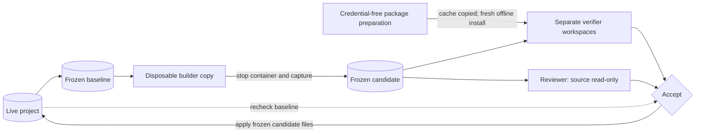

# agent-harness

A coding agent that works in a sandbox, proves what it built, then applies
it — or escalates to you.

Ordinary `work` applies one verified item. `team run` now coordinates accepted
role assignments with one or two builders, repairs failed integrations, and
retains verified results in staging. Explicit `team apply` writes the completed
batch through a recoverable journal. `TEAM_PLAN.md` is the active roadmap toward
assigned agents in isolated containers with verified integration.
`TEAM_M0_RESULTS.md` through `TEAM_M6_RESULTS.md` record the team milestones;
the original v2 milestone documents remain historical evidence.

```
npm run add  -- feed --title "RSS feed" --criterion "feed.xml is generated from site data"
npm run work
```

```
taking the next must: feed
tests: passed, 139 assertions executed
test collection: all 12 test files are collected
build: reproducible, committed artefacts match their sources
size: 10 files, 430 lines, within ceilings
claim: all 5 criteria point at real files
boundary: 10 files, all inside the project
review: passed, 5 criteria accounted for
  added    feed.xml
  added    src/render-feed.js
  ...
applied as r5. undo with: npm run undo -- r5
```

## The guarantee

> **The model works only on a copy. Nothing reaches your repository until
> the machine has proved it, and nothing that reaches it is irreversible
> or unrecorded.**

This is deliberately *not* "the model cannot act". The predecessor to this
project put a human approval in front of every byte the model wrote. It
worked, and it produced **76 lines of application code in a full working
day** across 135 approvals. Human review in the critical path is both the
guarantee and the ceiling.

So the trade here is explicit: the model reads what it needs and writes
what it likes, inside a container it cannot escape, and the burden moves
from *approving every change* to *proving every change and being able to
reverse it*. `THREAT_MODEL.md` states what that costs, including the six
residual risks, first among them that the whole guarantee rests on one
container boundary.

## Architecture

The container is the whole guarantee. Everything else exists to decide
what may cross back out of it.




`undo r1` reverses any of it later, three ways, keeping whatever ran after.


Three things that diagram is making precise:

- **Your project never enters the container.** A copy does. That is what
  lets the model have real tools without the blast radius.
- **The gates have no network.** A verification that can reach the network
  can pass because a service was up and fail because one was down, and
  neither outcome is about your change.
- **The reviewer is a separate process, not a sub-agent.** One running
  inside the builder's session would already believe every justification
  that produced the diff.

## Requirements

- **Node ≥ 26** — the harness runs TypeScript directly by type-stripping;
  there is no build step and no runtime dependency.
- **Docker**, with a Linux daemon.
- **[Pi](https://github.com/earendil-works/pi)**, installed
  and authenticated with a provider. Pi supplies the agent loop; this
  project supplies the boundary, the gates, the reviewer and the record.

## Setup

```bash
npm install && npm link
cp .env.example .env      # then edit it
```

`npm link` puts `harness` on your PATH so you run it inside your own
project. Settings are read from `~/.config/harness/config` or the
harness's own `.env` — never from the project directory, because a
project is a place a model has been writing and config decides how a run
is contained.

`.env.example` explains every value. The three that are required —
the container image, Pi's package directory, and Pi's data directory — are
refused loudly with a remedy if they are missing, rather than defaulted.

Then prove the boundary is real, against your actual Docker daemon:

```bash
npm run verify:boundary
# boundary verified: non-root, no host filesystem, no capabilities,
# no Docker socket, read-only container, writable copy only
```

## Dependencies

The builder and verifiers receive dependencies installed from a fixed
`package.json` and `package-lock.json`. The host's and worker's
`node_modules` are never used as verification evidence or applied back.
A dependency-free project may omit the lockfile. The initial preparation
policy supports one package root, npm lockfile versions 2/3 and
integrity-pinned HTTPS artifacts. Workspaces, Git/local dependencies and
shrinkwrap files stop with `environment-blocked` rather than falling back.

A separate container downloads package artifacts with installation scripts
disabled. It receives only the fixed package inputs, no Pi credentials or
skills. A fresh offline `npm ci` proves the prepared cache is usable. Every
executable gate then gets its own source copy, cache copy and offline
installation. Tests cannot alter the source or dependencies a later gate
uses. These are the clean-install properties described by [npm ci](https://docs.npmjs.com/cli/v11/commands/npm-ci/).

The environment key includes both package files, the immutable image,
container Node/npm versions and platform, installation flags and script
policy. Cache misses, lock mismatches and unsupported requirements are
recorded as `environment-blocked`, with no review or application.

Installation scripts default to denied. The harness checks both lock
metadata and unpacked package manifests. An operator can set
`HARNESS_NPM_SCRIPTS=allow` to exercise required scripts during the offline
proof and each offline installation. Scripts that change candidate source
are refused; dependency and generated outputs may be produced. Credentials
are absent and networking remains disabled during those scripts.

`HARNESS_NPM_FLAGS` accepts a JSON array containing `--legacy-peer-deps`,
`--install-links` or `--no-bin-links` when the lockfile needs them. Other
installation flags are refused. A dependency-free environment skips installation but still records the
container runtime in its identity.

Dependency manifests and shared contracts need a dedicated assignment:

```bash
harness add update-deps --shared-inputs --title "Update locked dependencies" --criterion "The locked environment installs offline and all checks pass"
```

This sets `kind: "shared-inputs"` in `features.json`. Ordinary assignments
that change package manifests, lockfiles or protected contracts become
blocked change requests. Contracts default to `contracts/`; set
`HARNESS_CONTRACT_PATHS` to a JSON array of other protected paths.
Accepting a shared-input update creates a new environment/candidate version
and conservatively marks other completed work for revalidation. Candidates
record their baseline and environment identities and cannot accept against
a changed live baseline. Fine-grained ownership arrives with the controller.

Dependencies are still not installed into the operator's project implicitly.
After application, `work` reports missing local dependencies and points to
`harness deps --install`.

`harness deps` on its own only reports. `--install` runs `npm install` in
your project — **the one command in this tool that reaches outside a
container**, which is why it takes a deliberate second word. Installing a
package runs whatever install scripts it ships, with your permissions,
outside every boundary the rest of this maintains.

## Extensions

Off for the builder, interactive planner and reviewer — `--no-extensions`.
All three launchers share this resource policy.

Pi discovers extensions from its own data directory, which the harness
mounts writable, and an extension can register tools and flags. The whole
argument here rests on knowing what the model can do, and "whatever
happens to be installed" is not knowing. The harness previously said
nothing either way, which meant discovery was live and silent.

If they are ever wanted they get the same treatment skills did: a
read-only mount, off by default, named in the output.

## Skills

Pi loads skills — directories containing a `SKILL.md` — and the harness
can mount a directory of them into the builder, read-only:

```bash
HARNESS_SKILLS=~/Developer/agent-skills npm run work
```

```
skills: codebase-design, diagnosing-bugs, domain-modeling, tdd
```

The harness always passes `--no-skills` to disable implicit discovery.
When a directory is configured, it additionally passes `--skill /opt/skills`;
Pi still loads explicitly selected paths with discovery off. This matters:
`--skill` alone adds to global and project skills rather than replacing them.
The same rule applies to interactive planning.

The printed names are folders found by the harness scanner. Pi validates
the definitions and advertises their descriptions; full instructions are
loaded on demand. A printed name does not prove that a skill was used.
`npm run verify:skills` checks this behavior with the pinned Pi loader.

**The reviewer never gets skills**, even when the builder does. Its job is
fixed, and a skill could redefine what it finds acceptable — the one
opinion here that must not depend on what is installed.

**A skills directory inside the project is refused**, because it would be
in the copy too, where the model could rewrite the instructions it is
then given.

Choose skills that fit the run: interview skills belong in `plan`, where
a human can answer. `disable-model-invocation` only hides a skill from the
model catalog; it does not classify every human-dependent workflow. The
current builder still receives the whole configured directory. Role-specific
selection and adapted unattended skills are planned before team execution.
`SKILLS_ASSESSMENT.md` records the current compatibility gaps.

## The seven verbs

Run them inside your project.

| | |
|---|---|
| `harness init` | create a project the gates can work with |
| `harness plan [<topic>]` | an interview, in the sandbox, to settle criteria |
| `harness add <id> …` | put an item on the feature list |
| `harness add --from latest` | import the items a plan proposed |
| `harness work [<id>]` | build the next Must, or a named item |
| `harness look` | what happened, what is pending, what escalated and why |
| `harness show <run-id>` | the exact diff a run applied |
| `harness view [--open]` | the whole record as a page you can read |
| `harness view --serve` | the same page, watching a run as it happens |
| `harness undo <run-id>` | put it back |
| `harness run [--max N]` | work items until one needs you |
| `harness commit [<run-id>]` | commit what a run applied — never pushes |
| `harness deps [--install]` | packages a run declared but did not install |
| `harness remove <path> --yes` | a project and its harness state, together |

`work` with no argument takes the next Must from `features.json`. The
project is the directory you are in, or `HARNESS_PROJECT` if you set it.

## Start to finish

```bash
mkdir ~/Developer/site && cd ~/Developer/site
harness init
harness plan "what this website should be"
harness add --from latest
harness work
```

### The chain

```
plan  ──►  PLAN.md + items.json  ──►  add --from  ──►  features.json  ──►  work
interview      the interview's         you read it        the backlog        build
               conclusions,            and accept
               machine-readable
```

`plan` writes its work items twice: as prose in `PLAN.md`, and as JSON in
`items.json`. Import the second rather than retyping the first:

```bash
npm run add -- --from <project>-harness/plans/<stamp>/items.json
```

**The model still never writes `features.json`.** It proposes; you run the
command that accepts. That is the same shape as `work` — propose inside
the sandbox, then a gate before anything lands — except the gate here is
you reading the list. Read it: a proposal comes from a model that has just
spent an interview agreeing with you.

A proposed `status` is discarded rather than trusted. Status is the
harness's own verdict, reached through the gates and the reviewer, and an
item importable as already done would let a model mark its homework before
doing it. An import that clashes with an existing id writes nothing at
all, rather than landing half a backlog.

### Why there is a sixth

The plan said five, and the sixth earns the exception by closing a gap the
five could not. `work` demands acceptance criteria and offers no help
writing them, while everything downstream — the reviewer's judgement,
whether an escalation means anything — rests on how good they are. `add`
takes whatever string you type.

`plan` runs Pi **interactively**, with your terminal attached to the
container, so an interview skill can ask a round of questions and wait for
your answers. `work` cannot do this: it runs with `--print`, one prompt in
and one answer out, with nobody to wait for.

Nothing a `plan` run does is ever applied. The model works in a disposable
copy and writes one file, collected to `<project>-harness/plans/` rather
than into the project. A plan is a document to argue with, not a change,
and it faces none of the gates because it changes nothing they could
check.

The containment is identical to every other run — verified by asserting
that an interactive argument list differs from a one-shot one by exactly
`--interactive` and `--tty` and nothing else.

## Prerequisites, blocked work and revalidation

`harness work` selects the highest-priority eligible item, preserving list
order within a priority. All of its `dependsOn` items must be `done`.
Explicit `harness work <id>` also enforces prerequisites before creating a
sandbox or starting Pi. Missing references, self-dependencies and cycles
are rejected when the feature list is read, added to, or imported; a cycle
is reported as a path such as `api -> client -> api`.

An empty queue is different from a waiting queue. `look` and `view` show
unfinished prerequisites, blocked items and items needing revalidation.
The automatic queue excludes blocked and won't-have items. Existing
no-change results are stepped over, except when revalidation is required.

A builder that needs a decision writes this to `.harness-claim.json`:

```json
{
  "outcome": "blocked",
  "reason": "The deployment region has not been approved.",
  "requestedInput": "Which deployment region should be used?"
}
```

Both text fields must be nonempty. The host records the blocked result,
marks the item `blocked`, and destroys the sandbox without review or
application. Partial edits are discarded. `look` and `view` show the
reason and requested input. Resolve the input in the task's requirements
or project context, then retry with `harness work <id>`. Ordinary claims
remain compatible; they may optionally specify `"outcome": "completed"`.

Undoing a prerequisite or accepting a rerun that changes its files marks
completed downstream items `needs-revalidation`, transitively. Their code,
criteria and run history remain available. Restoring a prerequisite does
not restore downstream acceptance. Revalidation follows dependency order
and must pass all applicable gates and a fresh review, even with no code
changes. An explicitly retried blocked item follows the same review rule.

M2 also checks live source and requirements against the starting baseline
before acceptance and again before application. The final check is not a
writer lock: a concurrent edit after it is still a race. Ordinary single-item
source application,
run recording and status updates retain their existing failure semantics.
Mutating commands now share a writer lock; M5 adds a recoverable application
journal for explicit team batch application and batch undo.

## How a run works

1. **Select and freeze.** Prerequisites are checked first. The harness
   captures source and requirements identities in a host-owned baseline,
   then creates a disposable worker copy from that baseline. The
   project itself is never mounted. Withheld from the copy, and announced
   rather than dropped silently: `.git`, `features.json`, `.harness`,
   `.secure-harness`, `.env`, `.env.local`, `.ssh`, `.aws`, `.gnupg`,
   `.npmrc`, `.netrc`.
2. **Build.** Pi runs in the container with tools enabled and the
   provider's network. It reads what it needs and writes what it likes —
   to the copy. A valid blocked submission stops here and records the input
   needed; the remaining gates, review and apply are skipped.
3. **Freeze and prove.** The worker container is stopped before output is
   captured. Paths, symlinks, scope and shared-input permissions are checked
   before creating a frozen candidate outside the worker directory. Each
   executable gate receives a fresh disposable verification workspace,
   with clean dependencies and no network or provider credentials. The first answers two
   questions, and the second is the one people forget to ask:

   - the test suite passes;
   - **assertions actually ran** — a suite that asserts nothing has not
     passed in any sense you care about;
   - every test file is one the runner actually collects;
   - the project typechecks, where it declares a typecheck;
   - the build is reproducible, so committed artefacts match their sources;
   - the change is within its ceilings;
   - the claim the model wrote matches what actually changed.

   A failing gate hands the model a **named diagnosis** — what failed, why
   it matters, what would count as fixed — and it gets one more attempt.
   Never a log to guess from.
4. **Review.** A second Pi process mounts frozen source read-only, with no
   skills and no shared context with the
   builder, judges the diff against the item's acceptance criteria. It
   answers two questions: is each criterion actually satisfied, and is
   anything here unaccounted for? It passes silently or escalates to you.
5. **Apply.** Recheck the live baseline and candidate identity, then apply
   only frozen candidate files. Test-generated files never become source.
   Recovery snapshots and append-only records carry the resulting change.
   Host-owned attempt manifests live under `<project>-harness/candidates/`.
6. **Destroy.** The sandbox goes, on every path, including a crash.

## Running unattended

```bash
harness run --max 5
```

Works items until the queue empties or **something needs a person** —
an escalation, a gate that failed twice, an empty queue. It stops there
rather than starting the next item on top of an unexamined one. That is
the whole discipline: an escalation nobody reads while later work builds
on it is exactly the failure the reviewer exists to prevent, and
automating past it would undo the point.

It is safe to run unattended only because every guarantee holds per item.
Each is copied, gated, reviewed, snapshotted and applied on its own, so
five items are five of those rather than one large one.

## Git

The model never sees git. `.git` is not in the sandbox copy, so history
cannot be rewritten, a branch cannot be moved, and no commit can be made
that looks like yours.

`harness commit` runs on the host, when you ask, and only ever adds a
commit — no push, no branch, no amend. The message records what the work
was meant to satisfy and what proved it:

```
Truncate text to a length

Applied by the harness as r2.

  tests: passed, 6 assertions executed
  test collection: all 3 test files are collected
  claim: all 3 criteria point at real files
  review: pass
```

Six months later the useful question about a commit is not what changed —
the diff says that — but what it was supposed to satisfy.

## Why the Reviewer exists

Every gate above asks whether the code is *sound*. None can ask whether it
is the work you *asked for*. Measured: in two runs out of two, the model
shipped a build script and an `npm run build` that no acceptance criterion
mentioned. Every gate passed, correctly.

The Reviewer is checked against the four defects that actually happened,
not invented ones:

```bash
npm run verify:reviewer
```

```
CAUGHT  1. .mjs where the test script globs .js
CAUGHT  2. tests at the repository root, where the glob cannot see them
CAUGHT  3. an assertion that would have failed had it ever run
CAUGHT  4. scope creep: a build step nobody asked for
PASSED  control: honest work that asks for nothing extra
```

The control is not optional. "Caught all four" proves nothing about a
reviewer that escalates everything, and a reviewer that escalates
everything is one you learn to ignore.

## What a run cost

Every run records the model, its token counts split by kind, and the cost
in dollars. `work` prints one line as it finishes and `look` keeps a
running total:

```
model: gpt-5.6-sol · 10 turns · 41,175 tokens · 61% cached · $0.1243
...
HISTORY  2 runs, 2 still standing  ·  107,078 tokens, $0.31
```

This comes from Pi's `--mode json` event stream rather than being
estimated, and the harness renders the readable commentary back out —
prose as it streams, tool calls named rather than dumped, and anything
that is not JSON passed through untouched so a warning is never
swallowed.

Two things the numbers get right that are easy to get wrong. Usage is
summed from `turn_end` only: the same figures appear on five other event
types, and counting more than one multiplies a turn by how often its
partial state was reported. And `input` is the *non-cached* share of the
prompt — `totalTokens = input + output + cacheRead` — so the cached
percentage is measured against the whole prompt. Measuring it against
`input` alone reported "207% cached" on the first live run.

Runs recorded before this existed have no usage, and `look` says so
rather than quietly totalling half the history.

## Reading what happened

```bash
harness view --open
```

`show` prints a diff to a terminal, and on a real run that was 1,526
lines. Nobody reads that — which means the one human check in this design
quietly does not happen. The information was never the problem; the shape
of it was.

`view` writes the record as a single HTML file: every run, its gate
verdicts, the Reviewer's findings, each file's diff separately and
collapsible with the acceptance criteria above them, and the project's
own files down the side — click one to read it, with a link to every run
that changed it. Runs reversed by a
later undo are marked as such rather than shown as though they still
stand.

File contents are carried in the page rather than fetched, because a
`file://` page cannot read its neighbours. That puts a ceiling on it, so
the ceiling is explicit: a file too large or binary is still *listed*,
with the reason it is not shown. A tree that hid what it could not carry
would misdescribe your project rather than the page.

### Watching a run

```bash
harness view --serve          # then harness work in another terminal
watching site at  http://127.0.0.1:7373
```

The page polls once a second and shows the phase, the item, turns, tokens
and cost as they accumulate — with a figure at the desk saying which agent
is working. The builder and the reviewer look different because they are
different: separate processes, separate containers, no shared context.

And while the gates run, **nobody is at the desk**. That is not a missing
picture: the gates are ordinary code, no model is involved, and it is the
one thing a figure says better than a word. Runs are still started with `harness work` —
this only watches.

Four rules hold it to that, each one line and each tested:

- binds `127.0.0.1` explicitly, never every interface;
- answers `GET` and refuses everything else with a 405;
- serves two fixed routes, so there is no path to traverse;
- has **no route that writes, applies, starts or approves anything**.

That last one is not a limitation to lift later. A console that can act is
a console that can act by accident, and this design rests on nothing
reaching a repository that was not proved and decided.

A port already in use is an error rather than a quiet reassignment, so you
can never end up reading a page served by yesterday's process. That rule
caught a stale server twice while this was being built.

The run writes its progress every four seconds regardless of what it is
doing, and the page disbelieves a status older than fifteen. So a harness
killed mid-run shows as stopped within seconds, and a slow model turn does
not.

**It runs nothing.** No server, no container, no model, no credentials —
it turns files already on disk into HTML. Everything it shows comes from
`record.jsonl` and the `before`/`after` copies in `recovery/`. That is why
it needs no permission and why there is nothing in it to trust.

Everything it renders — file contents, criteria, the Reviewer's words —
comes from a project a model has been writing in, so all of it is escaped.
A viewer that executed any of it would be a route out of the sandbox
through the one tool that was supposed to be safe precisely because it
runs nothing.

## Undo

`undo` reverses one run at any point, **including after later runs changed
the same files**. Every run snapshots both what was there before and what
it left behind, so undoing is a three-way merge rather than a restore:
later work is kept, and where the undo and later work rewrote the same
lines, nothing is written and the conflict is named.

An undo is itself a run, with its own snapshot, so it can be undone in
turn.

## Verifying it yourself

```bash
npm run check             # typecheck and unit suite; local HTTP tests need loopback access
npm run verify:skills     # real Pi loader, no Docker or model calls
npm run verify:boundary   # the container, against a real daemon
npm run verify:gates      # each gate broken in turn, confirmed to stop the apply
npm run verify:candidates # worker-dependency tampering, fresh verifiers and offline installs
npm run verify:reviewer   # the four real defects, plus the control
```

Boundary, gate and candidate verification need Docker and a configured
image. Candidate verification downloads one pinned public fixture package.
Reviewer verification also calls the configured model; skill verification
only needs the installed Pi package. These commands read the same config
files as the CLI, and each **fails loudly rather than skipping** when it cannot
run — because a check that skips quietly reads as a pass, and this project
has now shipped that defect twice and caught it twice.

`npm run check` is the exception, deliberately: the unit suite has to run
on a machine with no Docker at all, so the two Docker suites skip there by
name. `verify:gates` and `verify:candidates` refuse to report skipped suites
as verification.

## What it deliberately does not have

The shipped sequential harness has no team scheduler or integration
controller yet. These are required outcomes in `TEAM_PLAN.md`, which
supersedes their original exclusion from v2. Unrestricted worker-spawned
subagents, arbitrary extensions, ceremonies and signed evidence export
remain outside the first team release.

The record is append-only JSONL with **no cryptography**. The predecessor
spent 3,470 lines — 13% of its tree — on HMAC chaining, signing and
receipts, and in forty days the only thing that read them was a single
diagnosis. Observability is the requirement here; tamper-evidence is a
different requirement with a different threat model, and can be added when
something needs it.

## Reading the work

`V2_RESULTS.md` is the scorecard against the original plan. The milestone
write-ups — `M1_RESULTS.md` through `M5_RESULTS.md` — are worth more than
the code, because each records what building it *found*:

- **M0** — the read-only check verified the wrong thing; the writes it
  attempted fail for a non-root user whether or not the flag was given.
- **M1** — three separate green results that meant nothing had run.
- **M2** — the claim gate refused an honest claim, for a discrepancy the
  harness itself created.
- **M4** — reversal treated as a flag rather than a stack, and a test
  whose name claimed two things while asserting half of one.
- **M5** — `work` took the same item forever, found on the second command
  of that milestone's own verification.

None of these were caught by the test suite. They were found by using the
thing, and by breaking each check to confirm it could fail.

## Predecessor

[`secure-agent-harness`](https://github.com/BleOdel/secure-agent-harness)
is v1: 25,330 lines of source, human approval in front of every change. This is a
clean-room rebuild sharing no code with it, at 3,725 lines. `SCOPE.md`
explains what was given up and what was gained.

## Continuous verification

`.github/workflows/check.yml` runs `npm ci` and `npm run check` on pushes
and pull requests using `.nvmrc`. `.github/workflows/verify.yml` is manually
dispatched on main against a Linux self-hosted runner labeled
`harness-verification`. Provision that runner with Docker, Pi 0.80.6, an
immutable container image and provider authentication. Set repository variable
`HARNESS_VERIFY_CONFIG` to its host-side config path. Credentials stay outside
the checkout. The reviewer step uses the configured provider and incurs model
usage; its current verification command does not report dollar spend.
Do not run this credentialed workflow on untrusted changes.

These workflow files take effect after publication to GitHub; adding them
locally does not provision a runner or establish a passing remote run.

## Team controller (M6)

```sh
harness add api --title "Implement API" --criterion "Valid requests persist" --role backend --scope 'src/api/**' --scope 'test/**' --contract issues-v1
harness team run --profile /path/to/accepted-team.json --max-workers 2
harness team inspect <team-run-id>
harness team steer <attempt-id> "Check the empty-input case"
harness team abort <team-run-id>
harness team apply <team-run-id>
```

A profile has `version: 1`, `roles`, `skills`, and a `contracts` map from accepted
IDs to project-relative files. See [the bundled profile](profiles/team.json).
Roles specify an ID, instructions, selected skill IDs, optional provider/model,
optional `timeoutMs`, and optional `limits: {maxFiles, maxLines}`. The host's
configured timeout caps a role timeout. Multiple roles require `assignedRole`
on each task. A one-role profile defaults existing tasks to that role. Omitted
scope means `**`; contracts default to none. Scope patterns accept `*` within a
path segment and `**` for any number of segments; traversal and other glob
operators are refused.

By default, the bundled `builder` role uses adapted TDD and design skills.
`HARNESS_SKILLS` still configures ordinary work/planning; team skills come only
from its accepted profile. Skill entries declare `id`, relative `path`,
`interaction`, `requires`, `dependencies`, and `resources`. Only declared files
are copied. Supported unattended tool requirements are `read`, `bash`, `edit`
and `write`. See [the adaptation notes](SKILLS_ASSESSMENT.md#m3-unattended-adaptations).

Each team run lives under `<project>-harness/teams/<team-run-id>/`. Its `events/`
directory is authoritative, `state.json` is a rebuildable projection, `baselines/`
holds original source, and `attempts/` retains frozen candidates, integration
proposals and verification evidence. New journals use version 3 for bounded repair.
Version 2 runs can resume and apply their verified staging, retaining their
original retry semantics. Version 1 runs remain inspect/recover only.
Only the controller advances staging after candidate gates, independent review,
three-way merge, and full checks of the proposed combined source.
`team run` leaves live source and `features.json` unchanged. Apply a completed
staged run explicitly with `harness team apply <team-run-id>`. Resume never
applies newly staged work automatically.

Default concurrency is one; `--max-workers 2` enables two independent builders.
Shared-input assignments run exclusively. Other defaults are two attempts per task, 20 dispatches, one hour, and $10 of reported
cost. Set `--max-attempts`, `--max-dispatches`, `--max-ms`, or `--max-cost-usd` to
change them. Limits stop new dispatch; already-dispatched requests drain before stopping and may exceed a cost
budget. M6 includes reported builder and reviewer usage; unreported provider
usage remains unknown. Older runs may include only builder usage. Each retry starts from accepted staging with a fresh session and the
previous diagnosis. Integration failures get one additional repair by default
(`--max-repairs 0` disables it). The original role and scope, rejected diff,
current staging and specific failure are supplied; candidate gates, review and
combined checks must all pass again. A failed repair blocks dependent work.
Environment-blocked results wait for operator input.

Mutating commands share one canonical project writer lock, stored beside the
project as `<project>-harness.writer-lock`. After a controller crash:

```sh
harness recover-lock <exact-owner-token>
harness team recover <team-run-id>
harness team inspect <team-run-id>
```

The first command refuses a live owner or a different token/host. The second
stops containers matching both run and attempt labels, removes private auth and
session copies, verifies retained staging, and marks unfinished attempts
interrupted. It preserves committed integration events and never assumes an
unfinished worker passed. With no pending application, recovery does not restart
or apply the run.
To continue reconciled or interrupted work, use `harness team resume <team-run-id>`.
It cleans up owned attempts, checks live and retained source identities, and
retains accepted staging. Unfinished work gets a fresh attempt identity;
accepted and already-applied work is not relaunched. Original dispatch, cost,
wall-clock and repair budgets are retained; downtime counts against the
wall-clock ceiling. If a crash leaves a `.recovery` guard, inspect the guard's PID
and the lock before manually removing that guard; ordinary commands never steal it. External editors are not
controlled by this cooperating-writer lock.

Team authentication is copied per builder and reviewer; global settings are not
copied. Provider/model precedence is role, harness configuration, then the host
Pi settings' `defaultProvider`/`defaultModel`. Only those two defaults are read;
resolved values are frozen into the accepted roles.
Team builders and reviewers use the pinned Pi RPC transport described below.
Private token refreshes are not merged back to the operator's auth file. Restore
provider authentication before retrying authentication failures. Skill availability,
observed reads, and reported workflow evidence are recorded separately; they are
not proof of compliance.

Run `npm run verify:team` in a configured Docker environment for isolation,
crash recovery, bounded repair, CLI application/undo, pinned gates, live steering,
abort, installed Pi RPC compatibility and incompatible-component integration checks. It uses deterministic worker processes and no model credentials.
`npm run verify:skills` also checks the adapted role bundles against pinned Pi.


Profiles may also declare trusted contract checks:

```json
{
  "checks": [{
    "id": "system",
    "path": "checks/system",
    "files": ["system.mjs"],
    "command": ["node", "/harness-checks/system.mjs"],
    "after": ["api", "client"]
  }]
}
```

`path` is relative to the profile directory; only declared `files` are frozen.
The check runs after every proposed integration once all `after` tasks are
accepted, including the current proposal. Omit `after` to run it on every
integration. The host stores a digest of the check configuration in the creation
event and validates check sources before use. Each check gets a fresh dependency
installation, an offline container, and a read-only `/harness-checks` mount.
Project source is at `/work`; import it using absolute paths or `process.cwd()`.
Builders and reviewers never receive the check mount. Root package scripts and
the selected test command are pinned at run creation; verifier copies use those
scripts even if a shared-input assignment changes the manifest.

Concurrent candidates retain their own baseline. The controller merges each into
current accepted staging, preserving independent edits. Content conflicts,
delete/modify collisions, file/directory conflicts, unsupported binary conflicts,
and stale dependency or contract inputs reject the proposal. Failed merges or
combined checks leave staging and prerequisites unchanged. A bounded repair
receives the diagnosis and rejected diff, and starts from current staging.

### Live control and status

Team execution requires **Pi 0.80.6**. The host checks the configured package
version before launching. `npm run verify:team` probes that installed version's
RPC commands without model credentials and checks the full production flow with
deterministic Docker fixtures. An untested version is refused. Ordinary finite
commands continue to use `src/run.ts`; team builders and reviewers use bounded
JSONL over Docker interactive stdin, without a TTY. Reviewer tools and source
remain read-only, with separate credentials and no builder session or skills.

`team steer` targets an active builder's attempt ID, printed at launch and shown
by `look`, `view` and `team inspect`. It uses a private host control socket while
the controller retains its project writer lock. It cannot edit the accepted role,
scope or contract, and all verification/review checks remain required.

```sh
harness team steer <attempt-id> "Handle empty input before finishing"
harness team abort <team-run-id>
harness look
harness view --serve
```

Steering text is persisted before dispatch. The response says **acknowledged**
when Pi accepts it; **delivered** appears only after a matching user-message
event is observed. A timeout or lost connection is uncertain: inspect the
persisted steering history before retrying. There is no automatic resend.
Only active builders accept steering; reviewing and verification phases do not.

Abort immediately prevents further scheduling and acceptance. It records an
abort intent, requests cancellation, removes owned containers and discards their
private sessions. Pi 0.80.6 does not expose the newer `clear_queue` RPC command,
and its abort may continue queued messages. Consequently M6 always discards the
session/container on cancellation instead of relying on that acknowledgement.
The CLI initially reports `abort-requested`; durable `aborted` means cleanup was
confirmed. An aborted run never applies and cannot resume. Its accepted staging
and evidence remain available; start a new run for further work. If abort itself
is interrupted, recover the exact dead writer token and run `team recover`.

The host endpoint is a mode-0600 Unix socket under a private mode-0700 `/tmp`
directory, with a random capability. Its location is recorded in the private
`controller.json` beside the run; workers never receive this directory or socket.
Explicit recovery removes only the dead controller's matching owned endpoint.

`look` and the read-only web view show task/role assignments, unmet prerequisites,
phase, review and integration results, repair ancestry, elapsed time, per-builder
and per-reviewer reported tokens/cost, and steering history. The web server still
accepts only GET requests and has no control route. Status reconstructs from
acceptance events, immutable `telemetry/` records and retained verification files;
a dead controller is shown as interrupted. Recorded spend from interrupted
attempts remains part of the dispatch budget after resume. All spend remains an
estimate; missing or not-yet-reported provider usage cannot be inferred.

RPC records are LF-delimited, UTF-8 validated, bounded to 1 MiB and correlated by
request ID. Malformed/unmatched responses, premature process exit and timeouts
cannot accept work. Prompt acknowledgement and `agent_end` alone are insufficient:
completion requires a valid assistant lifecycle, `agent_settled`, and an idle
session with an empty queue. Ordinary gates and independent review still follow.

### Batch application, recovery and undo

`team apply` rechecks the original live source and feature-manifest fingerprints
under the project writer lock, and checks the verified staging and trusted-check
identities. Live drift refuses application and preserves staging; start a new
run from the changed project for revalidation.

The host stores an immutable intent, before/after source snapshots, feature
updates and the intended run record under
`<project>-harness/applications/application-<uuid>/`. A durable
`<project>-harness/application.json` pointer blocks other mutating commands until
completion or recovery. Replacements and progress are flushed to disk. Feature
statuses become `done` only after every source file matches the applied snapshot;
record append and completion events are idempotent.

After recovering a dead writer lock, choose one of:

```sh
harness team recover <team-run-id>             # finish the pending application
harness team recover <team-run-id> --rollback  # restore its before state
```

`team resume` also finishes an already-pending application before considering
new work. A rollback decision survives another interruption; recovery cannot
silently switch it back to forward application. Once the application record is
committed, finish recovery and use undo instead. Application, undo and pending
application recovery need no Docker or model configuration. Worker reconciliation
and new dispatch still require the configured runtime.

```sh
harness team undo <team-run-id>
harness undo <batch-record-id>  # same batch operation, for example r7
```

Undo journals its own transaction, restores the batch's prior files, marks its
tasks `todo`, and transitively marks completed/doing dependents
`needs-revalidation`. It invalidates acceptance before removing applied code.
Unrelated source edits are preserved; edits to batch files refuse undo and need
manual reconciliation. Repeated apply, completed recovery and undo do not create
duplicate records. Team batch redo is not supported; start and verify a new run.
Ordinary single-item undo retains its existing reversal behavior. `show` and
`view` read the retained batch snapshots for historical diffs.

Supported application changes are regular text/binary file additions,
modifications and deletions. Existing permissions are preserved; newly added
files retain staging permissions, including executable bits. The existing
exclusions keep secrets, dependencies and harness control files out of source
application. Symlinks, special files, touched hardlinks, file/directory
replacement and destinations on a different filesystem from the journal are
refused. Metadata-only changes, ownership and extended attributes are not
tracked as source changes; empty directories may remain after deletion.

This is a recoverable sequence of individual file replacements, not an atomic
multi-file filesystem transaction. Recovery accepts only known before/after
bytes and refuses unexpected source or feature edits, retaining snapshots for
manual recovery. Per-file checks narrow the external-editor race, but no
cooperating-writer lock can prevent an editor changing a file between its final
check and replacement. Avoid editing the project while applying or recovering.

To reproduce the real issue-tracker demonstration using your configured Pi model:

```sh
npm run demo:team -- /absolute/path/to/new-demo-directory
```

This creates a new project from the accepted issue API contract, runs API and
client builders with adapted TDD/design skills at concurrency two, then assigns
an integration task depending on both. It performs real model calls, with two
attempts per task, six total dispatches, a 30-minute run ceiling and a $5 reported
reported model-cost ceiling, including builder and reviewer usage. The result and measured
builder overlap are written to `result.json`; the final project stays in staging.
The host checks actual HTTP create/list/get, invalid input and persistence after
server restart. The deterministic Docker suite also proves that a wrong response
envelope can pass component tests while failing the combined contract check.
