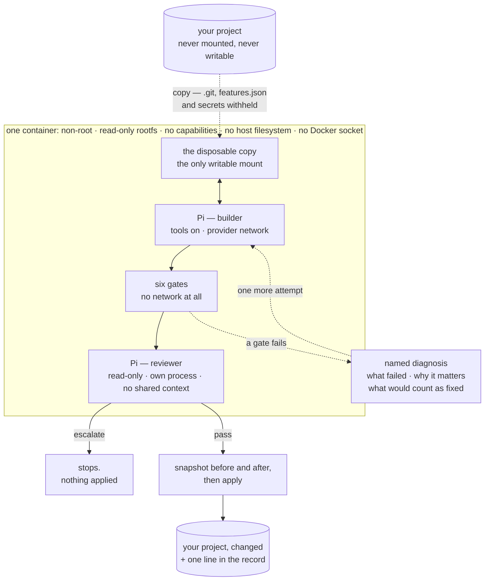

# agent-harness

A coding agent that works in a sandbox, proves what it built, then applies
it — or escalates to you.

```
npm run add  -- feed --title "RSS feed" --criterion "feed.xml is generated from site data"
npm run work
```

```
taking the next must: feed
tests: passed, 139 assertions executed
test collection: all 12 test files are collected
build: reproducible, committed artefacts match their sources
size: 10 files, 430 lines, within ceilings
claim: all 5 criteria point at real files
boundary: 10 files, all inside the project
review: passed, 5 criteria accounted for
  added    feed.xml
  added    src/render-feed.js
  ...
applied as r5. undo with: npm run undo -- r5
```

## The guarantee

> **The model works only on a copy. Nothing reaches your repository until
> the machine has proved it, and nothing that reaches it is irreversible
> or unrecorded.**

This is deliberately *not* "the model cannot act". The predecessor to this
project put a human approval in front of every byte the model wrote. It
worked, and it produced **76 lines of application code in a full working
day** across 135 approvals. Human review in the critical path is both the
guarantee and the ceiling.

So the trade here is explicit: the model reads what it needs and writes
what it likes, inside a container it cannot escape, and the burden moves
from *approving every change* to *proving every change and being able to
reverse it*. `THREAT_MODEL.md` states what that costs, including the six
residual risks, first among them that the whole guarantee rests on one
container boundary.

## Architecture

The container is the whole guarantee. Everything else exists to decide
what may cross back out of it.



`undo r1` reverses any of it later, three ways, keeping whatever ran after.


Three things that diagram is making precise:

- **Your project never enters the container.** A copy does. That is what
  lets the model have real tools without the blast radius.
- **The gates have no network.** A verification that can reach the network
  can pass because a service was up and fail because one was down, and
  neither outcome is about your change.
- **The reviewer is a separate process, not a sub-agent.** One running
  inside the builder's session would already believe every justification
  that produced the diff.

## Requirements

- **Node ≥ 26** — the harness runs TypeScript directly by type-stripping;
  there is no build step and no runtime dependency.
- **Docker**, with a Linux daemon.
- **[Pi](https://github.com/earendil-works/pi)**, installed
  and authenticated with a provider. Pi supplies the agent loop; this
  project supplies the boundary, the gates, the reviewer and the record.

## Setup

```bash
npm install
cp .env.example .env      # then edit it
set -a && . ./.env && set +a
```

`.env.example` explains every value. The three that are required —
the container image, Pi's package directory, and Pi's data directory — are
refused loudly with a remedy if they are missing, rather than defaulted.

Then prove the boundary is real, against your actual Docker daemon:

```bash
npm run verify:boundary
# boundary verified: non-root, no host filesystem, no capabilities,
# no Docker socket, read-only container, writable copy only
```

## Skills

Pi loads skills — directories containing a `SKILL.md` — and the harness
can mount a directory of them into the builder, read-only:

```bash
HARNESS_SKILLS=~/Developer/agent-skills npm run work
```

```
skills: codebase-design, diagnosing-bugs, domain-modeling, tdd
```

Loading is deliberate in both directions. With no directory configured,
the harness passes `--no-skills` rather than leaving Pi's own discovery to
find whatever happens to be installed in its data directory — which is
mounted writable, so something could appear there without anyone deciding
it should. What loads is printed by name.

**The reviewer never gets skills**, even when the builder does. Its job is
fixed, and a skill could redefine what it finds acceptable — the one
opinion here that must not depend on what is installed.

**A skills directory inside the project is refused**, because it would be
in the copy too, where the model could rewrite the instructions it is
then given.

Only skills that work without a human are worth mounting. The interview
and planning ones — anything marked `disable-model-invocation` — need
someone to answer, and there is nobody inside the container.

## The five verbs

| | |
|---|---|
| `npm run add -- <id> …` | put an item on the feature list |
| `npm run work [-- <id>]` | build the next Must, or a named item |
| `npm run look` | what happened, what is pending, what escalated and why |
| `npm run show -- <run-id>` | the exact diff a run applied |
| `npm run undo -- <run-id>` | put it back |

`work` with no argument takes the next Must from `features.json`. Point it
at a project with `HARNESS_PROJECT`, or run it from inside one.

## How a run works

1. **Copy.** Your project is copied into a disposable sandbox. The
   project itself is never mounted. Withheld from the copy, and announced
   rather than dropped silently: `.git`, `features.json`, `.harness`,
   `.secure-harness`, `.env`, `.env.local`, `.ssh`, `.aws`, `.gnupg`,
   `.npmrc`, `.netrc`.
2. **Build.** Pi runs in the container with tools enabled and the
   provider's network. It reads what it needs and writes what it likes —
   to the copy.
3. **Prove.** Six gates, with no network at all. The first answers two
   questions, and the second is the one people forget to ask:

   - the test suite passes;
   - **assertions actually ran** — a suite that asserts nothing has not
     passed in any sense you care about;
   - every test file is one the runner actually collects;
   - the project typechecks, where it declares a typecheck;
   - the build is reproducible, so committed artefacts match their sources;
   - the change is within its ceilings;
   - the claim the model wrote matches what actually changed.

   A failing gate hands the model a **named diagnosis** — what failed, why
   it matters, what would count as fixed — and it gets one more attempt.
   Never a log to guess from.
4. **Review.** A second Pi process, read-only, no shared context with the
   builder, judges the diff against the item's acceptance criteria. It
   answers two questions: is each criterion actually satisfied, and is
   anything here unaccounted for? It passes silently or escalates to you.
5. **Apply.** With a recovery snapshot of both sides, and a line in an
   append-only record.
6. **Destroy.** The sandbox goes, on every path, including a crash.

## Why the Reviewer exists

Every gate above asks whether the code is *sound*. None can ask whether it
is the work you *asked for*. Measured: in two runs out of two, the model
shipped a build script and an `npm run build` that no acceptance criterion
mentioned. Every gate passed, correctly.

The Reviewer is checked against the four defects that actually happened,
not invented ones:

```bash
npm run verify:reviewer
```

```
CAUGHT  1. .mjs where the test script globs .js
CAUGHT  2. tests at the repository root, where the glob cannot see them
CAUGHT  3. an assertion that would have failed had it ever run
CAUGHT  4. scope creep: a build step nobody asked for
PASSED  control: honest work that asks for nothing extra
```

The control is not optional. "Caught all four" proves nothing about a
reviewer that escalates everything, and a reviewer that escalates
everything is one you learn to ignore.

## Undo

`undo` reverses one run at any point, **including after later runs changed
the same files**. Every run snapshots both what was there before and what
it left behind, so undoing is a three-way merge rather than a restore:
later work is kept, and where the undo and later work rewrote the same
lines, nothing is written and the conflict is named.

An undo is itself a run, with its own snapshot, so it can be undone in
turn.

## Verifying it yourself

```bash
npm run check             # typecheck and the unit suite — needs nothing but Node
npm run verify:boundary   # the container, against a real daemon
npm run verify:gates      # each gate broken in turn, confirmed to stop the apply
npm run verify:reviewer   # the four real defects, plus the control
```

The three `verify:` commands need Docker, a configured image and a real
model, and each one **fails loudly rather than skipping** when it cannot
run — because a check that skips quietly reads as a pass, and this project
has now shipped that defect twice and caught it twice.

`npm run check` is the exception, deliberately: the unit suite has to run
on a machine with no Docker at all, so the one test that needs a daemon
skips there by name, and `verify:gates` is what refuses to skip it.

## What it deliberately does not have

Sealed read scopes, turn budgets, a skill catalog, sprints and stakeholder
roles, graph orchestration, sub-agents, signed evidence export. Each was
either measured as cost in the predecessor or coordinates nobody when
there is one operator.

The record is append-only JSONL with **no cryptography**. The predecessor
spent 3,470 lines — 13% of its tree — on HMAC chaining, signing and
receipts, and in forty days the only thing that read them was a single
diagnosis. Observability is the requirement here; tamper-evidence is a
different requirement with a different threat model, and can be added when
something needs it.

## Reading the work

`V2_RESULTS.md` is the scorecard against the original plan. The milestone
write-ups — `M1_RESULTS.md` through `M5_RESULTS.md` — are worth more than
the code, because each records what building it *found*:

- **M0** — the read-only check verified the wrong thing; the writes it
  attempted fail for a non-root user whether or not the flag was given.
- **M1** — three separate green results that meant nothing had run.
- **M2** — the claim gate refused an honest claim, for a discrepancy the
  harness itself created.
- **M4** — reversal treated as a flag rather than a stack, and a test
  whose name claimed two things while asserting half of one.
- **M5** — `work` took the same item forever, found on the second command
  of that milestone's own verification.

None of these were caught by the test suite. They were found by using the
thing, and by breaking each check to confirm it could fail.

## Predecessor

[`secure-agent-harness`](https://github.com/BleOdel/secure-agent-harness)
is v1: 25,330 lines of source, human approval in front of every change. This is a
clean-room rebuild sharing no code with it, at 3,725 lines. `SCOPE.md`
explains what was given up and what was gained.
