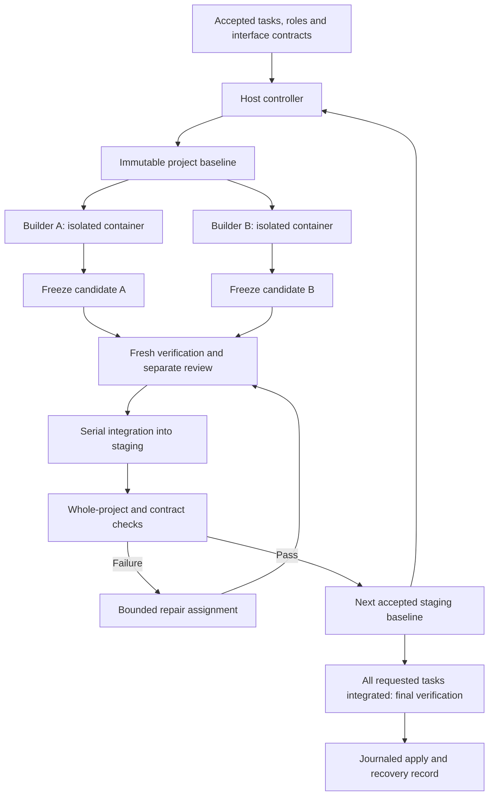

# Agent harness: assigned-team implementation plan

Implementation roadmap · 8 September 2026

Based on `BleOdel/agent-harness` at `0cc7c34b534fe60d46f66d19304db0c9b9c21b99`.
M0 is complete locally; M1–M6 remain pending. Team commands, schemas and later milestone modules below remain proposed. See `TEAM_M0_RESULTS.md` for checks and deployment status.

## Outcome and scope

Build a harness that takes an accepted project plan, assigns tasks to named agent roles, runs independent tasks in separate containers, checks the resulting components together, and applies a recoverable project result.

The first release supports Node/npm projects, two concurrent builders, a separate reviewer, and one bounded integration-repair role. The host controller owns scheduling, task state, acceptance and application. Existing interactive planning supplies the initial task graph; it can propose assignments and interfaces for the operator to accept through the existing import workflow.

Deliver the coordinated team capability regardless of whether steering reduces cost. Measurements determine useful concurrency and task size. Start with two workers; retain concurrency one as a supported operating mode.

Defer autonomous replanning, dynamically spawned teams, additional languages, remote workers, arbitrary extensions, and a writable web console. These are later extensions to a working system.

## Architecture and acceptance boundary



Workers never mount the live project, controller state, other workers' directories, or the Docker socket. Each attempt gets its own writable Pi state and session directory. Shared package, skill and contract inputs are immutable. Avoid concurrently mounting the existing writable Pi authentication directory into every worker; prepare attempt-specific authentication state and explicitly handle provider refresh requirements.

A model finishing its conversation is a submission event. Only host checks can advance it toward acceptance. Candidate verification proves the isolated change; integration verification proves compatibility with accepted work. Neither substitutes for the other.

For the first team release, successful tasks accumulate in host-owned staging. Apply to the live project once the requested team batch passes final verification. A failed batch retains accepted staging and evidence for resume while leaving the live project untouched.

## Data model and compatibility

Keep `features.json` as the operator-facing requirements and dependency list. Add optional assignment and contract references; old files remain readable. Store execution details in versioned host-owned state beside the project, following the existing `<project>-harness/` convention.

| Object | Required information |
|---|---|
| Task | ID, title, criteria, prerequisites, assigned role, change scope, contract references |
| Agent profile | Role ID, instructions digest, provider/model, allowed skills, limits |
| Team run | Unique ID, accepted plan digest, original live-tree digest, current staging baseline, policy |
| Attempt | Host-issued ID, task/role/run IDs, baseline digest, contract and dependency digests, status |
| Candidate | Attempt identity, immutable file manifest and content digest, claim, deletions |
| Integration | Input staging digest, candidate digest, resulting digest, verdicts, repair links |
| Event | Schema version, sequence, host timestamp, run/attempt identity, event type and payload |

Example task:

```json
{
  "id": "build-api",
  "title": "Implement issue creation",
  "priority": "must",
  "status": "todo",
  "criteria": ["Creating a valid issue persists it and returns the agreed response"],
  "dependsOn": ["define-issue-contract"],
  "assignedRole": "backend",
  "changeScope": ["src/api/**", "test/api/**"],
  "contracts": ["issues-api-v1"]
}
```

The host resolves contract IDs to immutable content digests. Change scope constrains the candidate accepted by the controller; it does not claim to prevent writes inside a disposable sandbox.

Use separate task and attempt state. A task can wait for prerequisites, run, block, reach integration, require revalidation, or complete. Each retry creates a new attempt with an explicit terminal outcome. Candidate verification success does not set `features.json` to `done`.

Inside one team run, prerequisites are satisfied by integration into the current staging baseline. Outside that run, completion remains tied to successfully applied work. After final application, update the corresponding feature statuses through the same recovery transaction. Migrate records additively; keep old history renderable.

## Skill assessment incorporated on 8 September

The supplied folder has now been assessed against installed Pi 0.80.6. See [the skill assessment](SKILLS_ASSESSMENT.md) for evidence and the per-skill compatibility matrix. All six definitions parse, but several require human interaction or a `Skill`/subagent capability that the default builder does not provide. `tdd` also references a missing `code-review` skill.

Before unattended role assignments, add a concrete skill-compatibility work item:

1. Use `--no-skills` together with explicit selected skill paths. A controlled Pi loader probe confirmed that the current `--skill`-only invocation also permits other discovered skills.
2. Add `--no-extensions` to the interactive planning path through a shared launcher policy. The builder/reviewer already set it; planning currently does not.
3. Adapt human-dependent workflows: planning accepts test interfaces and shared terminology; builders consume those decisions; unresolved input becomes structured blocked output. Keep `grilling` out of builder profiles and replace the `grill-me` wrapper's unsupported tool instruction.
4. Resolve skill dependencies and supporting resources into immutable per-attempt bundles. Define interaction mode and capability requirements in a host manifest; do not assume Pi's hidden-from-prompt flag implements those policies.
5. Record available skill versions separately from observed skill-file reads and workflow evidence. Neither a listing nor a read proves compliance.

Ship launcher policy fixes in M0. Deliver the initial adapted profiles and manifest validation before M3; complete durable evidence alongside M3's attempt events. Reserve an additional 1–2 focused days for adaptations and compatibility fixtures. The revised overall estimate is approximately 18–29 focused engineering days plus contingency.

## Delivery milestones

### M0 — Align the repository and establish checks

**Deliverable:** one authoritative roadmap and a reproducible validation baseline.

Update `TEAM_PLAN.md`, `README.md`, `NEXT.md`, and relevant scope statements in `PLAN.md`. Incorporate this plan into the repository so it does not depend on an absent blueprint. Correct claims about Pi capabilities. Preserve the project's TypeScript/ESM conventions and avoid adding runtime dependencies by default.

Run the unit/typecheck suite on an environment that permits localhost listeners. Run the existing boundary, gate and reviewer verification commands with their configured dependencies. Add ordinary CI for `npm run check`; expose Docker/model verification as an explicit integration job with its requirements and spend recorded.

**Exit check:** every failed or skipped check has an identified cause; the eight localhost permission failures from this review are rerun successfully before describing the baseline as green. Record the pinned Pi package version and container image used for subsequent tests.

### M1 — Enforce task prerequisites and report blocked work

**Changes:** `src/features.ts`, `src/verbs/work.ts`, `src/verbs/run.ts`, claim parsing, run outcomes, and `look`/`view` rendering.

Make automatic selection choose the highest-priority eligible task. Explicit selection of an ineligible task stops before any sandbox/model launch and explains its prerequisites. Validate missing references, self-dependencies and cycles, reporting a readable cycle path. Distinguish an empty backlog from one waiting on dependencies.

Add a structured blocked submission with reason and requested input. The host records it without review or application. The current feature schema already permits a `blocked` status; the missing part is the worker submission and recorded run outcome.

When a prerequisite is undone or materially changed, transitively mark affected tasks as needing revalidation. Preserve their code and history; stop treating previous acceptance as evidence for the changed prerequisite.

**Exit checks:** reverse-ordered prerequisites schedule correctly; explicit blocked work never starts; a cycle is rejected; a blocked submission applies nothing; undo invalidates downstream acceptance.

### M2 — Freeze candidates and verify cleanly

**Changes:** add baseline, candidate and dependency-preparation modules; refactor `src/pipeline.ts`, `src/workspace/sandbox-lifecycle.ts`, and `src/verbs/work.ts`.

Capture an immutable baseline when work starts. Stop comparing a finished worker against a moving live project. Stop its container before capturing output; validate paths, symlinks, deletions and change scope before creating a frozen candidate. Keep controller manifests outside worker-writable directories.

Build verifier inputs from baseline plus candidate files, excluding the worker's `node_modules`. Keep frozen source separate from the writable verification workspace; test-generated changes must not become silently applied source.

Use a separate preparation container to populate dependency inputs from a fixed manifest and lockfile. Key the environment by both files, container image, platform, Node/npm versions, installation flags and script policy. Give each verifier its own copy. No provider credentials are mounted for package preparation or verification.

Prove that the prepared cache supports a fresh offline installation before using it. Verification runs offline. Default the first supported fixture to packages requiring no installation scripts; explicitly configured script requirements must be exercised inside the isolated preparation/verification environment. A missing artifact or unsupported installation requirement produces `environment-blocked`, with no fallback to builder-modified dependencies.

`npm ci` rejects manifest/lockfile mismatches and removes an existing dependency directory. Matching installation flags are also necessary. This supplies the installation primitive, not a guarantee that every package can install offline. [npm documentation](https://docs.npmjs.com/cli/v11/commands/npm-ci/)

Dependency or contract changes require a dedicated assignment. Ordinary workers submit a change request; they cannot silently replace shared inputs. Accept the dedicated change through verification, create a new environment/contract version, and invalidate affected candidates.

**Exit checks:** a deliberately corrupted worker dependency cannot make a broken candidate pass; lockfile mismatch and cache miss stop before acceptance; edits to live files during building do not enter the candidate; verifier-created files do not leak into application.

### M3 — Introduce durable controller state and isolated assignments

**Changes:** add `src/team/{schema,state,scheduler,controller}.ts`, `src/workspace/baseline.ts`, and a project writer-lock module. Extract a reusable execute-and-submit operation from `work.ts`; only the controller applies team results.

Start with concurrency one. Resolve accepted role assignments deterministically. Persist scheduling decisions before launch. Give every attempt a unique ID, container name, working directory and Pi session directory. Snapshot only the skills named by its role; print and record their digests. Reviewer skills remain disabled. Exclude interview skills from unattended builders.

Enforce one controller/writer per project across team runs, ordinary work, undo and other mutating verbs. Use an owner token and explicit crash-recovery procedure for stale locks. Record unique container labels for cleanup. Do not rely on the existing count-derived `rN` identifier for concurrent attempt identity.

Use versioned append-only events and a reconstructable state snapshot with atomic replacement. A submitted result is associated with the host's process-to-attempt mapping; worker-supplied IDs cannot claim another assignment. Duplicate messages cannot advance state twice. Budget/time limits stop new dispatch and record the reason; reported token/cost totals remain estimates where provider usage is incomplete.

**Exit checks:** fake workers demonstrate correct ordering, role selection, retry identity, duplicate handling and recovery after controller termination. Restart never assumes an unfinished worker succeeded. Two simultaneous commands cannot become project writers.

### M4 — Deliver the first two-agent project

**Changes:** add `src/team/integrate.ts`, extend merge utilities for candidate integration, add a proposed `harness team run --max-workers 2` command and a fixture project.

Enable two independent assignments against the same accepted baseline. Use the existing finite Pi invocation initially; interactive RPC is not required to prove coordination.

Integrate candidates serially into a fresh staging copy. Three-way integration uses each candidate's own baseline, its frozen output, and current accepted staging. Treat conflicting edits, delete/modify cases, stale contracts and unsupported binary conflicts explicitly. File ownership reduces collisions but cannot prove compatibility.

Run the complete project checks and shared-contract checks after every proposed integration. Keep controller-selected contract tests and gate configuration outside worker control so a worker cannot weaken them. Only passing staging becomes the next baseline. A failed integration does not advance prerequisites.

**Demonstration:** build an issue tracker from an accepted API contract. Assign one worker the API/persistence component and another the client component, both depending on the contract task. Run a final integration task depending on both. Prove real create/read behavior, invalid-input errors and persistence after restart. Include a deliberately incompatible response shape that individual component tests allow and integration tests reject.

**Exit check:** two real Pi builders overlap in execution, use separate containers and sessions, and produce a combined verified project. A conflict or incompatibility leaves accepted staging and live files intact.

### M5 — Make completion, repair and resume reliable

**Changes:** add `src/team/repair.ts` and an application journal; update recovery, undo, record and task-status handling.

Assign integration repair a specific failure report, current staging baseline and bounded scope. Permit one automatic repair attempt per failed integration by default. Repair produces a new candidate and faces all applicable verification/review checks. A second failure blocks dependent work and surfaces the reason.

Implement proposed `harness team resume <run-id>`. On restart, reconcile recorded attempts against actual containers and candidate digests, terminate or quarantine orphan work, and resume only from durable accepted staging. Do not restart previously applied changes.

Before final application, recheck the original live-tree fingerprint under the writer lock. If it changed, stop application and preserve staging; require a deliberate rebase/revalidation path. Keep the existing file exclusion policy and define supported project file types explicitly.

Journal the intended source writes and feature-status updates with before/after snapshots. Apply staged file replacements and record progress. A filesystem does not provide atomic replacement of an arbitrary multi-file tree: handle interrupted application with deterministic recovery before another run may start. Do not overwrite a concurrent external edit during rollback; retain snapshots and require manual recovery when fingerprints disagree.

**Exit checks:** inject interruption before application, midway through writes, and after writes but before final record append. Recovery never double-applies a result or reports `done` while only half the files landed. Undo restores the batch and invalidates affected downstream acceptance.

### M6 — Add live control and operational visibility

**Changes:** add `src/agent/rpc.ts`, terminal control verbs, and team projections in `src/view/status.ts`, `look`, and `view`.

Pin and compatibility-test the installed Pi version. Its documented RPC mode uses JSON lines over stdin/stdout, supports request correlation, and provides prompt, steer and abort commands. A prompt acknowledgment does not mean work completed. Use bounded LF framing, separate stderr, explicit request timeouts and verified lifecycle events. The documented abort behavior also requires considering queued messages. [Pi RPC documentation](https://github.com/earendil-works/pi/blob/main/packages/coding-agent/docs/rpc.md)

Use Docker interactive stdin without a TTY. Keep `src/run.ts` for finite commands. Provide proposed `harness team steer <attempt-id> "message"` and `harness team abort <run-id>` through a host-only control socket with restrictive permissions. Workers cannot mount it. Abort first prevents new scheduling, clears queues, requests cancellation, then force-removes only owned containers if needed. It must not proceed into application.

Show role, task, prerequisites, phase, review/integration results, repair attempts, elapsed time and spend across every model role. Persist steering messages and report acknowledged versus delivered state only when the protocol provides evidence. Keep the web view read-only.

**Exit checks:** framing handles partial/multiple records and Unicode; unmatched or malformed responses cannot accept work; abort leaves no owned containers and no application; status reconstructs from persisted state after restart.

## Implementation sequence and effort

| Milestone | Depends on | Planning estimate |
|---|---|---|
| M0: roadmap and checks | — | 0.5–1 day |
| M1: prerequisites and blocked outcomes | M0 | 2–3 days |
| M2: immutable candidates and clean verification | M0 | 3–5 days |
| M3: controller with concurrency one | M1, M2 | 3–4 days |
| M4: real two-agent integration | M3 | 3–5 days |
| M5: recovery, repair and final application | M4 | 3–5 days |
| M6: live control and visibility | M5 | 2–4 days |

Estimate: roughly 17–27 focused engineering days for the original milestones, plus 1–2 days for the assessed skill adaptations: approximately 18–29 days overall, with additional contingency for package preparation and provider/session behavior. This is a planning estimate, not a measured commitment. M4 is the first functional demonstration; M5 is required before relying on the team for project writes. M6 completes the initial operating experience.

Start with a narrow M1 change: enforce prerequisites in both automatic and explicit selection, reject cycles, and add behavioral regression tests. Keep blocked submission and undo invalidation as subsequent reviewable changes within M1. M2 then makes those tasks safe to accept before orchestration grows.

## Release evidence

Use deterministic fake workers for scheduler and crash tests, real Docker tests for isolation and offline verification, and a small real-model project for end-to-end acceptance. A fake-worker success does not prove provider or container behavior.

Compare concurrency one and two on the same fixture, starting snapshot, accepted tasks, model settings and package environment. Run several repetitions and report the distribution of completion time, total spend across builders/reviewers/repairs, blocked outcomes and integration failures. Use the result to tune scheduling, not to remove the assigned-team requirement.

The release is complete when the issue-tracker demonstration passes, the incompatibility fixture is rejected, restart/abort/application recovery checks pass, old records still render, and the existing sequential workflow remains usable. No claim of complete automated correctness: criteria quality and integration-test coverage remain practical limits.

## Source context

- [Current team proposal](https://github.com/BleOdel/agent-harness/blob/0cc7c34b534fe60d46f66d19304db0c9b9c21b99/TEAM_PLAN.md): staged intent and existing gaps.
- [Task selection](https://github.com/BleOdel/agent-harness/blob/0cc7c34b534fe60d46f66d19304db0c9b9c21b99/src/features.ts): advisory dependency handling.
- [Work pipeline](https://github.com/BleOdel/agent-harness/blob/0cc7c34b534fe60d46f66d19304db0c9b9c21b99/src/verbs/work.ts): launch, gate, review and apply coupling.
- [Sandbox lifecycle](https://github.com/BleOdel/agent-harness/blob/0cc7c34b534fe60d46f66d19304db0c9b9c21b99/src/workspace/sandbox-lifecycle.ts): copy and recovery primitives to extend.
- [Pi subagent extension example](https://github.com/earendil-works/pi/tree/main/packages/coding-agent/examples/extensions/subagent): implementation reference; this plan keeps worker isolation and acceptance in the host controller.

Milestone status is recorded separately from this design: see `TEAM_M0_RESULTS.md`. Later milestones remain pending until their exit checks pass.
