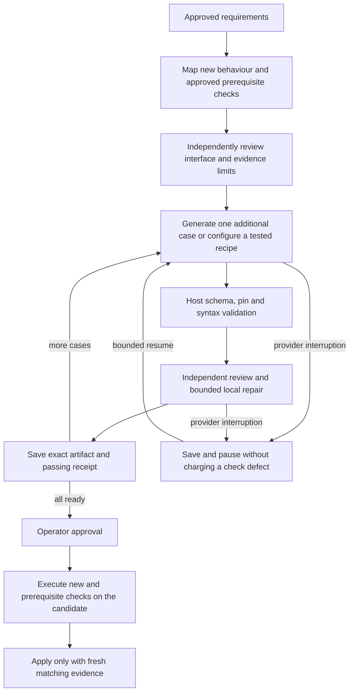

# Acceptance preparation architecture review

Date: 2026-09-26. Scope: preparation, simplification, review, recovery and application gates.

## Finding

The harness made the operator manage a second software project: generated acceptance
programs. Raising timeouts, adding retries and subdividing programs did not reduce
that responsibility. The implementation mixed four different questions:

1. What behaviour is required, and what evidence can this runner actually provide?
2. Does a usable check artifact exist?
3. Has an independent reviewer accepted that artifact against the frozen behaviour?
4. Did the candidate application satisfy the operator-approved expectations?

These must remain separate. A generated artifact is not a reviewed check; a reviewed
check is not an application pass; a provider timeout is not a defect in the check.

## Evidence from To Be Heard

The saved reader simplification contained four generated replacement checks and no
completed executable review ledger. Its last three recorded invocations made 12
requests and reported about $3.71, with incomplete reporting on one request.
A request started with 22 seconds left in a 600-second allowance. That interrupted
request consumed a generation attempt, leaving a later format error stranded at the
same limit as a genuinely defective program.

The approved manifest already contained 26 local-story-service checks and one runtime
check. Work originally selected acceptance by the current task alone. Reader
preparation therefore had no explicit route to reuse backend regression evidence,
while the frozen reader description expanded into backend lifecycle fixtures,
hashed-key database inspection, static asset traversal and public disclosure scans.

The earlier size and stdout schema fixes were useful compatibility corrections.
They did not address batching, retry ownership or missing dependency evidence.

## Implemented decisions

| Concern | Owner and behaviour |
| --- | --- |
| Routine mechanics | Versioned harness helpers and recipes; generated checks may not replace recipe internals. |
| Coverage | Outline review uses approved prerequisite check descriptions as context. Reuse is explicit; HTTP evidence does not establish browser UX. |
| Prerequisite regression | Completed, approved transitive dependencies rerun against the new candidate. Proof validation requires those tasks too; stale task fingerprints block reuse. Unapproved or unfinished dependencies are not advertised as evidence. |
| Work in progress | Generate one case, validate it, independently review/repair it, save its receipt, then generate the next. This applies to ordinary preparation and simplification. |
| Existing batches | Review saved generated cases first. Keep their code; do not regenerate a whole batch. |
| Resumption | Persist the selected check, exact proposal, review ledger and any charged pending repair. A pause cannot require another charged repair for the same pending operation. |
| Provider interruption | Record request spend, pause, retain artifacts. Classified timeouts/provider/output-limit failures do not consume a usable-response or format-correction attempt. Unknown failures still fail closed. |
| Request admission | Do not dispatch near the end of an allowance with only a small fraction of the configured request window. A small bookkeeping margin is allowed. |
| Approval and application | Explicit approval remains separate. Every selected and reusable prerequisite check must execute on the candidate before it can apply. |

An independent outline change may rebind unchanged case receipts only after the
replacement outline passes review and host checks prove the retained case bytes are
unchanged. Expected values, commands, task mappings and approval digests remain
host-controlled. Lists of output fragments mean all fragments, never alternatives.

## Revised flow

The resume edge represents the saved stage: a pending review resumes review, and a
pending repair resumes that repair. It does not unconditionally regenerate code.

## Boundaries and remaining work

This change does not make arbitrary generated code deterministic or guarantee that
an independent reviewer will pass it. Concrete check defects still block progress.
The catalogue currently covers routine web/SQLite delivery and boundary mechanics;
it is not a general lifecycle or browser scenario interpreter.

The next architectural extension is a typed scenario format backed by tested host
operations. Add capabilities from repeated, observed use cases and test each runner
operation against correct and deliberately broken fixtures. Do not infer a generic
recipe from a broad privacy description or silently substitute partial coverage.
Browser interaction, accessibility and rendering need actual browser evidence.
Neither static HTML scans nor backend tests can replace it.

Do not silently rewrite To Be Heard's frozen descriptions to exploit reuse. A smaller
replacement design needs its own independent coverage review and final operator
approval. Existing approvals and saved artifacts are retained by this change.

## Validation contract

Regression tests must show: review before later generation; reuse after interrupted
review; one charged pending repair across resume; unchanged peers after subdivision;
no request dispatch with 22 seconds left in a 180-second window; retained request
spend after provider failure; dependency closure and fresh-proof enforcement; stale
prerequisite rejection; exact output and all-fragment matching. Offline orchestration
replays are not model reviews or evidence that the application passed acceptance.

## Validation performed

- `npm run build`: passed (TypeScript, no emitted files).
- `npm test`: 635 tests; 592 passed, 43 environment-dependent skips, zero failures.
- Deliberately removing incremental review or prerequisite proof expansion made the
  corresponding regressions fail. Outline/split interruption tests also failed before
  their corrections.
- A read-only orchestration replay reused the four saved generated checks and the
  fifth retained response, with nine original peers unchanged. Mocked review stages
  ran before the next generation request. This validates resumption order only;
  it is not an independent model review or application acceptance pass.
- No provider calls were made. Live blog drafts, review records and approvals were
  byte-for-byte unchanged by the replay.

## Follow-up: byte-preserving HTTP evidence

The final reader disclosure check exposed a capability mismatch: the legacy HTTP
observer retains UTF-8 text, which cannot reconstruct arbitrary response bytes.
The byte-preserving observer is versioned separately as
`/harness-checks/http-bytes.mjs`. Its `bytes` Buffer contains fetch's response body
before text decoding (after any HTTP content decompression). Binary disclosure
scans and byte counts must use this Buffer directly. JSON helpers retain it too.

The original `/harness-checks/http.mjs` bytes and digest remain unchanged. Adding
this capability does not force a pin refresh or erase passing receipts for legacy
checks. However, the same lossy reconstruction was found in two previously reviewed
reader checks. Reviews combining legacy HTTP observation with database-byte scans and
`Buffer.from(response.text)` reconstruction must be revisited under the lossless-evidence policy; unrelated receipts stay valid.
This is selective review invalidation, not an automatic code change or claim of
static-analysis completeness. A selected check may migrate under independent review;
its expected outputs and application contract remain frozen, and final approval is
still required. Legacy text-only checks cannot claim lossless binary evidence.

A code-repair model can now return a capability/contract blocker instead of code.
The host saves and displays that unverified report without trying to turn it into
executable code through a format-correction request. Mixed blocker/code responses
are rejected. Any proposed resolution must be inspected, not automatically executed.

Follow-up validation: TypeScript passed; the final suite reported 643 tests,
600 passed and 43 environment-dependent skips. Binary-response tests include
invalid UTF-8 split across chunks and demonstrate the disclosure missed by text
reconstruction. Deliberate byte-loss and blocker-handling mutations fail the tests.
A read-only replay confirmed that the existing approved helper pins remain valid,
three simplified check receipts remain reusable, and two previously passing
binary-disclosure checks require fresh review. The final blocked check needs the
same correction. No provider requests, application edits or approval changes were
made during this investigation.
