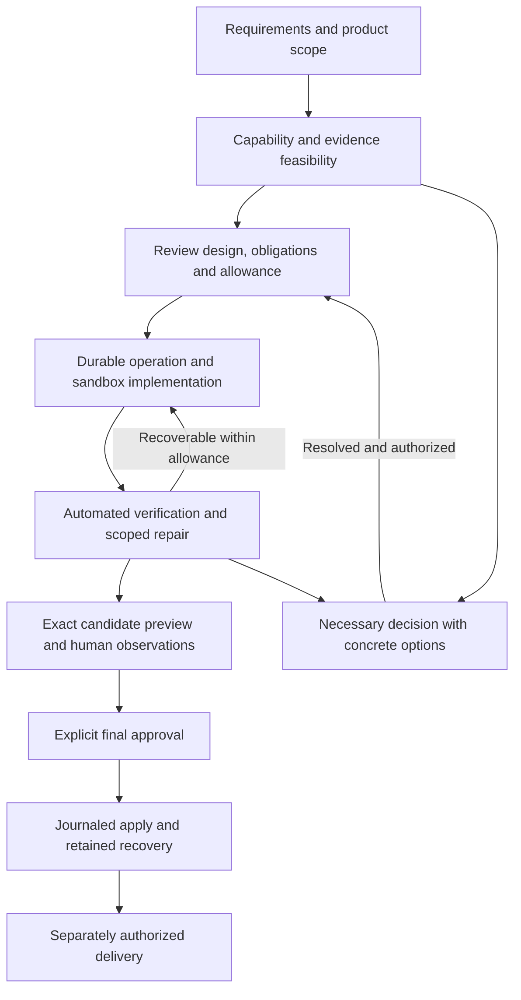

# Harness reliability implementation plan

Prepared 3 October 2026. Proposed task plan based on the whole-harness audit of commit `1104bd1d9811bca8ebe65ed1810819a20ef35903`. Implementation authorized by the operator on 3 October 2026. Task completion is tracked in items.json and findings.json; approval of this plan does not approve generated application candidates or publication.

## Intended outcome

Make the harness a dependable agentic programming workflow: agree what to build, let the harness prepare and implement within an approved allowance, and return a verified candidate for final human review. Routine technical recovery must stay inside the harness. The operator should not have to relay logs, repair generated probe code or repeatedly restart the same stage.

This plan covers the 25 audit findings with 45 bounded tasks. It preserves the existing useful safeguards: operator-owned requirements, exact candidate identity, isolated execution, independent observations, explicit evidence limitations, retained history and separate release approval. Pi remains the agent interface. The work is incremental consolidation, not a replacement agent framework or a full rewrite.

The baseline audit found 846 passing and 65 skipped tests in the default check, plus important failures exposed through separate operational reproductions. Those counts describe the audit snapshot, not a guarantee about a future branch. Passing unit tests alone is not the completion target.

## Human involvement policy

| Point | Required user involvement | What the harness handles |
|---|---|---|
| Start | Approve product requirements, material interface/evidence choices, any residual limitations, permitted routine design choices and an operating allowance. | Capability preflight, task decomposition, reusable verification design and concrete recommendations. |
| Middle | Decide only on changed scope/meaning, unresolved evidence, missing access, unsupported capabilities, exhausted allowance or demonstrated non-convergence. | Retry safe transient failures, resume saved work, repair affected checks, preserve successful reviews and explain recovery progress. |
| End | Inspect the exact candidate, perform required human observations, approve application; authorize external delivery separately where needed. | Collect evidence, prepare preview, show limitations, and carry out journaled application after authorization. |

The middle cannot be guaranteed interruption-free. The requirement is **no avoidable engineering intervention** for known recoverable cases. Budget renewal remains an explicit choice. A model cannot grant approval, silently switch providers, waive evidence or spend beyond the agreed allowance.

## Proposed lifecycle

The common records are **task, operation, candidate, evidence and decision**. Existing specialized runners retain their native evidence. Adapters normalize references and validate identity; they do not rewrite a failure into a pass. CLI and dashboard consume the same operation service and next-action projection.

## Delivery rules

- Fix reproduced correctness and preservation defects before running more expensive acceptance-generation experiments. Baseline tests and independent containment fixes can proceed in parallel.
- Milestones are release checkpoints, not a requirement to serialize every task. The task dependency graph is authoritative. Early capability and browser fixes can run alongside preservation fixes.
- Each task is one reviewable change or a short stack. Large tasks must be split along their stated contracts if they cannot remain reviewable; do not expand them into unbounded subsystem rewrites.
- Use disposable workspaces, tests that exercise the defect, a deliberate broken-code control, the collected flat test layout, `npm run check`, and the relevant real runtime lane. Do not weaken criteria to obtain a pass.
- Do not bootstrap this stabilization by sending all 45 tasks into the currently defective acceptance generator. Develop the harness through its repository workflow, deterministic regressions and direct review first. Use the repaired harness for qualification once the prerequisite gates pass.
- Keep runtime dependencies unchanged unless already authorized or explicitly approved after a concrete choice. The security evidence provider is a planned decision; this plan does not select a paid service or authorize a new installation.
- Preserve legacy records, approvals, partial source and original bytes during migrations. Unknown versions fail safely. Never reset To Be Heard or delete retained work to make migration easier.
- A safety fix may intentionally invalidate affected proof. Explain the scope and batch the repair; do not avoid necessary revalidation or relabel stale evidence.

## Recommended first implementation batch

Start **hr-001** to establish the failure registry. In parallel after its fixtures are identified, take **hr-002** (operational smoke CI), **hr-007** (dashboard authority), **hr-005** (secret selection) and **hr-014** (active preparation ledger). Complete **hr-003 → hr-018** early to freeze the minimum shared record contracts before new snapshot, checkpoint and journal formats. Pair **hr-004** output limits with a tested retain-before-cleanup path or the **hr-009** rollout before deploying overflow termination to live builders. Then land the browser timing chain **hr-015 → hr-016 → hr-017** and the apply-safety chain **hr-008 → hr-009 → hr-010**.

These are independently useful fixes; they do not wait for the larger operation-service migration. Preserve normal safe use of already-qualified lanes while restricting claims about broken or unqualified combinations.

## Effort and scheduling

Sizes describe engineering scope, not a calendar promise: **S** is a narrow behavior or documentation change, **M** crosses a small set of modules with an integration test, and **L** changes a shared lifecycle or proves a complete journey. No token or cost estimate is claimed before measuring the first batch.

Use three parallel workstreams where dependencies permit: execution/recovery, acceptance/browser, and product qualification. One integration owner reconciles shared schemas and migrations. Avoid simultaneous edits to the same state-owning modules. Review progress at each milestone using retained evidence, not the number of tasks or tests alone.

## Milestones

| Milestone | Tasks | Completion gate |
|---|---|---|
| M0 — Establish a trustworthy baseline | hr-001–hr-003, hr-018 | Audit failures are reproducible, the operational smoke lane runs, the support catalog distinguishes complete routes, and minimum shared record contracts are frozen before new persistent formats. |
| M1 — Protect work and fix trust defects | hr-004–hr-013 | No known reproduced loss-of-work, apply/recovery, mode-identity, output-bound or local request-boundary defect remains in the covered paths. Checkpoint promotion and definitive delivery rejection behave correctly. |
| M2 — Make acceptance preparation correct and reusable | hr-014–hr-017, hr-019–hr-023 | The harness measures delayed browser behavior correctly, repairs the active ledger, plans feasible atomic observations, scopes review invalidation and evaluates a common evidence envelope. |
| M3 — Deliver one continuous guided workflow | hr-024–hr-033 | Headless CLI and authenticated dashboard use the same durable operation service. Routine recovery stays inside an allowance; dependent web apps can reach preview and worktree delivery; retained state is manageable. |
| M4 — Complete product evidence and delivery provenance | hr-034–hr-036 | The supported Node product scope has a real dependency-security route and domain-appropriate assessment. Product releases bind exact source, artifact and required evidence; unsupported scopes fail early. |
| M5 — Prove complete workflows and publish the supported scope | hr-037–hr-045 | Core project journeys pass deterministic fault tests and bounded repeated trials; CI catches cross-feature regressions. Existing platform recipes have fresh qualification or explicit unavailable status, and every finding has evidence or a residual disposition. |

Audit evidence: [finding registry](findings.json). Implementation backlog: [items](items.json).

## Detailed task backlog

Dependencies are hard prerequisites. Source module names below are relative to `src/` in `/Users/blessingodeleye/Developer/harness`; test, documentation and .github paths are relative to the repository root. They identify likely change areas, not permission to expand scope. See items.json for implementation status. Task IDs remain stable; milestone grouping and dependencies determine execution order.

### M0 Establish a trustworthy baseline

#### hr-001 Turn audit reproductions into a failure registry

**Size:** M · **Dependencies:** None · **Audit:** F01, F02, F04, F05, F06, F07, F09, F10, F13, F14, F15

**Scope:** test/*.test.ts; existing audit reproductions; a qualification manifest.

**Acceptance criteria:**

- Record every audit finding with its reproducible trigger or explicit inspection-only status, affected behavior, regression location and current qualification result.
- Port deterministic reproductions into the collected test layout; use failing tests on the fix branch or an explicitly separate known-defect lane, never a passing assertion that celebrates broken behavior.
- Record the source commit, runtime identities, executed and skipped lanes, and baseline results. Keep historical platform results distinct from fresh execution.
- A fixed finding closes only after its reproduction passes and the deliberately restored defect is detected.

**Verification:** Re-run the provider-free audit reproductions in a disposable copy; prove the registry distinguishes unexecuted, reproduced and fixed findings.

#### hr-002 Establish a required operational smoke lane

**Size:** M · **Dependencies:** hr-001 · **Audit:** F15

**Scope:** .github/workflows/check.yml; .github/workflows/verify.yml; test/asset-helper-docker.test.ts.

**Acceptance criteria:**

- Correct the stale helper-file expectation to match the intentionally generated helper set, retaining the missing-asset and database-disclosure assertions.
- Run a credential-free Docker and Chromium smoke suite in CI for affected core changes, with pinned runtime inputs and retained diagnostics.
- A required lane that cannot run is reported as unavailable and cannot contribute a passing qualification; optional platform skips remain visible.
- Fork or untrusted pull-request execution receives no provider, release or native-host credentials.

**Verification:** Exercise the actual CI job locally or in CI, including a seeded browser/helper failure. The ordinary npm check remains required; smoke coverage does not replace it.

#### hr-003 Publish a capability and lifecycle support catalog

**Size:** M · **Dependencies:** hr-001 · **Audit:** F20, F21

**Scope:** adapters/registry.ts; runner registrations; doctor and planning capability descriptions; platform documentation.

**Acceptance criteria:**

- Inventory build, test, acceptance, browser/GUI, preview, human review, apply, recovery and release support separately for each supported project/runtime combination.
- Distinguish general project adapters, specialized recipes, diagnostics, unavailable infrastructure and unsupported targets; do not market a fixed training demo as arbitrary ML support.
- Expose one machine-readable catalog that planning, doctor and later preflight can consume; record required tools, dependency policy and evidence limitations.
- Mark Android, iOS, Windows, CUDA, general LLM training and the failed Mac-VM PyTorch GPU path according to actual evidence. New support is outside this plan.

**Verification:** Table-driven catalog tests cover Node without dependencies, Node with dependencies, Python, current desktop recipes and current ML recipes; every advertised complete route has named evidence providers.

#### hr-018 Define common task, operation, candidate, evidence and decision records

**Size:** M · **Dependencies:** hr-001, hr-003 · **Audit:** F23

**Scope:** new shared lifecycle contracts plus adapters for existing records; no controller rewrite in this task.

**Acceptance criteria:**

- Define versioned IDs and strict readers for the five shared concepts, plus typed outcomes for interruption, capability gap, requirement conflict, rejected candidate and pending application.
- Specify legal transitions, immutable bindings, request reservation and expected-version writes; a process exit alone cannot imply task completion.
- Document the existing authoritative record for each phase and the adapter needed, preventing a second mutable source of truth during migration.
- Unknown or malformed versions fail without side effects; legacy records remain inspectable and originals are retained through idempotent migrations.

**Verification:** Table-driven transition and malformed-record tests include concurrent writers and old fixtures. Review the schema and migration map before downstream implementation.

**Milestone completion gate:** Audit failures are reproducible, the operational smoke lane runs, the support catalog distinguishes complete routes, and minimum shared record contracts are frozen before new persistent formats.

### M1 Protect work and fix trust defects

#### hr-004 Bound process output and retain useful failure evidence

**Size:** M · **Dependencies:** hr-001 · **Audit:** F07

**Scope:** run.ts and all builder, reviewer, verifier and subprocess callers.

**Acceptance criteria:**

- Apply a finite default to every captured process stream and structured reply; require an explicit bounded override rather than an unlimited omission.
- Stream diagnostics to quota-controlled storage, retain a bounded tail and report truncation without treating a truncated reply as valid JSON or evidence.
- Exceeding the limit terminates only owned processes, records an output-limit outcome and leaves a recoverable operation record.
- Memory, disk and cleanup remain bounded for continuous output, huge single chunks, multibyte text and a child that ignores graceful termination.
- Enable builder overflow termination only with a tested minimal retain-before-cleanup path, or deploy it atomically with hr-009. Other process caps can ship independently; no new overflow failure may discard useful source.

**Verification:** Use local fake processes; measure retained byte counts and bounded memory behavior. Verify builder failure reaches checkpoint handling once hr-009 is integrated.

#### hr-005 Use one secret-aware project selection policy

**Size:** M · **Dependencies:** hr-001 · **Audit:** F09

**Scope:** workspace/changes.ts; workspace/candidate.ts; sandbox, prompt, artifact and diff input selection.

**Acceptance criteria:**

- Apply the same depth-aware exclusions to source copies, prompts, candidate snapshots and exported diffs/artifacts, covering nested .env files and environment variants.
- Permit documented safe examples and explicit operator exceptions; present excluded paths and redacted reasons without printing secret values.
- Scan only approved bounded inputs with high-confidence rules; label limitations and false-positive handling rather than promising discovery of every secret.
- Preserve existing files and old retained snapshots. A policy change produces a migration or quarantine decision rather than silently deleting work or reusing an unsafe snapshot.

**Verification:** Use synthetic canary values in root/nested .env variants, example files and ordinary code; verify canaries never enter generated model context or public reports.

#### hr-006 Isolate Pi credentials consistently across agent lanes

**Size:** M · **Dependencies:** hr-004, hr-005 · **Audit:** F08

**Scope:** agent/credentials.ts; agent/pi.ts; planning, ordinary work, preparation, team and reviewer launchers.

**Acceptance criteria:**

- Every lane uses the same selected-provider credential mechanism; no tool-capable worker mounts the canonical multi-provider Pi auth directory writable.
- Refresh and persist canonical authentication on the host, serialize refresh where necessary, exclude refresh credentials from worker copies and clean up operation-scoped credentials after owned children exit. If a provider cannot support this route, expose the limitation before dispatch.
- Exclude unrelated providers and avoid logging credential contents; make selected-provider exposure and unrestricted-egress limits explicit.
- Retain Pi as the agent interface. Document a host credential-broker extension separately if complete credential hiding cannot be delivered by the current Pi integration.

**Verification:** Synthetic auth fixtures test provider isolation, read/write mounts, concurrent refresh, failure cleanup and absence from artifacts. No real credentials are needed for these tests.

#### hr-007 Validate dashboard authority and cross-site access

**Size:** S · **Dependencies:** hr-001 · **Audit:** F10

**Scope:** view/server.ts and local dashboard request tests.

**Acceptance criteria:**

- Accept only configured loopback authorities and expected ports; reject hostile, duplicate and malformed Host values before loading project information.
- Validate present Origin and relevant request context against the local dashboard policy while supporting normal same-origin navigation and polling.
- Set an appropriate frame-ancestors policy and test ordinary browser navigation; keep read-only observer behavior intact.
- Return rejection responses without embedding project paths, configuration or private task data.

**Verification:** Repeat the hostile Host/Origin reproduction with synthetic private data, plus normal polling, aliases explicitly allowed by configuration and framing checks.

#### hr-008 Include executable file metadata in candidate identity

**Size:** M · **Dependencies:** hr-001, hr-018 · **Audit:** F06

**Scope:** workspace candidate, change, snapshot, apply and undo representations.

**Acceptance criteria:**

- Version candidate identity to include the normalized executable bit in addition to relative path and content; reject privileged permission bits and avoid treating ownership, timestamps or irrelevant platform permission bits as portable semantics.
- Detect and deliver mode-only changes, and restore the original mode during undo.
- Treat a live mode change after verification as identity drift and refuse applying stale evidence.
- Read old records for history and recovery, but do not silently upgrade byte-only receipts into proof of mode-aware identity.

**Verification:** Verify a 0644-to-0755 script change is visible, executable after apply, reversible and rejected if the target mode changes concurrently.

#### hr-009 Retain implementation work on every unsuccessful exit

**Size:** M · **Dependencies:** hr-004, hr-005, hr-008 · **Audit:** F05

**Scope:** work.ts; workspace/work-checkpoints.ts; sandbox lifecycle.

**Acceptance criteria:**

- Capture safe unverified source for timeout, provider/auth/quota/network errors, nonzero exit, cancellation and output-limit failure before sandbox cleanup.
- Write the checkpoint atomically with failure classification, task/attempt identity and a recoverable source manifest; do not require a valid builder claim to retain work.
- Resume into a fresh sandbox only when original task, approval and execution bindings still match, or after an explicit versioned rebase/reapproval. Reconcile exclusion-policy changes and rerun every required gate.
- If checkpoint capture fails or detects unsafe content, preserve a quarantined recovery reference and the previous valid checkpoint; never report successful retention when bytes are missing.
- Confirm worker termination before final snapshot capture. For abrupt host death, recover a durable periodic checkpoint if present or identify the previous available checkpoint and possible unsaved loss; do not promise an exit handler can run after SIGKILL.

**Verification:** Fake agents write a marker then fail in each category; restart the host and confirm exactly that work is recoverable and the live project is unchanged.

#### hr-010 Journal all application and undo writes

**Size:** L · **Dependencies:** hr-008, hr-009 · **Audit:** F04

**Scope:** workspace/sandbox-lifecycle.ts; work apply; undo; staging and team application adapters.

**Acceptance criteria:**

- Use one versioned application transaction with reserved record identity, intent, before/after manifests and per-file progress for ordinary work, staged work, team application and undo.
- Check expected live bytes and executable modes before replacing each file; use atomic file replacement and a durable recovery journal.
- After interruption, recover deterministically to a completed or explicitly recoverable transaction. Never claim cross-file filesystem atomicity where the platform does not provide it.
- Recovery or rollback must not overwrite unrelated edits made after the transaction; surface a specific conflict with retained originals.
- Keep existing-version journals recoverable before enabling the new writer, and prevent concurrent writers from applying competing transactions.
- Journal feature-status changes and record publication as well as source writes; recovery produces one consistent run record and task state, not applied bytes paired with a stale todo or duplicate application record.

**Verification:** Inject crashes and write failures before and after every file/record transition, including the second-file EACCES reproduction; test apply, undo and undo-of-undo.

#### hr-011 Validate full PyTorch checkpoint contents

**Size:** M · **Dependencies:** hr-001 · **Audit:** F13

**Scope:** torch/schema.ts; torch/recipe.ts; product/evidence/torch-checkpoint.ts.

**Acceptance criteria:**

- Validate model tensor names, dtypes, dimensions and finite values against the selected recipe/model specification.
- Validate optimizer parameter mapping, moments and step counters, scheduler state, RNG structures, data identity and sampler permutation/cursor as required by that recipe.
- Validate clustering centers and other recipe-specific recovery data; empty or null structures cannot satisfy complete-recovery claims.
- Keep validation non-executing for untrusted serialized input; reject unsupported schemas with an actionable diagnosis rather than loading arbitrary serialized code.

**Verification:** Start with real valid retained fixtures, then independently corrupt every required component, including the audit null-tensor/empty-optimizer cases. Validate CPU recipes before any GPU claim.

#### hr-012 Advance ML recovery state only after validation

**Size:** M · **Dependencies:** hr-011 · **Audit:** F13

**Scope:** jobs checkpoint promotion; torch workflow and recovery-test.py.

**Acceptance criteria:**

- Promote the active checkpoint only after schema, artifact integrity and recipe identity validation succeeds; preserve the last known-valid reference on failure.
- Record the relation between interrupted attempt, checkpoint and resumed attempt, with clear incomplete versus recoverable outcomes.
- Compare interrupted/resumed and uninterrupted CPU runs using predeclared exactness or numerical tolerances appropriate to the recipe.
- A corrupted newest checkpoint falls back only through an explicit validated selection, never by silently labeling the invalid checkpoint usable.

**Verification:** Interrupt real bounded CPU classifier and clustering runs, resume, compare outputs and prove malformed late checkpoints do not displace the earlier good reference.

#### hr-013 Classify GitHub delivery outcomes before retry

**Size:** M · **Dependencies:** hr-001 · **Audit:** F14

**Scope:** releases/github.ts; releases/store.ts; destination client.

**Acceptance criteria:**

- Represent confirmed rejection, confirmed success and ambiguous transport outcome as distinct typed results for release creation and asset upload.
- After an authoritative rejection proves no mutation, allow a retry after the underlying permission or validation problem is resolved.
- After an ambiguous response, reconcile remote identity before retrying; do not classify all server errors as proof of no mutation.
- Retain the original approval scope and prevent duplicate assets or adoption of unrelated remote releases during reconciliation.

**Verification:** Use a fake GitHub server/client for permission rejection then recovery, rate limits, validation errors and disconnects before/after commit. Any real publication remains separately authorized.

**Milestone completion gate:** No known reproduced loss-of-work, apply/recovery, mode-identity, output-bound or local request-boundary defect remains in the covered paths. Checkpoint promotion and definitive delivery rejection behave correctly.

### M2 Make acceptance preparation correct and reusable

#### hr-014 Repair the active preparation ledger

**Size:** M · **Dependencies:** hr-001 · **Audit:** F01

**Scope:** acceptance/preparation.ts; acceptance/workflow.ts; acceptance/guided.ts.

**Acceptance criteria:**

- Select saved state by task, operation and preparation phase, including incremental reviewLedger state; never select an unrelated legacy file merely because it exists.
- A blocked check during generation repairs in place while completed checks and later ungenerated obligations remain intact.
- Reserve and persist retry use before dispatch and reconcile interruption without granting duplicate attempts or consuming a check-defect retry for provider failure.
- Return a stable structured next action that identifies the active check and source of truth, alongside readable CLI guidance.

**Verification:** Reproduce a blocked third case after two successes with a stale reader-experience review-progress file present; interrupt before/after retry reservation and resume without any provider call.

#### hr-015 Wait for bounded positive browser observations

**Size:** M · **Dependencies:** hr-001, hr-003, hr-018 · **Audit:** F02

**Scope:** browser/schema.ts; browser/capabilities.ts; browser/instrumentation/driver.mjs; host comparisons.

**Acceptance criteria:**

- Define eventual positive observations for text, counts, attributes and request events, with per-action and whole-journey deadlines.
- Keep expected values and pass/fail comparison host-owned; collect timestamped observations through a trusted bounded protocol without exposing approval authority to the app.
- A delayed compliant update succeeds, and an absent update fails with the last observed values and elapsed interval.
- Completion waits cannot become unbounded or hide navigation, console or transport failures that the journey requires observing.

**Verification:** Real Chromium fixtures cover delayed text, debounced requests and optimistic UI. Restoring immediate snapshots must fail the regression.

#### hr-016 Measure negative browser claims over explicit windows

**Size:** M · **Dependencies:** hr-015 · **Audit:** F02

**Scope:** browser observation schema, driver lifetime and retained evidence.

**Acceptance criteria:**

- Require an explicit bounded interval or trustworthy completion boundary for no-request and absence claims; absence at one immediate sample is insufficient.
- Keep the browser and relevant listeners alive through the declared interval and record its start, end and observed events.
- The audit delayed forbidden POST at 400 ms fails a no-request claim whose window includes that event; early shutdown cannot turn it into a pass.
- Present finite-window limits honestly and reject underspecified negative expectations during preparation.

**Verification:** Test forbidden events just inside the observation boundary, a clean complete window, timeout/cancellation and separate positive and negative request predicates.

#### hr-017 Migrate helper and browser semantics without losing unrelated work

**Size:** M · **Dependencies:** hr-015, hr-016 · **Audit:** F02, F18

**Scope:** acceptance helper pins; browser evidence versions; saved preparation and staged receipts.

**Acceptance criteria:**

- Produce one migration report identifying every affected check, changed helper/observation semantics and required review, instead of stopping at one stale pin per invocation.
- Preserve source, proposals, completed unaffected checks and prior approvals as history; do not copy a new digest onto an old review.
- Allow compatible mechanical migrations to run in a bounded batch, with independent validation; meaning-changing expectations require explicit renewed approval.
- A controller crash during migration resumes idempotently, and old receipts cannot authorize a candidate under newly changed timing semantics.

**Verification:** Replay the blog helper-update sequence, a changed browser window and a staged candidate interrupted mid-migration; demonstrate exactly which receipts remain usable.

#### hr-019 Plan atomic evidence and check complete feasibility before freezing

**Size:** L · **Dependencies:** hr-003, hr-015, hr-016, hr-018 · **Audit:** F03, F20

**Scope:** acceptance/planning-context.ts; planning-stages.ts; browser-design.ts; capability preflight.

**Acceptance criteria:**

- Map each criterion to stable atomic obligations containing required observations, evidence type, interface anchors and capability requirements before generating executable checks.
- Reject known unsupported project/runtime combinations deterministically before any provider request. After bounded model-assisted discovery of semantic details, resolve the full route through build, verification, preview, apply and required product/delivery evidence before executable generation or build dispatch.
- Replay the author outline and discover missing content-note controls, explanation/error anchors and forbidden-control inspection obligations together, before interface freeze.
- Separate unsupported capability, missing installation, unqualified runtime and human observation; retain uncovered obligations without silently weakening or rerouting them.
- Only freeze a complete minimally sufficient interface after feasibility review. Keep visual or source-inspection obligations distinct from API evidence.

**Verification:** Provider spies show zero requests for known impossible combinations. Test the project-profile matrix and the retained author outline using deterministic discovery fixtures; qualify semantic discovery separately under a bounded live allowance.

#### hr-020 Resolve routine interface choices through scoped amendments

**Size:** M · **Dependencies:** hr-014, hr-019 · **Audit:** F03, F01

**Scope:** acceptance outline amendment and blocker classification.

**Acceptance criteria:**

- Classify contract-choice, missing-action, journey-limit, invalid-format, provider failure and genuine requirement conflict separately, each with a bounded recovery route.
- Within explicit initial delegation, propose routine accessible names and control types, and split compound observations without requesting operator-written probe code.
- Preserve completed checks when amending only the affected obligations; record the old and proposed interface, dependencies and reason.
- Changes to approved meaning, privacy, user-visible scope or evidence sufficiency remain a human decision with concrete options. An agent cannot approve its own amendment.

**Verification:** Exercise the content-note blocker, forbidden-control inspection split, an actual missing browser action and a privacy-changing proposal. A split is autonomous only while unapproved or within explicit delegation; changing approved evidence sufficiency requires consent.

#### hr-021 Compile common form checks from trusted scenario templates

**Size:** M · **Dependencies:** hr-015, hr-016, hr-019, hr-020 · **Audit:** F03, F22

**Scope:** acceptance recipe/scenario catalog; browser action compiler.

**Acceptance criteria:**

- Provide bounded typed scenarios for text limits/live counts, acknowledgements, optional content notes and submission-failure prose retention.
- Let models supply approved control mappings and fixtures; trusted harness code owns repeated interaction, timing, process cleanup and observation mechanics.
- Validate scenario size and capability use before execution; reject unsupported cases honestly rather than generating an HTTP substitute for UI behavior.
- Cover alternate compliant UIs and boundary values with reusable data; do not hard-code To Be Heard names into generic mechanics.

**Verification:** Real browser fixtures include typing/paste/delete, missing validation, accidental early submit, lost prose and delayed responses. Deliberate defects must be observed by host comparisons.

#### hr-022 Invalidate review receipts by their actual dependencies

**Size:** M · **Dependencies:** hr-018, hr-019, hr-020 · **Audit:** F18

**Scope:** acceptance/scoped-review.ts; preparation initialization; outline-patch.

**Acceptance criteria:**

- Give contract clauses and obligations stable IDs and record each case receipt dependency on relevant clauses, inputs and runner semantics.
- Keep a separate global coverage/consistency receipt; a global outline change does not automatically erase every independent case review.
- An unrelated manual instruction retains valid browser reviews, while a changed shared privacy rule invalidates all cases that depend on it.
- Unknown or incomplete dependency information defaults to re-review and produces a readable reason; never manufacture compatibility for an old receipt.

**Verification:** Reproduce the two-peer-receipt invalidation case and shared-rule changes, including interrupted migration and independent tasks with similar IDs.

#### hr-023 Use one evidence admission policy across delivery modes

**Size:** M · **Dependencies:** hr-008, hr-017, hr-018 · **Audit:** F12, F23

**Scope:** acceptance, staging, worktrees and product evidence adapters.

**Acceptance criteria:**

- Represent approved design, automated observations, source review, manual observation and final authorization separately in one reference-based evidence envelope.
- Validate exact candidate, contract, runtime, artifact and limitation bindings through one policy evaluator. Adopt it for ordinary and staged admission here; provide tested team/worktree adapters whose full delivery integration is completed in hr-030.
- Combined valid automated and human evidence can satisfy the same requirement through each supported route; automated-passed alone cannot become fully passed.
- Adapt old receipts by validated reference while preserving original hashes and limitations; missing or stale records remain incomplete.

**Verification:** Policy tests cover all delivery modes, changed source/runtime/contract, missing manual review and forged status flags. Integration is completed in hr-030.

**Milestone completion gate:** The harness measures delayed browser behavior correctly, repairs the active ledger, plans feasible atomic observations, scopes review invalidation and evaluates a common evidence envelope.

### M3 Deliver one continuous guided workflow

#### hr-024 Move workflow ownership into a durable operation service

**Size:** L · **Dependencies:** hr-010, hr-014, hr-018, hr-023 · **Audit:** F01, F23

**Scope:** workflow/controller.ts; workflow/store.ts; work, preparation and staging adapters.

**Acceptance criteria:**

- Use the common operation service for dispatch, reservation, checkpoint, pause, attention, completion and recovery; CLI status is a projection of this service.
- Migrate ordinary work, continuation and staging first, then preparation/team adapters behind compatibility boundaries; keep existing command names usable.
- Expected-version writes and writer ownership prevent competing commands, double dispatch and stale dashboard guidance; all side effects bind an operation ID.
- Retain readable old state and interrupted journals, and format touched safety-critical modules so transitions and error paths can be reviewed.

**Verification:** Crash and concurrency tests cross command boundaries: prepare versus repair, continue versus work, staging versus apply and stale status reads. Exactly one owner and one durable outcome must result.

#### hr-025 Provide noninteractive commands and structured progress events

**Size:** M · **Dependencies:** hr-024 · **Audit:** F16, F17

**Scope:** verbs/checks.ts; guide/dialogue.ts; workflow command adapters.

**Acceptance criteria:**

- Explicit prepare, repair, continue and status commands run without a TTY when required task and allowance inputs are supplied.
- Expose versioned structured events and stable terminal outcomes for success, paused allowance, decision required, capability failure and provider failure.
- When information or approval is missing, return a pending decision with concrete choices; never prompt invisibly, hang or auto-approve.
- Keep interactive guide behavior as a thin client of the same operation API.

**Verification:** Use ordinary pipes, closed stdin, redirected output and a noninteractive subprocess. Verify event ordering and that no PTY is needed for an already specified operation.

#### hr-026 Account for cumulative allowances and detect non-convergence

**Size:** M · **Dependencies:** hr-004, hr-018, hr-024, hr-025 · **Audit:** F19

**Scope:** model dispatch reservations; workflow accounting; preparation/build/review budget adapters.

**Acceptance criteria:**

- Persist task and operation request/time use across planning, generation, repair, implementation and review; reconnecting or restarting does not replenish an allowance.
- Track provider usage completeness, estimated cost and cached versus other reported tokens without presenting incomplete estimates as enforceable dollar caps.
- Use progress fingerprints and failure categories to detect repeated equivalent failures; stop once with a specific remedy and retained state instead of consuming endless renewals.
- Support approved session-level allowances and explicit renewal; distinguish depleted allowance from authentication, capability and product decisions.
- Reserve spend before dispatch and reconcile uncertain interrupted requests conservatively; retain historical spend even after task redesign.

**Verification:** Provider-free fixtures exercise auth/format/no-progress loops, a provider request containing multiple Pi turns, process loss after reservation and fresh session limits. Show correct unknown usage.

#### hr-027 Continue through routine failures without operator routing

**Size:** L · **Dependencies:** hr-009, hr-017, hr-020, hr-021, hr-022, hr-024, hr-025, hr-026 · **Audit:** F01, F03, F19, F23

**Scope:** workflow continuation policy and typed recovery handlers.

**Acceptance criteria:**

- Within an approved allowance, resume provider interruptions, checkpointed generation, scoped repairs and safe helper migrations using the active operation state.
- Never retry authentication or capability failures blindly; present one diagnosis with an actionable decision when autonomous recovery has no supported route.
- Reuse successful work and complete a check review before spending on unrelated new generation; scope retries to the failed obligation.
- No approval, evidence limitation, model/provider change or allowance increase happens implicitly. Return a staged candidate or one necessary decision, not a command-and-log relay.

**Verification:** Replay the saved blog failure sequence with deterministic provider fixtures, injecting timeout, format error, stale helper and restart; count operator interventions and verify spend limits.

#### hr-028 Define one prepared application launch descriptor

**Size:** M · **Dependencies:** hr-003, hr-005, hr-006, hr-018 · **Audit:** F11, F20

**Scope:** runtime and dependency preparation contracts; browser and staging launch adapters.

**Acceptance criteria:**

- Bind candidate/source identity, prepared dependency identity, runtime image, start command, readiness signal, ports and disposable writable data paths in an immutable descriptor.
- Support single-package Node projects first, reusing approved offline dependency preparation; workspaces or unsupported services fail early with explicit limits.
- Changing the lockfile, runtime, launch command or required data/service configuration invalidates relevant launch evidence.
- Verification and preview do not perform unapproved online installation or mount host credentials; prepared caches have integrity and lifecycle checks.

**Verification:** Test descriptors for dependency-free Node, Express and a prebuilt frontend, plus drift, missing cache and unsupported workspace cases.

#### hr-029 Run dependent web apps through browser verification and preview

**Size:** M · **Dependencies:** hr-015, hr-016, hr-017, hr-023, hr-028 · **Audit:** F11

**Scope:** browser/controller.ts; browser/runtime.ts; staging/preview.ts; staging/store.ts.

**Acceptance criteria:**

- Replace dependency-free rejection with launch-descriptor support for the approved single-package Node scope.
- Browser verification and human preview run the exact same candidate identity using isolated disposable data and the prepared dependency artifact.
- Record preview observations against that candidate; source or lockfile drift invalidates the receipt and prevents final application.
- Cancel, controller loss and failed readiness clean up owned servers/containers without deleting the candidate or unrelated evidence.

**Verification:** Complete verification → preview → manual observation → staged readiness for an Express app and built frontend. Repeat with stale receipts, missing dependencies and forced process loss.

#### hr-030 Complete staged and team delivery through managed worktrees

**Size:** M · **Dependencies:** hr-008, hr-010, hr-023, hr-029 · **Audit:** F12

**Scope:** worktrees/controller.ts; staging/apply.ts; team integration; backend-specific Git transaction adapter.

**Acceptance criteria:**

- Allow worktree work to begin from an approved executable plan and require the shared complete evidence policy before commit/apply.
- A browser/manual staged candidate can complete worktree commit and integration with exact matching evidence, without relabeling automated evidence.
- Integrate through existing Git primitives with backend-specific recoverable intent; do not directly rewrite .git files or treat filesystem journaling as a Git transaction.
- A merge or conflict resolution that changes the candidate invalidates affected verification and manual receipts; unrelated concurrent changes are preserved.

**Verification:** Exercise staged, ordinary and two-worker/team routes through isolated worktrees, stale approvals, merge conflict, controller crash, application and undo.

#### hr-031 Guide users through decisions instead of technical commands

**Size:** M · **Dependencies:** hr-019, hr-025, hr-026, hr-027, hr-029, hr-030 · **Audit:** F17, F20

**Scope:** guide and status clients; workflow diagnosis and next-action projections.

**Acceptance criteria:**

- At setup, show supported route, material interface choices, unresolved evidence, model/reasoning and an understandable allowance before approval.
- During work, display current activity, retained progress, cumulative usage, recovery in progress and a single next useful action from the authoritative operation.
- When blocked, offer concrete options and consequences in ordinary language; do not require editing probe code or copying logs into another agent.
- At completion, show the exact staged preview, passed/failed/unresolved evidence, required human observations and an explicit final decision.

**Verification:** Script a novice session for initial approval, automatic recovery, an auth blocker and final review; verify all information survives restart and stale guidance disappears.

#### hr-032 Add authenticated dashboard workflow controls

**Size:** M · **Dependencies:** hr-007, hr-025, hr-026, hr-027, hr-029, hr-030, hr-031 · **Audit:** F17, F10

**Scope:** view/server.ts; dashboard workflow panels and action client.

**Acceptance criteria:**

- Keep an observer-only mode and add explicit authenticated local controls using the shared operation API, with session capability and CSRF protections.
- Support start/resume, pause, allowance renewal, decision review and exact-candidate final approval without a separate dashboard state machine.
- Bind every mutation to the current operation/decision version; reject double clicks, stale tabs and cross-site requests before side effects.
- Show accessible text status and evidence independent of office animations; failed operations retain their diagnosis and source checkpoint links.

**Verification:** Real browser end-to-end tests cover a complete local session, keyboard use, stale approval, concurrent tabs, hostile origin and server restart; viewing a page never starts work.

#### hr-033 Add safe storage accounting and retained-state compaction

**Size:** M · **Dependencies:** hr-009, hr-010, hr-018, hr-023, hr-024 · **Audit:** F25

**Scope:** retained source, acceptance replies/history, artifacts and recovery storage.

**Acceptance criteria:**

- Provide a read-only size inventory and reachability report for active checkpoints, approvals, candidate evidence, apply/undo history and artifacts.
- Deduplicate repeated immutable content through verified content-addressed storage while retaining compatibility readers and original recovery bindings.
- Expose dry-run retention proposals that protect all reachable approvals, resumable work and undo dependencies; destructive cleanup is separately invoked and audited.
- Disk-full preserves the last durable state where storage permits. Missing/corrupt blobs leave manifests and healthy blobs intact, mark affected references unavailable and fail safely; claim recoverability only when another verified intact copy exists.

**Verification:** Generate thousands of synthetic interrupted operations, compact, and prove resume, approval validation and undo still work. No user data is deleted as part of implementing or reviewing this plan.

**Milestone completion gate:** Headless CLI and authenticated dashboard use the same durable operation service. Routine recovery stays inside an allowance; dependent web apps can reach preview and worktree delivery; retained state is manageable.

### M4 Complete product evidence and delivery provenance

#### hr-034 Provide a real dependency-security evidence route

**Size:** M · **Dependencies:** hr-003, hr-019, hr-023, hr-028 · **Audit:** F20

**Scope:** security/schema.ts; security/controller.ts; dependency inventory and evidence provider.

**Acceptance criteria:**

- Support Node lockfile inventory and one pinned scanner/rules/feed provider or strictly validated external-evidence import; record the chosen approach before adding a dependency.
- Bind results to the exact dependency inventory, tool/rule identity, advisory feed timestamp, policy and artifact digest.
- Represent unavailable, stale, clean within scope and findings-present distinctly. Unreadable inventory cannot become an empty clean inventory.
- Expose a real completion route for the supported Node security scope without claiming coverage of runtime, business-logic or supply-chain risks the provider does not assess.

**Verification:** Use synthetic vulnerable/clean inventories and retained intelligence fixtures; test stale feeds, changed lockfiles, malformed imports and absent tooling. New dependencies or external services remain explicit setup decisions.

#### hr-035 Match security and performance obligations to the product

**Size:** M · **Dependencies:** hr-003, hr-019, hr-023, hr-034 · **Audit:** F20, F21

**Scope:** product/spec.ts; product/report.ts; security and performance providers; capability catalog.

**Acceptance criteria:**

- Resolve approved security/performance requirements to domain-appropriate providers rather than assigning a dependency-free HTTP recipe to every sensitive product.
- Complete the supported local Node/API route by wiring both security and performance execution to hr-028 prepared dependency launch descriptors, alongside validated dependency evidence and source/runtime/workload/threshold identity.
- For desktop, Python and ML obligations without a provider, present an approved external/manual evidence route only when sufficient under policy; otherwise stop at preflight as unsupported.
- Keep correctness, privacy/security, performance and human UX judgments distinct; accepted risk and not-applicable dispositions remain visible and cannot silently downgrade product consequences.

**Verification:** Product-profile matrix tests prove each advertised supported combination can finish, including offline Express security/performance execution; impossible combinations stop before model spending. Known security defects and performance regressions fail their relevant obligations.

#### hr-036 Bind product releases to source and verification provenance

**Size:** M · **Dependencies:** hr-010, hr-013, hr-023, hr-028, hr-034, hr-035 · **Audit:** F24, F14

**Scope:** releases/controller.ts; releases/github.ts; product/artifact provenance manifest.

**Acceptance criteria:**

- Distinguish diagnostic artifact export from product publication and preserve the lower assurance claim of diagnostic exports.
- For product publication, bind source commit and tree, candidate identity, approved product requirements, build/runtime inputs, artifact hashes and required evidence report in a versioned manifest.
- Validate companion artifacts and only the signatures required by the selected target; an existing Git commit is not proof that an artifact was built from it.
- Reject stale or substituted inputs before upload, retain separate release authorization and use the typed reconciliation outcomes from hr-013.

**Verification:** Fake destination tests cover commit/tree mismatch, wrong artifact, stale evidence, missing companion/signature and lost responses. A real GitHub draft trial requires explicit destination/upload approval; publication is not required for the trial and needs separate authorization.

**Milestone completion gate:** The supported Node product scope has a real dependency-security route and domain-appropriate assessment. Product releases bind exact source, artifact and required evidence; unsupported scopes fail early.

### M5 Prove complete workflows and publish the supported scope

#### hr-037 Qualify the To Be Heard author workflow end to end

**Size:** L · **Dependencies:** hr-002, hr-007, hr-009, hr-010, hr-017, hr-021, hr-022, hr-023, hr-027, hr-029, hr-030, hr-031, hr-032, hr-034, hr-035 · **Audit:** F01, F02, F03, F11, F12, F17, F19

**Scope:** isolated copy of To Be Heard and its saved author requirements; harness qualification fixtures.

**Acceptance criteria:**

- Use the approved blog requirements and saved progress in an isolated qualification copy; do not reset live source, approvals or history.
- Complete author-experience preparation → initial design/evidence approval → implementation → real browser checks → candidate preview → required manual observations → explicit apply.
- Inject timeout, transient provider failure, browser failure and controller restart through deterministic runs; preserve completed work without operator probe edits or copied logs.
- A live bounded trial uses the existing configured provider only after deterministic gates pass; record every interruption and unresolved obligation. Remaining blog milestones retain their own existing backlog.
- Do not count an author-milestone pass as completion of the whole blog or as evidence of production readiness.

**Verification:** Retain the exact candidate/evidence/decision chain, before-and-after source identities, recovery traces and intervention log. Demonstrate deliberate privacy and lost-prose defects fail.

#### hr-038 Qualify ordinary and team CLI delivery

**Size:** M · **Dependencies:** hr-002, hr-006, hr-008, hr-009, hr-010, hr-023, hr-025, hr-026, hr-027, hr-030, hr-033 · **Audit:** F04, F05, F06, F07, F12, F23

**Scope:** versioned small Node CLI corpus project and deterministic agent fixtures.

**Acceptance criteria:**

- Complete an independent CLI task through ordinary work and through a bounded two-worker integration route, including approved verification and exact application.
- Exercise mode-only executable changes, provider interruption, conflicting edits and retained output limits.
- Apply, undo and undo the undo through the shared journal; restart at selected transaction points without losing unrelated edits.
- Record task completion, recovery outcomes and operator interventions with explicit denominators; unit-test count is not the success measure.

**Verification:** Run against actual supported Node/Docker runners using synthetic provider responses, then include this project in the later live-model evaluation corpus.

#### hr-039 Qualify a dependency-based web application

**Size:** M · **Dependencies:** hr-002, hr-023, hr-027, hr-028, hr-029, hr-030, hr-031, hr-034, hr-035 · **Audit:** F02, F11, F12, F20

**Scope:** single-package Express or equivalent already-approved dependency fixture with built frontend.

**Acceptance criteria:**

- Complete preparation, implementation, offline dependency reuse, real Chromium checks, exact-candidate human preview and journaled application.
- Use a UI and routes different from To Be Heard so no blog-specific assumption is required to pass.
- Prove changed lockfiles, unavailable cache, bad readiness, stale human review and unsupported workspace layouts stop at the correct stage.
- Produce a scoped product report with a functioning dependency-security route and a repeatable supported performance profile.

**Verification:** Run one valid complete fixture plus deliberate delayed-browser, source-drift and vulnerability failures. Retain the runtime/dependency artifacts needed to reproduce it.

#### hr-040 Qualify the supported Python project route

**Size:** M · **Dependencies:** hr-003, hr-009, hr-010, hr-019, hr-023, hr-025, hr-026, hr-027, hr-035 · **Audit:** F20, F21, F23

**Scope:** single-package Python CLI/service corpus project and existing Python adapter.

**Acceptance criteria:**

- Complete a project within the actual supported Python profile through build, verification, recovery and application using the common lifecycle.
- Exercise deterministic provider failure and interrupted implementation without losing source or pretending Node browser capabilities apply to Python.
- Publish the exact supported package/dependency/evidence scope and early rejection for unsupported GUI or sensitive-product combinations.
- Use external/manual evidence only when the approved policy permits it; an unresolved required provider keeps the corresponding product profile unqualified.

**Verification:** Actual Python runner trial with valid and broken application behavior, stale evidence and resume. Keep supported CLI qualification separate from any unimplemented Python browser launch path.

#### hr-041 Requalify the existing desktop recipes

**Size:** M · **Dependencies:** hr-003, hr-019, hr-023, hr-031, hr-035 · **Audit:** F15, F20, F21

**Scope:** existing Linux/macOS Electron and SwiftUI/AppKit protocols; product evidence adapters.

**Acceptance criteria:**

- Run fresh bounded qualification on available existing infrastructure for each desktop recipe the release intends to advertise.
- Record runtime/protocol/source identities, GUI observations, package artifacts and remaining human/security/performance requirements.
- Exercise a deliberate GUI/protocol defect and an interrupted run; a screenshot or app-reported flag alone cannot satisfy independent evidence.
- Unavailable infrastructure remains unqualified, and fixed recipe support is not relabeled arbitrary native-project support.

**Verification:** Use the existing provisioned Mac and Linux environment only within an approved runtime allowance; if unavailable, keep that capability out of the qualified release scope.

#### hr-042 Requalify existing CPU and Metal ML recipes

**Size:** M · **Dependencies:** hr-003, hr-011, hr-012, hr-019, hr-023, hr-035 · **Audit:** F13, F15, F20, F21

**Scope:** existing CPU supervised/clustering/deep-learning and Metal regression workflows.

**Acceptance criteria:**

- Run current supported recipes with pinned synthetic data, split/preprocessing identity and approved evaluation thresholds.
- Prove checkpoint integrity and actual interruption/recovery separately from ordinary successful training; retain uninterrupted comparison evidence.
- Report CPU, Metal and diagnostic PyTorch GPU outcomes separately, with no implied CUDA or general LLM training support.
- The fixed small language-model trial remains a specialized experiment; broader fine-tuning, user datasets and quality/safety evaluation remain separately scoped.
- Unavailable optional Metal or other infrastructure receives a recorded unqualified disposition and is excluded from complete-support release claims; this does not prevent qualification of the supported core CPU route.

**Verification:** Repeat bounded CPU recovery comparisons and existing Metal qualification when available; corrupted state, bad lineage and held-out quality failure must remain non-passing.

#### hr-043 Measure model and skill outcomes on a fixed corpus

**Size:** M · **Dependencies:** hr-021, hr-026, hr-037, hr-038, hr-039, hr-040 · **Audit:** F22, F19

**Scope:** evaluation corpus, deterministic provider fixtures and opt-in live trial runner.

**Acceptance criteria:**

- Version tasks, seeded failures, expected outcomes and model/skill configuration so comparisons use the same problem and evidence policy.
- Measure completion, technical interventions, false acceptance/rejection, recovery, elapsed time, reported cost and usage completeness; publish denominators and failures.
- Run deterministic regressions first, then separately budgeted repeated live trials. Each independent run starts from the same versioned source/requirements/runtime fixture in isolated state, without reusing generated implementations or model-review receipts. Record pre-existing approved inputs separately.
- Keep Pi as the common agent and change one model/skill variable at a time. Never infer skill effectiveness from availability or prompt inclusion, or reviewer independence from a different agent name alone.

**Verification:** Proposed initial qualification sample: three independent bounded runs per selected core project/configuration, with zero seeded false acceptances. This is an engineering gate, not a statistical reliability guarantee.

#### hr-044 Enforce cross-feature qualification in CI and release gates

**Size:** M · **Dependencies:** hr-002, hr-010, hr-012, hr-013, hr-017, hr-027, hr-029, hr-030, hr-033, hr-036, hr-037, hr-038, hr-039, hr-040 · **Audit:** F15, F21

**Scope:** CI qualification manifest, workflow selectors and scoped release admission.

**Acceptance criteria:**

- Promote credential-free recovery, browser, dependency-preview, worktree and release-client composition tests into required affected-change CI lanes.
- Require fresh or policy-valid pinned qualification for each advertised runtime at release; unavailable optional platforms are excluded or labeled unqualified, never silently passed.
- Retain raw diagnostics and runtime identities, and verify workflow selection catches changes to shared helpers and schemas.
- Keep paid-provider, native-host and external publication runs outside untrusted pull requests; deterministic fixtures cover their orchestration.

**Verification:** Seed defects in each critical integration and demonstrate the selected lane fails. Test that a skipped required lane blocks that scope of release, not unrelated supported capabilities.

#### hr-045 Publish the qualified support scope and close the audit

**Size:** S · **Dependencies:** hr-031, hr-032, hr-033, hr-036, hr-037, hr-038, hr-039, hr-040, hr-041, hr-042, hr-043, hr-044 · **Audit:** F01, F02, F03, F04, F05, F06, F07, F08, F09, F10, F11, F12, F13, F14, F15, F16, F17, F18, F19, F20, F21, F22, F23, F24, F25

**Scope:** README; architecture and threat-model diagrams; guide; audit registry and release notes.

**Acceptance criteria:**

- Close findings only with linked regression and qualification evidence; label residual limitations and partially addressed findings explicitly.
- Update user guidance and diagrams from the implemented lifecycle and capability catalog, including initial/middle/final human involvement.
- Provide migration and recovery instructions for existing projects without resetting To Be Heard; record source and schema versions and known unsupported combinations.
- Publish the core qualification results and a prioritized residual backlog. Starting Android/iOS/Windows/CUDA/general-LLM work requires a new scoped plan after the core gate.

**Verification:** Perform a clean-start documentation walkthrough and a saved-state migration walkthrough; compare every supported claim to its current evidence reference.

**Milestone completion gate:** Core project journeys pass deterministic fault tests and bounded repeated trials; CI catches cross-feature regressions. Existing platform recipes have fresh qualification or explicit unavailable status, and every finding has evidence or a residual disposition.

## Global definition of done

Every completed implementation task must have the following evidence:

1. The original failure or gap is represented by a meaningful regression or a bounded reference workflow, with a negative control proving the relevant defect is detected.
2. Applicable collected tests, type/build checks and real runtime lanes pass. Skips and unavailable infrastructure remain explicit. Source claims and filenames match the actual change set under the repository workflow.
3. Relevant interruption, stale-state and concurrent-command behavior is tested. A later error cannot erase previously valid evidence or source.
4. Migrations preserve old records and recovery; approvals bind the new semantics only after the appropriate review. No silent waiver, spend extension or approval is introduced.
5. User-facing guidance names the actual next action and explains remaining limitations. Documentation changes describe implemented behavior, not proposed support.

## Qualification and release acceptance

The initial release target is the supported core: Node CLI, supported single-package Node web, Python within its current adapter scope, and the To Be Heard author milestone. Desktop and ML retain their distinct specialized support levels. A capability may be released as unqualified or unavailable only if it is clearly excluded from claims of a complete supported route.

Proposed measurable gates:

- All reproduced P1 defects affecting the released scope have a passing regression and a negative control. Remaining risks are named; they cannot be hidden in a generic approval.
- Deterministic fault-injection runs recover from the supported provider, process, browser and writer failures with **zero operator probe edits, zero log-copying steps, zero unauthorized applications and zero lost retained checkpoints**. Abrupt host death can recover only durable checkpoints; do not promise preservation of unsaved bytes.
- The CLI and dashboard reach the same states and decisions. A routine healthy run requires initial choices/approval and final review; necessary exceptions are counted with their reason.
- Each selected core corpus project/configuration completes three independent bounded live trials after deterministic tests pass. Publish successes, failures, interventions and cost-reporting completeness. Three trials are a practical regression gate, not a statistical claim of high reliability.
- All seeded privacy, stale-evidence, corrupted-checkpoint and delayed-browser failures are rejected. Record false rejections as defects too; strict but incorrect checks are not successful verification.
- Changes to unrelated obligations preserve valid case reviews. Changes to relevant source, contract, dependency or runtime identity reliably invalidate affected proof.
- Ordinary history/report viewing causes no model calls or expensive execution. Unsupported complete-product routes are detected before model dispatch.

Live trials require a concrete allowance at execution time. Increase neither model request counts nor spending limits merely to force a result. Pause on repeated equivalent failure, attach one diagnosis and retain all useful work.

## Existing project migration

1. Inventory source, feature status, active operations, implementation checkpoints, approvals, helper/runtime pins and retained evidence without mutating them.
2. Preserve original files and record a migration manifest. Recover any pending application journal with its original semantics before starting a new writer.
3. Adapt old records by reference; capture fresh mode-aware identity when necessary. Do not invent historical metadata or silently reset approval status.
4. Present one report of affected checks and revalidation reasons. Reuse unrelated valid reviews; run supported mechanical migrations in one bounded operation.
5. Exercise a copy of To Be Heard first. Only move the live project onto the new operation service after migration and rollback tests pass, preserving its remaining application backlog.

## Explicitly deferred work

New Android/iOS/Windows/CUDA runners, arbitrary native-project automation, general GPU frameworks and user-corpus LLM training remain outside this reliability plan. Existing platform recipes receive correctness fixes, maintenance and truthful qualification. A host credential broker that completely hides provider tokens is a separate follow-up unless the current Pi integration can support it within hr-006; selected-provider access-token exposure must remain documented until then.

Graph-based repository indexing or additional UI/UX skills may be evaluated later through hr-043. Neither replaces durable state, correct observations, scoped reviews or evidence admission, so neither is a prerequisite for fixing this audit.

## Using the task file

The accompanying items file contains the same task IDs, dependencies, testable criteria and validation obligations. Statuses are maintained in the accompanying items file. Shared schema/contract tasks are explicitly marked `shared-inputs`; that label does not itself approve a dependency or contract change. The richer roadmap remains the review document.

The file is intended for later import or backlog tooling after the plan is accepted and the chosen integration path is safe. It has **not** been imported into the live harness. No implementation, model call, project migration, commit or push is part of producing this plan.

## Audit to task traceability

The closing documentation task hr-045 is omitted here so it cannot mask an unassigned finding.

| Finding | Audit issue | Primary implementation and qualification tasks |
|---|---|---|
| F01 | Preparation repairs read the wrong saved state | hr-001, hr-014, hr-020, hr-024, hr-027, hr-037 |
| F02 | Browser observations can be too early | hr-001, hr-015, hr-016, hr-017, hr-037, hr-039 |
| F03 | The interface is frozen before it is executable as a test | hr-019, hr-020, hr-021, hr-027, hr-037 |
| F04 | Ordinary application and undo are not crash recoverable | hr-001, hr-010, hr-038 |
| F05 | Partial work survives a timeout but can disappear after provider failure | hr-001, hr-009, hr-038 |
| F06 | Snapshot identity omits executable file mode | hr-001, hr-008, hr-038 |
| F07 | Host output capture is not bounded on important paths | hr-001, hr-004, hr-038 |
| F08 | Builder credential exposure is broader than necessary | hr-006 |
| F09 | Secret-file exclusion is incomplete | hr-001, hr-005 |
| F10 | The local dashboard accepts arbitrary Host and Origin | hr-001, hr-007, hr-032 |
| F11 | Staged manual review cannot finish for many normal web apps | hr-028, hr-029, hr-037, hr-039 |
| F12 | Staged review and managed worktrees use incompatible evidence rules | hr-023, hr-030, hr-037, hr-038, hr-039 |
| F13 | PyTorch accepts structurally incomplete recovery checkpoints | hr-001, hr-011, hr-012, hr-042 |
| F14 | GitHub delivery can remain blocked after a definitive rejected request | hr-001, hr-013, hr-036 |
| F15 | Green default CI omits important operational paths | hr-001, hr-002, hr-041, hr-042, hr-044 |
| F16 | Explicit preparation commands still require a terminal | hr-025 |
| F17 | The dashboard is a viewer rather than the workflow control surface | hr-025, hr-031, hr-032, hr-037 |
| F18 | Review invalidation is broader than necessary | hr-017, hr-022 |
| F19 | Budgets constrain requests and time but not useful progress or total spend | hr-026, hr-027, hr-037, hr-043 |
| F20 | Capability limits are discovered too late | hr-003, hr-019, hr-028, hr-031, hr-034, hr-035, hr-039, hr-040, hr-041, hr-042 |
| F21 | Fixed platform demonstrations are not general application support | hr-003, hr-035, hr-040, hr-041, hr-042, hr-044 |
| F22 | Skills and model review need outcome evaluation | hr-021, hr-043 |
| F23 | State and implementation complexity make local fixes hard to integrate | hr-018, hr-023, hr-024, hr-027, hr-038, hr-040 |
| F24 | Release identity is not yet product build provenance | hr-036 |
| F25 | Evidence retention lacks a complete storage lifecycle | hr-033 |
